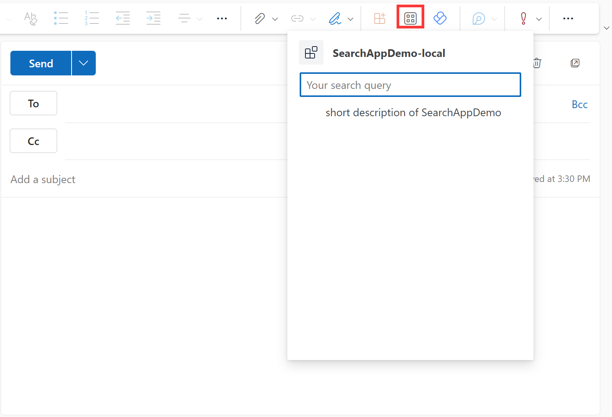

# Getting Started with Npm Search Connector
NPM Search Connector is a Message Extension that allows you to perform a quick search to NPM Registry for a package and insert package details into conversations for sharing with your co-workers. The front end is built with Adaptive Cards to render NPM package details and the backend is an Azure Bot Service handling search queries and communication between the server workload and the clients, including Teams and Outlook (Web Client).

## This sample illustrates
- How to build message extension bot on Azure for your app.
- How to use Teams Toolkit to build a message extension app that runs across Microsoft 365 including Teams and Outlook (Web)

## Prerequisite to use this sample
- [Node.js](https://nodejs.org/), supported versions: 16, 18
- An [Azure subscription](https://azure.microsoft.com/en-us/free/)
- [Set up your dev environment for extending Teams apps across Microsoft 365](https://aka.ms/teamsfx-m365-apps-prerequisites)
- [Teams Toolkit Visual Studio Code Extension](https://aka.ms/teams-toolkit) version 5.0.0 and higher or [TeamsFx CLI](https://aka.ms/teams-toolkit-cli)

## Minimal path to awesome
> Here are the instructions to run the sample in **Visual Studio Code**. You can also try to run the app using TeamsFx CLI tool, refer to [Try the Sample with TeamsFx CLI](cli.md)

### Run the app locally
1. Clone the repo to your local workspace or directly download the source code.
1. Open the project in Visual Studio Code.
1. Open the `Run and Debug` Activity Panel. Select a target Microsoft application where the app runs: `Debug in Teams` or `Debug in Outlook`.

### Deploy the app to Azure
1. Open the command palette and select `Teams: Provision`.
1. Once provision is completed, open the command palette and select `Teams: Deploy`.

### Preview the app
1. Once deployment is completed, you can preview the app running in Azure. In Visual Studio Code, open the `Run and Debug` Activity Panel. Select a target Microsoft application where the app runs: `Launch Remote in Teams` or `Launch Remote in Outlook`.

#### Preview the app In Teams
To trigger the message extension in Teams, there are multiple entry points:
- `@mention` your message extension, from the search box area.
  
- `@mention` your message extension from the compose message area.
  
- Click the `...` under compose message area, find your message extension.
  

#### Preview the app In Outlook
To trigger the message extension in Outlook:
- Click the "Apps" icon above compose email area, find your message extension.
  

## Version History
|Date| Author| Comments|
|---|---|---|
| Nov 9, 2021 | swatDong | add to support Teams Toolkit v2.10.0 |
| Apr 18, 2022 | kuojianlu | update to support Teams Toolkit v3.8.0 |
| Oct 17, 2022 | swatDong | update to support Teams Toolkit v4.1.0 |
| Mar 28, 2023 | kuojianlu | update to support Teams Toolkit v5.0.0 |

## Feedback
We really appreciate your feedback! If you encounter any issue or error, please report issues to us following the [Supporting Guide](https://github.com/OfficeDev/TeamsFx-Samples/blob/dev/SUPPORT.md). Meanwhile you can make [recording](https://aka.ms/teamsfx-record) of your journey with our product, they really make the product better. Thank you!
