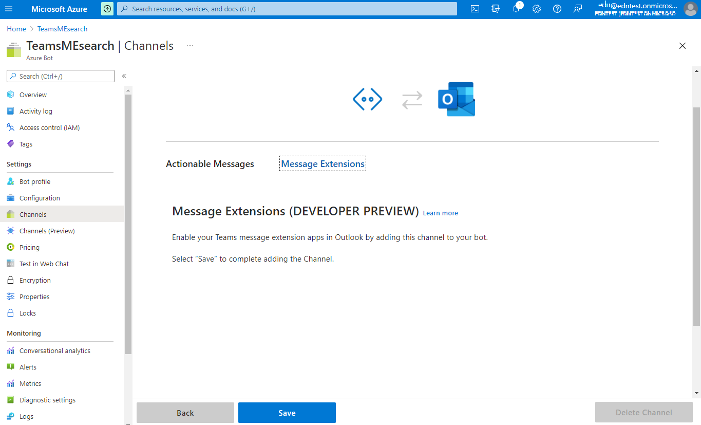
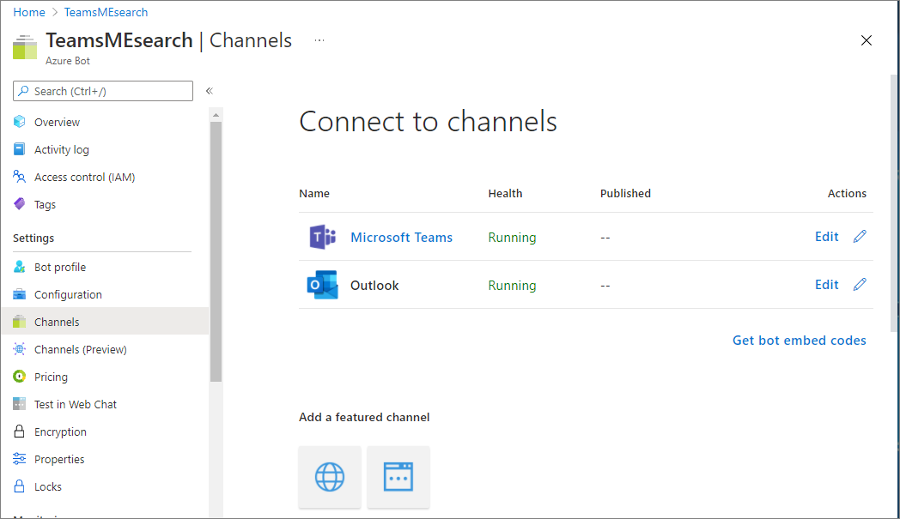
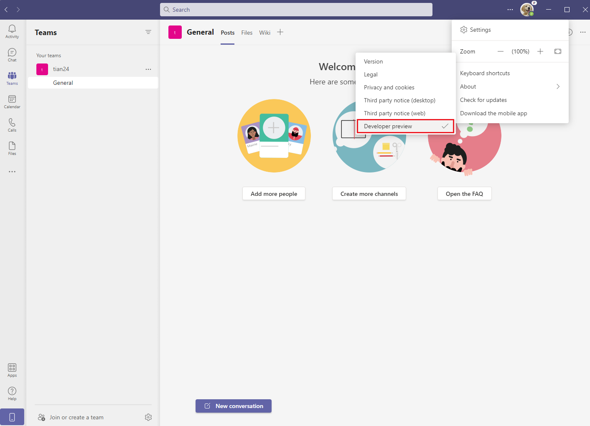
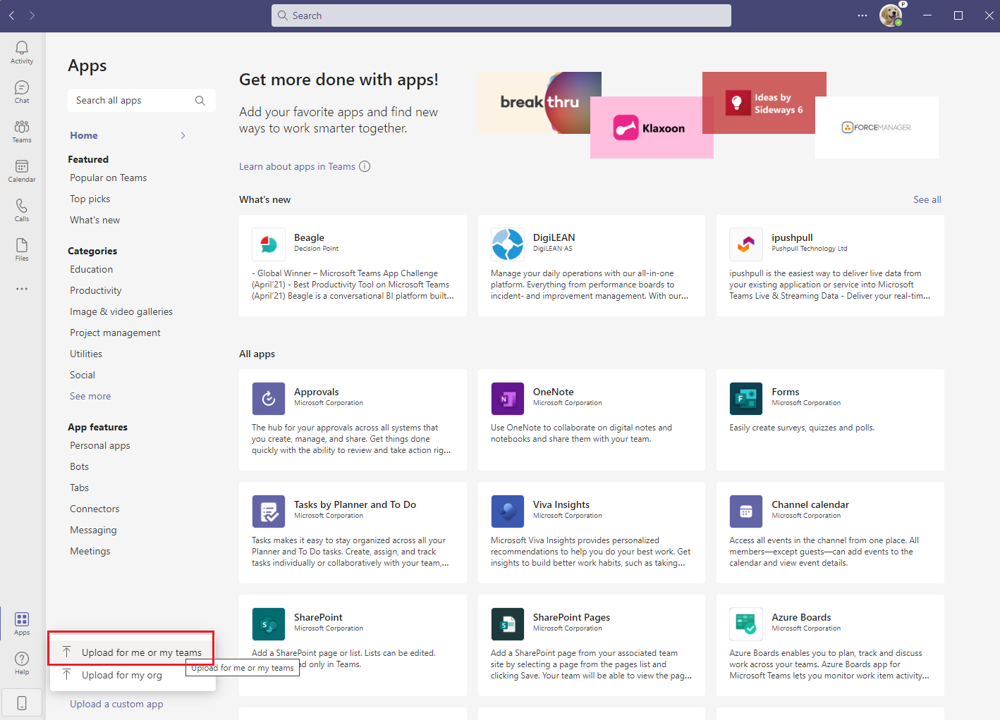
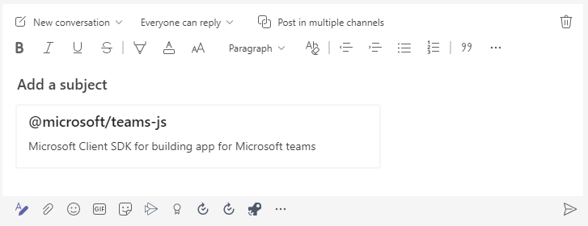
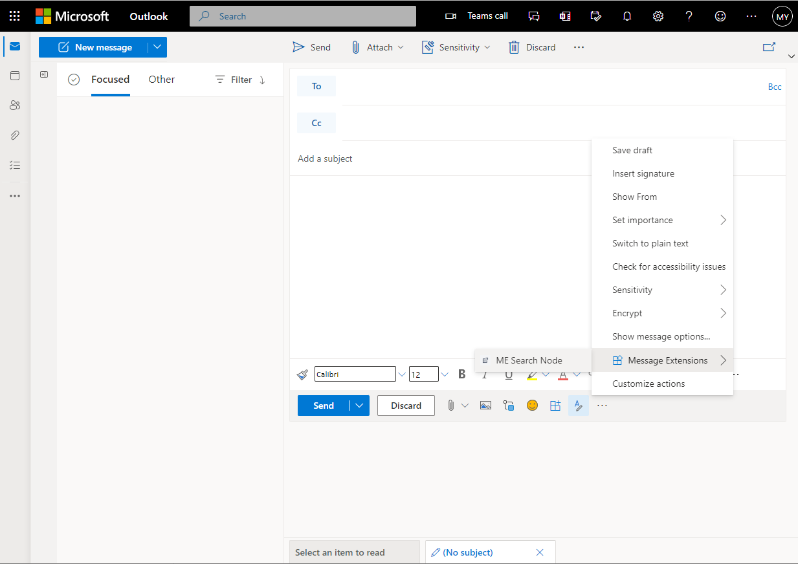

# Getting Started with Npm Search Connector Sample

> Note: Please be advised that this sample repository is currently in **Public Preview**, with a lot of active development work taking place. Please expect breaking changes as we continue to iterate. 
> 
> We really appreciate your feedback! If you encounter any issue or error, please report issues to us following the [Supporting Guide](./../SUPPORT.md). Meanwhile you can make [recording](https://aka.ms/teamsfx-record) of your journey with our product, they really make the product better. Thank you!
>  
> This warning will be removed when the samples are ready for production.

NPM Search Connector is a Messaging Extension that allows you to perform a quick search to NPM Registry for a package and insert package details into conversations for sharing with your co-workers. The front end is built with Adaptive Cards to render NPM package details and the backend is an Azure Bot Service handling search queries and communication between the server workload and the clients, including Teams and Outlook (Web Client).

## Prerequisite
- [NodeJS](https://nodejs.org/en/), version 10, 12 or 14
- An [Azure subscription](https://azure.microsoft.com/en-us/free/)
- [Set up your dev environment for extending Teams apps across Microsoft 365](https://aka.ms/teamsfx-m365-apps-prerequisites)

## What you will learn in this sample:
- How to build message extension bot on Azure for your app.
- How to use Teams Toolkit to build a message extension app that runs across M365 including Teams and Outlook (Web)

## Try the Sample with Visual Studio Code Extension:
1. Clone the repo to your local workspace or directly download the source code.
2. Download [Visual Studio Code](https://code.visualstudio.com) and install [Teams Toolkit Visual Studio Code Extension](https://aka.ms/teams-toolkit).
3. Open the project in Visual Studio Code.
4. Open the command palette and select `Teams: Provision in the cloud`.
5. Once provision is completed, open the command palette and select `Teams: Deploy to the cloud`.
6. Once deployment is completed, from [Azure Portal](https://portal.azure.com/), navigate to your bot resource. From *Settings*, select **Channels**. Click on **Outlook**, select the **Message Extensions** tab and then click **Save**.

   

   Confirm that your Outlook channel is listed along with Microsoft Teams in your bot's **Channels** pane.

   
7. Open the command palette and select `Teams: Zip Teams metadata package`.
8. Log in to Teams with your test tenant account, and ensure you are on the Public Developer Preview. You can verify this in Teams client by clicking on the ellipsis (...) menu by your user profile and opening **About** to check that the *Developer preview* option is toggled on.

   
9.  Open the *Apps* pane, and click **Upload a custom app** and then **Upload for me or my teams**.

    
    
    Select your app package and click *Open*. Once the app is uploaded, your app will be available in Outlook Web Client within several minutes.

## Use the app in Teams
In a conversation, open the **Messaging extensions** flyout menu on the bottom of the composition window. Your message extension will be listed and you can invoke it from there. Type a NPM package that you want to search and select one from the search results.

Then an adaptive card will be inserted to the message you are composing.

## Use the app in Outlook Web Client
To preview your app running in Outlook Web Client, log in to [outlook.com](https://www.outlook.com) using credentials for your test tenant. Click on **New message**. Open the **Messaging extensions** flyout menu on the bottom of the composition window. Your message extension will be listed. You can invoke it from there and use it just as you would while composing a message in Outlook.

## Architecture
### Code structure
- You can check app configuration and environment information in: [.fx](.fx)
- You will find bot code in: [bot](bot)

## Code of Conduct
This project has adopted the [Microsoft Open Source Code of Conduct](https://opensource.microsoft.com/codeofconduct/).

For more information see the [Code of Conduct FAQ](https://opensource.microsoft.com/codeofconduct/faq/) or
contact [opencode@microsoft.com](mailto:opencode@microsoft.com) with any additional questions or comments.