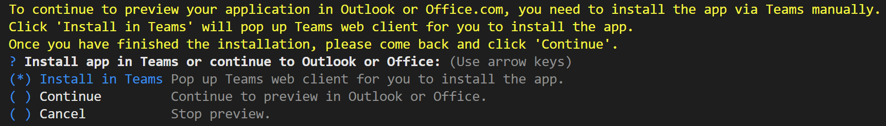

## Try the Sample with TeamsFx CLI
1. Install [Node.js](https://nodejs.org/en/download/)
1. To install the TeamsFx CLI, use the npm package manager:
    ```
    npm install -g @microsoft/teamsfx-cli
    ```
1. Create npm-search-connector-m365 project.
    ```
    teamsfx new template npm-search-connector-m365
    ```
1. Provision the project to Azure.
    ```
    teamsfx provision
    ```
1. Deploy.
    ```
    teamsfx deploy
    ```
1. Execute `teamsfx preview --env <env> --m365-host <m365-host>` in your project directory to launch your application, where `m365-host` is `teams` or `outlook`. If you select `m365-host` as `outlook`, a dialog will be popped up as the image below. Please select "Install in Teams" first to install the app in Teams, then select "Continue" to continue to preview the app in Outlook.
  

## (Optional) Debug
1. Start debugging the project by executing the command `teamsfx preview --env local --m365-host <m365-host>` in your project directory, where `m365-host` is `teams` or `outlook`. If you select `m365-host` as `outlook`, a dialog will be popped up as the image below. Please select "Install in Teams" first to install the app in Teams, then select "Continue" to continue to debug the app in Outlook.
  