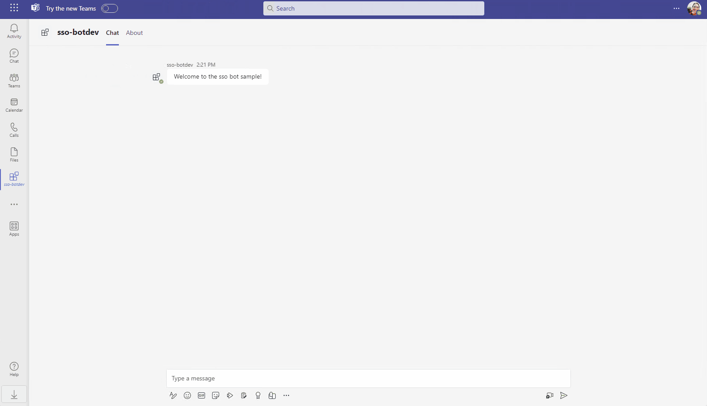

# Getting Started with Bot SSO in Docker

A bot, chatbot, or conversational bot is an app that responds to simple commands sent in chat and replies in meaningful ways. Examples of bots in everyday use include: bots that notify about build failures, bots that provide information about the weather or bus schedules, or provide travel information. A bot interaction can be a quick question and answer, or it can be a complex conversation. Being a cloud application, a bot can provide valuable and secure access to cloud services and corporate resources.

This is a sample chatbot application running in Docker container. It demonstrates Single Sign-on using `botbuilder` and Teams Framework that can respond to a `show` message.



## This sample illustrates

- Use Teams Toolkit to create a Teams bot app.
- Use Microsoft Graph to get User info and picture in Teams app.
- Use TeamsFx SDK to implementing SSO for Teams bot.
- Use Docker to containerize a Teams bot.

## Prerequisite to use this sample

- [Docker Engine](https://docs.docker.com/engine/install/)
- A Microsoft 365 tenant in which you have permission to upload Teams apps. You can get a free Microsoft 365 developer tenant by joining the [Microsoft 365 developer program](https://developer.microsoft.com/en-us/microsoft-365/dev-program).
- [Teams Toolkit Visual Studio Code Extension](https://aka.ms/teams-toolkit) version 5.0.0 and higher or [TeamsFx CLI](https://aka.ms/teamsfx-toolkit-cli)
- [Azure CLI](https://learn.microsoft.com/cli/azure/install-azure-cli) for Azure Container Apps deployment

## Containerization of Teams App

Teams applications can be developed and run locally using containerization, which provides a consistent and isolated environment for testing and deployment. Containerizing your Teams app makes it easier to manage dependencies, scale efficiently, and maintain your app in production. Below are steps and references to help you containerize your Teams app.

### How to containerize

This sample demonstrate how to containerize a Teams App and integrate the Docker container into Teams Toolkit development lifecycle, which can serve as reference for your containerization process.

- **Write a Dockerfile**: Create a Dockerfile that specifies the build instructions for your container image. Refer to this [Dockerfile example](./Dockerfile)

- **Configure Debugging**: Configure `launch.json` and `tasks.json` to run Docker locally for debugging. Refer to this [VS Code launch.json example](./.vscode/launch.json) and [VS Code tasks.json example](./.vscode/tasks.json)

- **Provision Infrastructure**: Automate the provisioning of Azure Container Apps and Azure Container Registry using Bicep templates. Refer to this [Azure Bicep example](./infra/azure.bicep).

- **Build and Deploy to ACA**: Build the Docker image and push it to Azure Container Registry using Docker CLI. Deploy the image to Azure Container Apps using Azure CLI. Refer to the deployment scripts in this [teamsapp.yml example](./teamsapp.yml).

## Minimal path to awesome

### Run the app locally

- From VS Code:
  1. hit `F5` to start debugging. Alternatively open the `Run and Debug Activity` Panel and select `Debug (Edge)` or `Debug (Chrome)`.
- From TeamsFx CLI:
  1.  Install [dev tunnel cli](https://aka.ms/teamsfx-install-dev-tunnel).
  1.  Login with your M365 Account using the command `devtunnel user login` .
  1.  Start your local tunnel service by running the command `devtunnel host -p 3978 --protocol http --allow-anonymous` .
  1.  In the `env/.env.local` file, fill in the values for `BOT_DOMAIN` and `BOT_ENDPOINT` with your dev tunnel URL.
      ```
      BOT_DOMAIN=sample-id-3978.devtunnels.ms
      BOT_ENDPOINT=https://sample-id-3978.devtunnels.ms
      ```
  1.  Run command: `teamsfx provision --env local` .
  1.  Run command: `docker build -t sso-bot ./` .
  1.  Run command: `docker run -p 3978:80 --env-file .localConfigs sso-bot` .
  1.  Run command: `teamsfx preview --open-only` .

### Deploy the app to Azure

- From VS Code:
  1. Sign into Azure by clicking the `Sign in to Azure` under the `ACCOUNTS` section from sidebar.
  1. Click `Provision` from `LIFECYCLE` section or open the command palette and select: `Teams: Provision`.
  1. Login Azure CLI with commands: `az login` and `az account set -s <subscription-id>`.
  1. Click `Deploy` or open the command palette and select: `Teams: Deploy`.
- From TeamsFx CLI:
  1. Run command: `teamsfx account login azure` .
  1. Run command: `teamsfx provision --env dev` .
  1. Run command: `az login` .
  1. Run command: `teamsfx deploy --env dev` .

### Preview the app in Teams

- From VS Code:
  1. Open the `Run and Debug Activity` Panel. Select `Launch Remote (Edge)` or `Launch Remote (Chrome)` from the launch configuration drop-down.
- From TeamsFx CLI:
  1. Run command: `teamsfx preview --env dev`.

## Deploying on Azure Kubernetes Service

You can deploy a containerized Teams App on a Kubernetes cluster. This assumes that you have an existing Azure Kubernetes Service connected to your Azure Container Registry, which hosts your container images. If you do not have one, please refer to this tutorial to create one: [AKS Tutorials](https://learn.microsoft.com/azure/aks/tutorial-kubernetes-prepare-app).

The following steps are provided as an example:

1. Install dependency for setting up TLS. Refer to [Create an ingress controller](https://learn.microsoft.com/azure/aks/ingress-basic?tabs=azure-cli) and [Use TLS with Let's Encrypt certificates](https://learn.microsoft.com/azure/aks/ingress-tls?tabs=azure-cli#use-tls-with-lets-encrypt-certificates).
    ```
    helm install ingress-nginx ingress-nginx/ingress-nginx --create-namespace --namespace $NAMESPACE \
        --set controller.nodeSelector."kubernetes\.io/os"=linux  \
        --set defaultBackend.nodeSelector."kubernetes\.io/os"=linux  \
        --set controller.healthStatus=true \
        --set controller.service.externalTrafficPolicy=Local \
        --set controller.service.annotations."service\.beta\.kubernetes\.io/azure-load-balancer-health-probe-request-path"=/healthz  \
    helm install cert-manager jetstack/cert-manager --namespace $NAMESPACE --set installCRDs=true --set nodeSelector."kubernetes\.io/os"=linux
    ```
1. Update the DNS for the ingress public IP.
    ```
    > kubectl get services --namespace $NAMESPACE -w ingress-nginx-controller

    NAME TYPE CLUSTER-IP EXTERNAL-IP PORT(S)
    ingress-nginx-controller LoadBalancer $CLUSTER_IP $EXTERNAL_IP 80:32514/TCP,443:32226/TCP

    > PUBLICIPID=$(az network public-ip list --query "[?ipAddress!=null]|[?contains(ipAddress, '$EXTERNAL_IP')].[id]" --output tsv)
    > az network public-ip update --ids $PUBLICIPID --dns-name $DNSLABEL
    > az network public-ip show --ids $PUBLICIPID --query "[dnsSettings.fqdn]" --output tsv

    $DNSLABEL.$REGION.cloudapp.azure.com
    ```
1. Fill the BOT_DOMAIN value in [.env.${envName}](./env/.env.dev) with your FQDN. Update the `arm/deploy` action as the following in [teamsapp.yml](./teamsapp.yml) since you do not need other Azure resources, and run `provision` command of Teams Toolkit to create a Teams app and a bot registration.
    ```
  - uses: arm/deploy 
    with:
      subscriptionId: ${{AZURE_SUBSCRIPTION_ID}} 
      resourceGroupName: ${{AZURE_RESOURCE_GROUP_NAME}} 
      templates:
        - path: ./infra/botRegistration/azureBot.bicep
          parameters: ./infra/botRegistration/azurebot.parameters.json
          deploymentName: Create-resources-for-bot
      bicepCliVersion: v0.9.1
    ```
1. Create a secret that serves as environment variables with the following command. Make sure to fill in the values in [.env.dev-secrets](./deploy/env/.env.dev-secrets) beforehand. You can find the values in [.env.${envName}](./env/.env.dev) and [.env.${envName}.user](./env/.env.dev.user) after provisioning.
    ```
    kubectl create secret generic dev-secrets --from-env-file ./deploy/env/.env.dev-secrets -n $NAMESPACE
    ```
1. Update the hostname and your email in the [sso-bot.yaml](./deploy/sso-bot.yaml) and apply it.
    ```
    kubectl apply -f deploy/sso-bot.yaml -n $NAMESPACE
    ```
1. In VS Code `Run and Debug` panel, select the `Launch Remote` configuration and press F5 to preview the Teams bot application that deployed on AKS.

## Further reading

- [How Microsoft Teams bots work](https://docs.microsoft.com/azure/bot-service/bot-builder-basics-teams?view=azure-bot-service-4.0&tabs=javascript)
- [Azure Container Apps overview](https://learn.microsoft.com/azure/container-apps/overview)

## Version History

| Date         | Author     | Comments                               |
| ------------ | ---------- | -------------------------------------- |
| Jan 17, 2024  | hund030   | Onboard sample in Teams Toolkit V5.0.0 |

## Feedback

We really appreciate your feedback! If you encounter any issue or error, please report issues to us following the [Supporting Guide](https://github.com/OfficeDev/TeamsFx-Samples/blob/dev/SUPPORT.md). Meanwhile you can make [recording](https://aka.ms/teamsfx-record) of your journey with our product, they really make the product better. Thank you!
