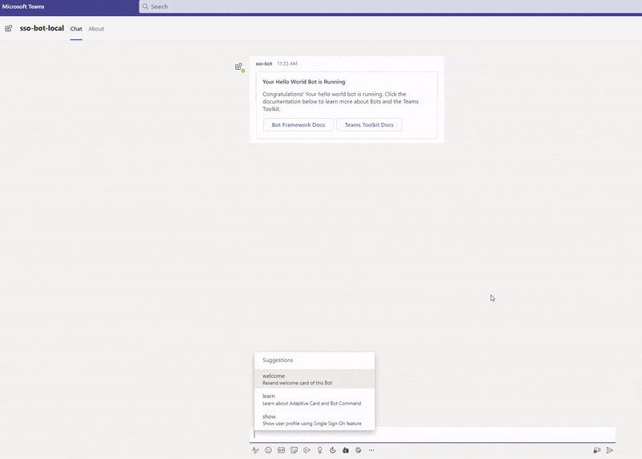

# Getting Started with Bot SSO

A bot, chatbot, or conversational bot is an app that responds to simple commands sent in chat and replies in meaningful ways. Examples of bots in everyday use include: bots that notify about build failures, bots that provide information about the weather or bus schedules, or provide travel information. A bot interaction can be a quick question and answer, or it can be a complex conversation. Being a cloud application, a bot can provide valuable and secure access to cloud services and corporate resources.

This is a sample chatbot application demonstrating Single Sign-on using `botbuilder` and Teams Framework that can respond to a `show` message.



## This sample illustrates
- Use Teams Toolkit to create a Teams bot app.
- Use Microsoft Graph to get User info and picture in Teams app.
- Use TeamsFx SDK to implementing SSO for Teams bot.

## Prerequisite to use this sample
- [Node.js](https://nodejs.org/), supported versions: 16, 18
- A Microsoft 365 tenant in which you have permission to upload Teams apps. You can get a free Microsoft 365 developer tenant by joining the [Microsoft 365 developer program](https://developer.microsoft.com/en-us/microsoft-365/dev-program).
- [Teams Toolkit Visual Studio Code Extension](https://aka.ms/teams-toolkit) version 5.0.0 and higher or [TeamsFx CLI](https://aka.ms/teamsfx-cli)

## Minimal path to awesome

### Run the app locally
- From VS Code:
    1. hit `F5` to start debugging. Alternatively open the `Run and Debug Activity` Panel and select `Debug (Edge)` or `Debug (Chrome)`.
- From TeamsFx CLI:
   1. Install [dev tunnel cli](https://aka.ms/teamsfx-install-dev-tunnel).
   1. Login with your M365 Account using the command `devtunnel user login`.
   1. Start your local tunnel service by running the command `devtunnel host -p 3978 --protocol http --allow-anonymous`.
   1. In the `env/.env.local` file, fill in the values for `BOT_DOMAIN` and `BOT_ENDPOINT` with your dev tunnel URL.
      ```
      BOT_DOMAIN=sample-id-3978.devtunnels.ms
      BOT_ENDPOINT=https://sample-id-3978.devtunnels.ms
      ```
    1. Run command: `teamsfx provision --env local` .
    1. Run command: `teamsfx deploy --env local` .
    1. Run command: `teamsfx preview --env local` .

### Deploy the app to Azure
- From VS Code:
    1. Sign into Azure by clicking the `Sign in to Azure` under the `ACCOUNTS` section from sidebar.
    1. Click `Provision` from `LIFECYCLE` section or open the command palette and select: `Teams: Provision`.
    1. Click `Deploy` or open the command palette and select: `Teams: Deploy`.
- From TeamsFx CLI:
    1. Run command: `teamsfx account login azure`.
    1. Run command: `teamsfx provision --env dev`.
    1. Run command: `teamsfx deploy --env dev`.

### Preview the app in Teams
- From VS Code:
    1. Open the `Run and Debug Activity` Panel. Select `Launch Remote (Edge)` or `Launch Remote (Chrome)` from the launch configuration drop-down.
- From TeamsFx CLI:
    1. Run command: `teamsfx preview --env dev`.

## Version History
|Date| Author| Comments|
|---|---|---|
|Apr 19, 2022| IvanJobs | update to support Teams Toolkit v4.0.0|
|Dec 7, 2022| yukun-dong | update to support Teams Toolkit v5.0.0|

## Feedback
We really appreciate your feedback! If you encounter any issue or error, please report issues to us following the [Supporting Guide](https://github.com/OfficeDev/TeamsFx-Samples/blob/dev/SUPPORT.md). Meanwhile you can make [recording](https://aka.ms/teamsfx-record) of your journey with our product, they really make the product better. Thank you!