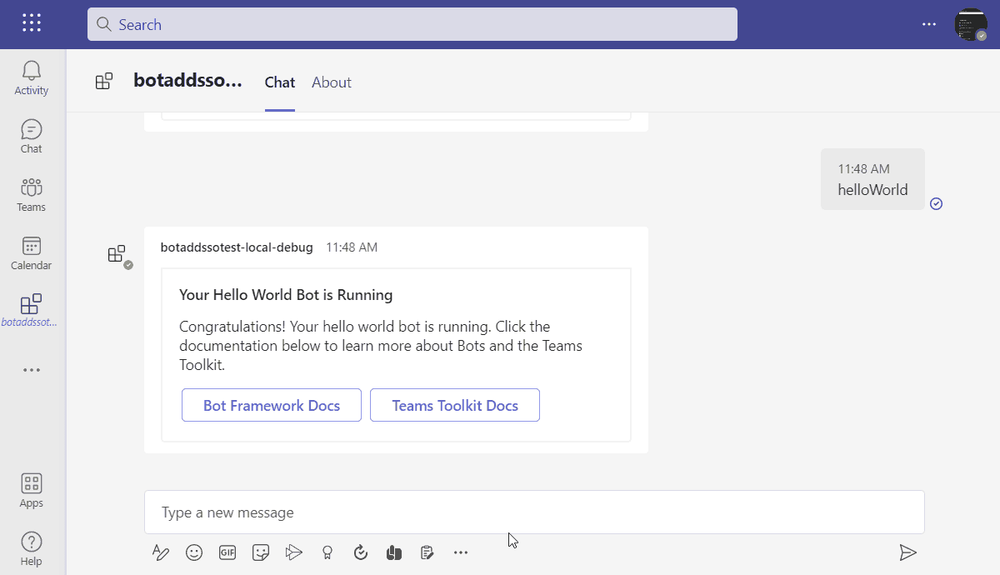

# Getting Started with Command Bot with SSO

A bot, chatbot, or conversational bot is an app that responds to simple commands sent in chat and replies in meaningful ways. Examples of bots in everyday use include: bots that notify about build failures, bots that provide information about the weather or bus schedules, or provide travel information. A bot interaction can be a quick question and answer, or it can be a complex conversation. Being a cloud application, a bot can provide valuable and secure access to cloud services and corporate resources.

This is a simple command bot that implements single sign-on feature to retrieve profile and photo for currently signed-in user using Bot Framework SDK, TeamsFx SDK and Microsoft Graph API, and the commands can be found as below:

| command    | response                                          | sso command |
| ---------- | ------------------------------------------------- | ----------- |
| helloworld | helloworld adaptive card message                  | false       |
| profile    | user profile information from Microsoft Graph API | true        |
| photo      | user photo image from Microsoft Graph API         | true        |



## This sample illustrates

- How to use Teams Toolkit to create a Teams bot app.
- How to use Microsoft Graph to get User info and picture in Teams app.
- How to use TeamsFx SDK to implementing SSO for Teams bot.

## Prerequisite to use this sample

- [Node.js](https://nodejs.org/) version 16, 18
- A Microsoft 365 tenant in which you have permission to upload Teams apps. You can get a free Microsoft 365 developer tenant by joining the [Microsoft 365 developer program](https://developer.microsoft.com/en-us/microsoft-365/dev-program).
- [Teams Toolkit Visual Studio Code Extension](https://aka.ms/teams-toolkit) version 5.0.0 and higher or [TeamsFx CLI](https://aka.ms/teams-toolkit-cli)

## Minimal path to awesome

### Run the app locally

- From VSCode

  1. Clone the repo to your local workspace or directly download the source code.
  1. Open the project in Visual Studio Code.
  1. Open Debug View (`Ctrl+Shift+D`) and select "Debug in Teams (Edge)" or "Debug in Teams (Chrome)" in dropdown list.
  1. Press "F5" to open a browser window and then select your package to view contact exporter sample app.

- From TeamsFx CLI
  1. Install [dev tunnel cli](https://aka.ms/teamsfx-install-dev-tunnel).
  1. Login with your M365 Account using the command `devtunnel user login`.
  1. Start your local tunnel service by running the command `devtunnel host -p 3978 --protocol http --allow-anonymous`.
  1. In the `env/.env.local` file, fill in the values for `BOT_DOMAIN` and `BOT_ENDPOINT` with your dev tunnel URL.
     ```
     BOT_DOMAIN=sample-id-3978.devtunnels.ms
     BOT_ENDPOINT=https://sample-id-3978.devtunnels.ms
     ```
  1. Run command: `teamsapp provision --env local` .
  1. Run command: `teamsapp deploy --env local` .
  1. Run command: `teamsapp preview --env local` .

### Deploy the app to Azure

> If you don't have an Azure subscription, create [a free account](https://azure.microsoft.com/en-us/free/) before you begin

- From VSCode

  1. Sign in to Azure by clicking `Sign in to Azure` under the `ACCOUNTS` section from sidebar.
  1. Click `Provision` from `LIFECYCLE` section or open the command palette and select: `Teams: Provision`.
  1. Click `Deploy` or open the command palette and select: `Teams: Deploy`.

- From TeamsFx CLI
  1. Run command: `teamsapp auth login azure`.
  1. Run command: `teamsapp provision --env dev`.
  1. Run command: `teamsapp deploy --env dev`.

### Preview the app in Teams

- From VSCode:
  1. Once deployment is completed, you can preview the APP running in Azure. In Visual Studio Code, open `Run and Debug` and select `Launch Remote (Edge)` or `Launch Remote (Chrome)` in the dropdown list and Press `F5` or green arrow button to open a browser.
- From TeamsFx CLI:
  1. Run command: `teamsapp preview --env dev`.

## Version History

| Date         | Author | Comments                               |
| ------------ | ------ | -------------------------------------- |
| Sep 20, 2022 | rentu  | update to support Teams Toolkit v4.0.0 |
| Mar 17, 2023 | rentu  | update to support Teams Toolkit v5.0.0 |

## Feedback

We really appreciate your feedback! If you encounter any issue or error, please report issues to us following the [Supporting Guide](https://github.com/OfficeDev/TeamsFx-Samples/blob/dev/SUPPORT.md). Meanwhile you can make [recording](https://aka.ms/teamsfx-record) of your journey with our product, they really make the product better. Thank you!

## Limitation Section

SSO for command bot only supports personal chat. This bot may not work if you add it to a team or a group chat.