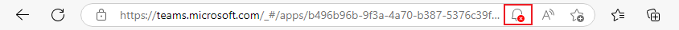
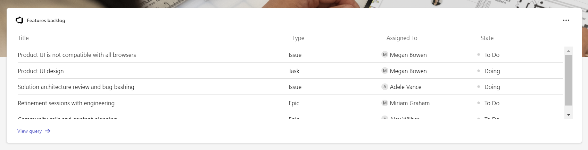
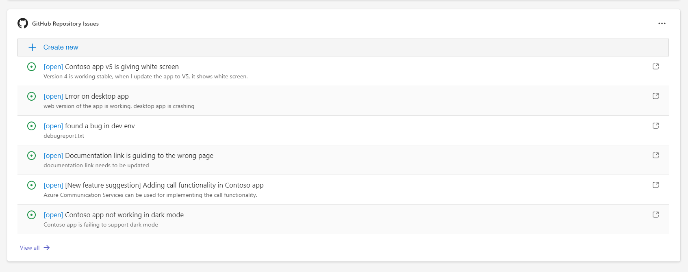
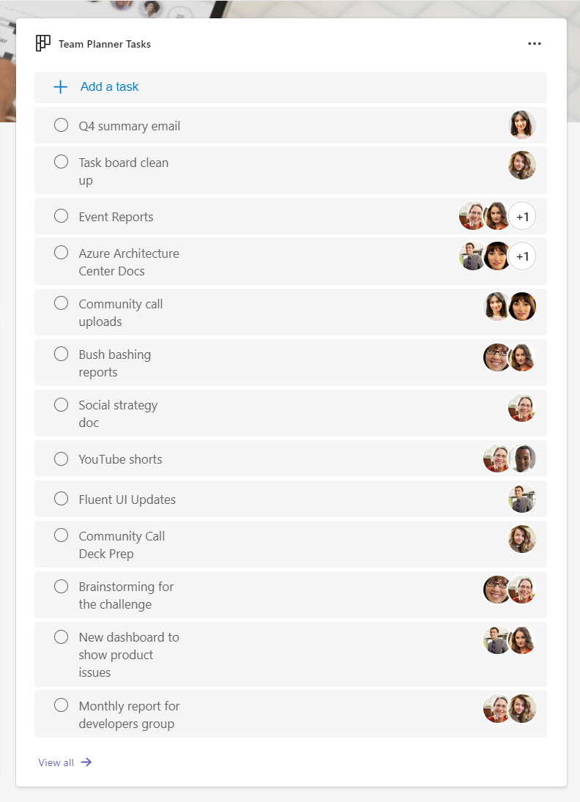

# Getting Started with Developer Assist Dashboard

Microsoft Teams supports the ability to run web-based UI inside "custom tabs" that users can install either for just themselves (personal tabs) or within a team or group chat context.

Developer Assist Dashboard shows you how to build a tab with Azure DevOps work items, GitHub issues and Planner tasks to accelerate developer team collaboration and productivity. Developer Assist Dashboard is capable of working on Microsoft Teams, Outlook Web and Microsoft 365 app.

<https://user-images.githubusercontent.com/36196437/223398461-e3f5a521-6439-407c-a458-584c769f730b.mp4>

## This sample illustrates

- Use TeamsFx to embed a canvas containing multiple cards that provide an overview of data or content in your tab app.
- Use TeamsFx to build frontend hosting on Azure for your tab app.
- Use TeamsFx to build backend hosting on Azure for your tab app.
- Use DevOps, GitHub, and Microsoft Graph APIs in TeamsFx to get access to variety of data.

## Prerequisite to use this sample

- [NodeJS](https://nodejs.org/), fully tested on NodeJS 14, 16, 18
- A Microsoft 365 tenant in which you have permission to upload Teams apps. You can get a free Microsoft 365 developer tenant by joining the [M365 developer program](https://developer.microsoft.com/en-us/microsoft-365/dev-program)
- [Teams Toolkit Visual Studio Code Extension](https://aka.ms/teams-toolkit) or [TeamsFx CLI](https://aka.ms/teamsfx-cli)

## Minimal path to awesome

> Here are the instructions to run the sample in **Visual Studio Code**. You can also try to run the app using TeamsFx CLI tool, refer to [Try the Sample with TeamsFx CLI](cli.md)

### Run the app locally

1. Clone the repo to your local workspace or directly download the source code.
1. Download [Visual Studio Code](https://code.visualstudio.com) and install [Teams Toolkit Visual Studio Code Extension](https://aka.ms/teams-toolkit).
1. Open the project in Visual Studio Code.
1. Update `./src/configs.ts` file with required DevOps, GitHub and Planner configurations. For more details, read [Advanced usage of this sample](#advanced-usage-of-this-sample) section.
1. Hit the `F5` key in your keyboard. Alternatively open the `Run and Debug Activity` panel(Ctrl+Shift+D) in Visual Studio Code and click the `Run and Debug` button.

> The first time you run this sample, you need to login to consent some delegated permissions. If you don't see the consent page, please check if your browser blocks the pop-up window.
> 

### Deploy the app to Azure

Deploy your project to Azure by following these steps:

1. Open Teams Toolkit in Visual Studio Code, and sign in your Azure account by clicking the `Sign in to Azure` in the `ACCOUNTS` section from sidebar.
1. After you signed in, select a subscription under your account. The Teams Toolkit will use this subscription to provision Azure resources to host you app.
1. Open the Teams Toolkit and click `Provision in the cloud` in the `DEVELOPMENT` section. Alternatively open the command palette(Ctrl+Shift+P) and type: `Teams: Provision in the cloud` command.
1. Open the Teams Toolkit and click `Deploy to the cloud` in the `DEVELOPMENT` section. Alternatively open the command palette(Ctrl+Shift+P) and type: `Teams: Deploy to the cloud` command.

> Note: Provision Azure cloud resources and deploy to Azure may cause charges to your Azure Subscription.

### Preview the app in Teams

After you have completed the provision and deploy steps in `Deploy the app to Azure` section, you can preview your app in Teams client by following steps below:

1. Open the `Run and Debug Activity` panel from sidebar, or use short key Ctrl+Shift+D.
1. Select `Launch Remote (Edge)` or `Launch Remote (Chrome)` in the launch configuration (a dropdown selection in the upper-left corner).
1. Press the `Start Debugging` button to launch your app, the Teams web client will be automatically opened in your browser, where you will see your app running remotely from Azure.

## Advanced usage of this sample

### Azure DevOps Work Items

This widget displays DevOps Work Items including the title, type, assigned to and state of the work item.

**To integrate DevOps Work Items in the dashboard, follow the instructions:**

1. Login to [Azure DevOps](https://dev.azure.com/) and select the project you want to configure in the Developer Assist Dashboard. Copy the `organization name` and `project name` from the project url.
1. In Azure DevOps, select **User settings** and then select **Personal access token**. Select **+ New token** to create a new personal access token, give a name to your token, select **Read** permission for Work Items and **Create**.
1. Open `./src/configs.ts` file in Developer Assist Dashboard project:
   - Add the values of **ORGANIZATION_NAME** and **PROJECT_NAME** with your `organization name` and `project name`.
   - Add the value of **DEVOPS_PERSONAL_ACCESS_TOKEN** with your personal access token.

### GitHub Issues

This widget displays GitHub issues including the title, status and the url of the GitHub issue. This widget also includes creating a new issue:

**To integrate GitHub issues in the dashboard, follow the instructions:**

1. Login to [GitHub](https://github.com/) and select **Settings > Developer settings > Personal access token**. Select **Generate new token** to create new personal access token. Give a name to your token, select the repositories you want to access. Under `Repository permissions`, give **Read and write** access to **Issues**.
1. Open `./src/configs.ts` file in Developer Assist Dashboard project:
   - Add the value of **GITHUB_PERSONAL_ACCESS_TOKEN** with your personal access token.
   - Add the values of **REPOSITORY_OWNER_NAME** and **REPOSITORY_NAME** with your GitHub username and your repository name.

### Planner Tasks

This widget displays Planner tasks including the title of the task. This widget also includes creating a new task functionality:

**To integrate Planner tasks in the dashboard, follow the instructions:**

1. Visit [Microsoft Graph Explorer](https://aka.ms/ge), select profile icon on the right side and login with your Microsoft 365 developer account.
   1. Type `https://graph.microsoft.com/v1.0/planner/plans` in Graph Explorer query box and select **Run query**. Copy the id of the plan you wish to use.
   1. Type `https://graph.microsoft.com/v1.0/planner/plans/{Plan-Id}/buckets` in Graph Explorer query box and replace {Plan-Id} with your **plan-id** and select **Run query**. Copy the id of the bucket you'd like to see in your dashboard.
1. Open `./src/configs.ts` file in Developer Assist Dashboard project:
   - Add the value of **PLAN_ID** with your plan id.
   - Add the value of **BUCKET_ID** with your bucket id.

## Version History

| Date         | Author                          | Comments                               |
| ------------ | ------------------------------- | -------------------------------------- |
| Mar 14, 2023 | Ayca, Huihui, Hui, Frank, Ellie | onboard                                |
| Mar 31, 2023 | Hui                             | update to support Teams Toolkit V5.0.0 |

## Feedback

We really appreciate your feedback! If you encounter any issue or error, please report issues to us following the [Supporting Guide](https://github.com/OfficeDev/TeamsFx-Samples/blob/dev/SUPPORT.md). Meanwhile you can make [recording](https://aka.ms/teamsfx-record) of your journey with our product, they really make the product better. Thank you!
