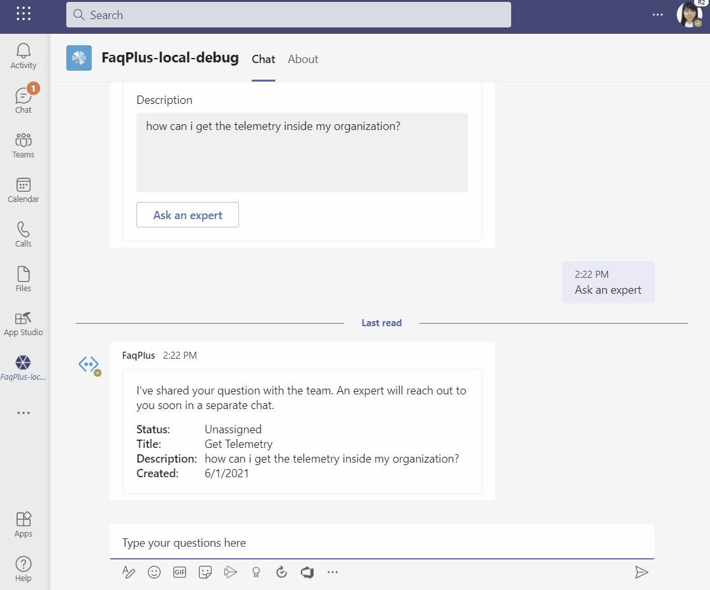
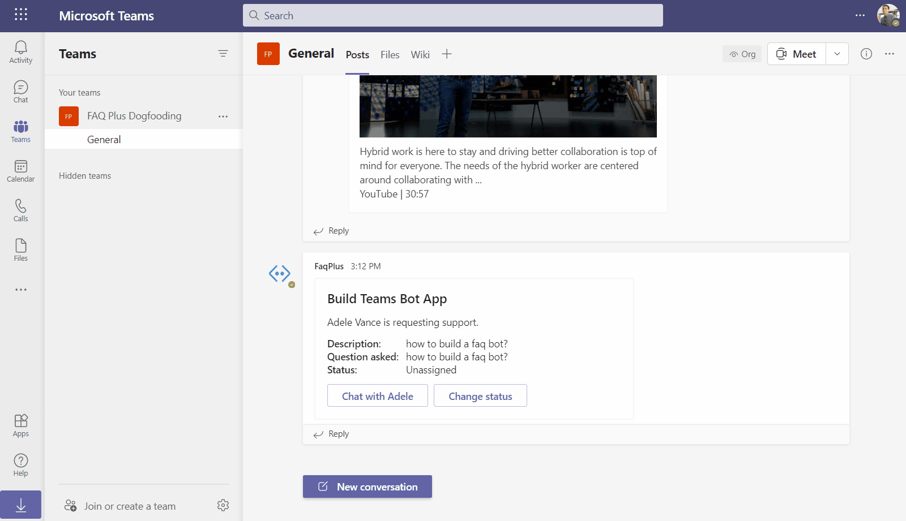
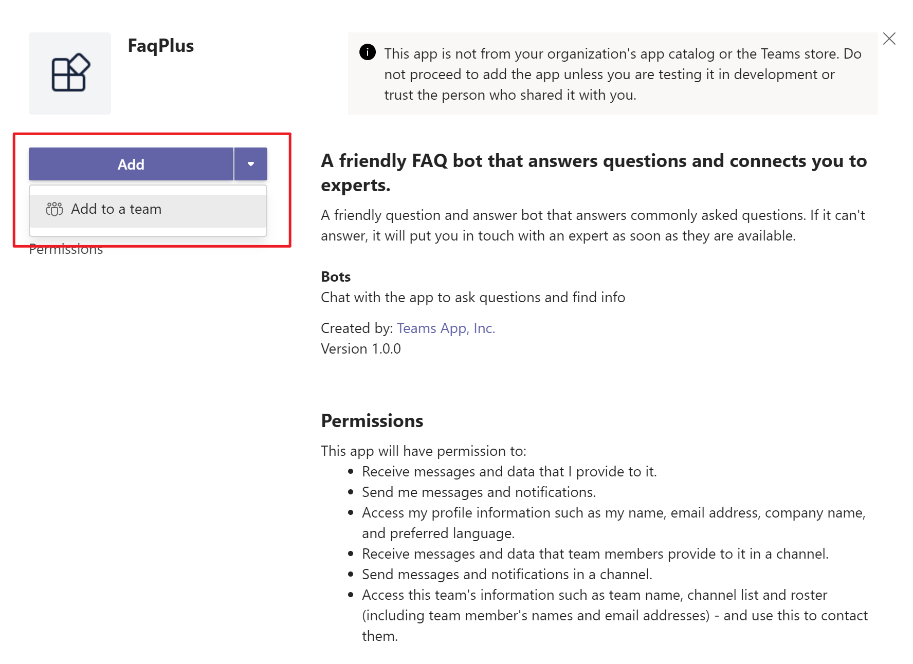
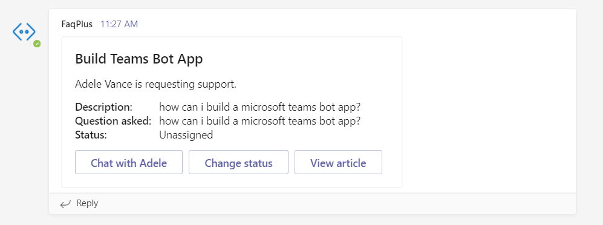

# Getting Started with FAQ Plus Sample

> Note: Please be advised that this sample repository is currently in **Public Preview**, with a lot of active development work taking place. Please expect breaking changes as we continue to iterate. 
> 
>We really appreciate your feedback! If you encounter any issue or error, please report issues to us following the [Supporting Guide](./../SUPPORT.md). Meanwhile you can make [recording](https://aka.ms/teamsfx-record) of your journey with our product, they really make the product better. Thank you!
>
> This warning will be removed when the samples are ready for production.

Chatbots on Microsoft Teams are an easy way to provide answers to frequently asked questions by users. However, most chatbots fail to engage with users in a meaningful way because there is no human in the loop when the chatbot fails to answer a question well.

FAQ Plus bot is a friendly Q&A bot that brings a human in the loop when it is unable to help. A user can ask the bot a question and the bot responds with an answer if it's in the knowledge base. If not, the bot offers the user an option to "Ask an expert", which posts the question to a pre-configured team of experts to provide support. An expert can assign the question to themself, chat with the user to gain more context.

**Here are some screenshots showing FAQ Plus in action:**

*	A user interacting with FAQ Plus through chat:



*	Expert using FAQ Plus:



## Getting Started

### Prerequisites

- [NodeJS](https://nodejs.org/en/), recommend v14.x
- An M365 account. If you do not have M365 account, apply one from [M365 developer program](https://developer.microsoft.com/en-us/microsoft-365/dev-program)
- [Visual Studio Code](https://code.visualstudio.com/)
- [Teams Toolkit Visual Studio Code Extension](https://aka.ms/teams-toolkit)
- An [Azure subscription](https://azure.microsoft.com/en-us/free/)

### What you will learn in this sample:

- How to use TeamsFx to build a bot app.
- How to connect a Teams bot to an external system.
- How to use the Teams Toolkit to provision and deploy your app to Azure.

### Try the Sample

1. FAQ Plus Bot relies on the 'QnA Maker' Azure services. Before you start, follow the [instructions](docs/deploy-qna-maker-services.md##step-1-register-azure-ad-applications) to create an Azure AD app.
2. Open project in [Visual Studio Code](https://code.visualstudio.com/), ensure you have installed [Teams Toolkit Visual Studio Code Extension](https://aka.ms/teams-toolkit)
3. Open the command palette by pressing `Ctrl+Shift+P / ⌘⇧-P or View -> Command - Palette` and select: `Teams: Provision in the cloud`. If you have not logged in with your Azure Account, you will be asked to login and select a subscription to provision resources for this Bot.
4. Once provision is completed, follow the [instructions to create qna maker](docs/deploy-qna-maker-services.md#step-2-create-the-qna-maker-knowledge-base) and [configure the FAQ Plus app](docs/deploy-qna-maker-services.md#step-3-finish-configuring-the-faq-plus-app).
5. Open the command palette and select: `Teams: Deploy to the cloud`.
6. To install and run the app, in Visual Studio Code, open `Run and Debug` tab and select `Launch Remote (Edge)` or `Launch Remote (Chrome)` in the dropdown list. Then press `F5` or click green arrow button to launch Teams client in browser. Log in to Teams and click `Add` button to install the app to your Teams client.
7. Your app is successfully running in your Teams client now, refer to ['Use the App' section](#use-the-app) below to interact with the app.

### (Optional) Debug

1. Open project in [Visual Studio Code](https://code.visualstudio.com/), ensure you have installed [Teams Toolkit Visual Studio Code Extension](https://aka.ms/teams-toolkit)
2. Follow the [instcution](docs/deploy-qna-maker-services.md#step-4-prepare-required-parameters-for-teams-bot-app) to get necessary info. You need to use them in the next step.
3. Open `bot/.env.teamsfx.local` file. Fill values for following environment variables. Note: You should get all these values in previous step.
    ```
    SCORETHRESHOLD=0.5
    STORAGECONNECTIONSTRING=
    QNAMAKERAPIENDPOINTURL=
    QNAMAKERHOSTURL=
    QNAMAKERSUBSCRIPTIONKEY=
    ```
4. To install and run the app, in Visual Studio Code, open `Run and Debug` tab and select `Debug (Edge)` or `Debug (Chrome)` in the dropdown list. Then press `F5` or click green arrow button to launch Teams client in browser. Log in to Teams and click `Add` button to install the app to your Teams client.
5. Your app is successfully running in your Teams client now, refer to ['Use the App' section](#use-the-app) below to interact with the app.

### Use the App

#### User interacting with FAQ Plus:

1. The Bot will send out Welcome Message to kick off the conversation.
2. You can just ask any question.
3. Once receive questions, the Bot will search the QnA knowledge base to find answers. You can click 'Ask an expert' if Bot doesn't solve your questions well.
4. Click "Ask an expert" button to escalate your question to an expert, fill in required information and click "Ask an expert" again to create a ticket.
    > #### WARNING: To enable "Ask an expert" feature, you will need to install the app to a Teams Channel for expert to receive ticket creation notification. Note that this Teams Channel must be a Channel of the Team configured in your FAQ Plus configuration app in [this](docs/deploy-qna-maker-services.md) doc.
    > To install the FAQ Plus app to Teams Channel, you can terminate the current F5 session (just close the web browser), and launch a new F5 session to install app to Teams Channel by clicking "Add to a team".. 
    >  

#### Expert interacting with FAQ Plus in Teams channel:

Experts can receive Bot notifications from Teams Channel. An expert can assign the questions to themselves, initiate chat with the user to gain more context.
1. To enable the feature for expert, add the Bot to a Teams Channel for expert group.
2. When user 'Ask an expert', a support ticket is created and posted to experts Teams Channel.
    
4. Click "Chat with xxx" to initiate a chat with the user who asked for help. Note: if the support ticket is created by yourself, you cannot use this feature to chat with yourself.
5. Click "Change status" button to change the status of the support ticket. The user who created the ticket will receive status change notification from the bot.
6. Click 'View article' to search related answers from Knowledge base for some reference.


## Feedback

Thoughts? Questions? Ideas? Bugs and other code issues? Share them with us on [GitHub Issues](https://github.com/OfficeDev/TeamsFx-Samples/issues)!

## Contributing

This project welcomes contributions and suggestions. Most contributions require you to agree to a Contributor License Agreement (CLA) declaring that you have the right to, and actually do, grant us the rights to use your contribution. For details, visit [https://cla.microsoft.com](https://cla.microsoft.com/).

When you submit a pull request, a CLA-bot will automatically determine whether you need to provide a CLA and decorate the PR appropriately (e.g., label, comment). Simply follow the instructions provided by the bot. You will only need to do this once across all repos using our CLA.

This project has adopted the [Microsoft Open Source Code of Conduct](https://opensource.microsoft.com/codeofconduct/). For more information see the [Code of Conduct FAQ](https://opensource.microsoft.com/codeofconduct/FAQ/) or contact [opencode@microsoft.com](mailto:opencode@microsoft.com) with any additional questions or comments.
