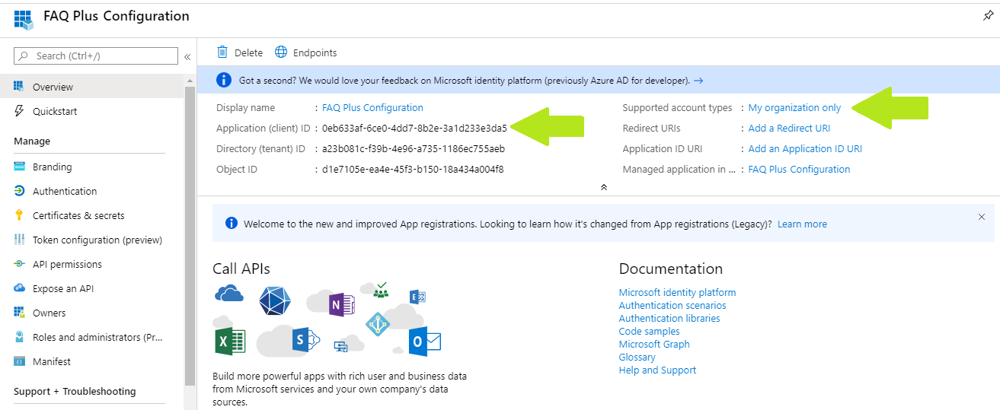
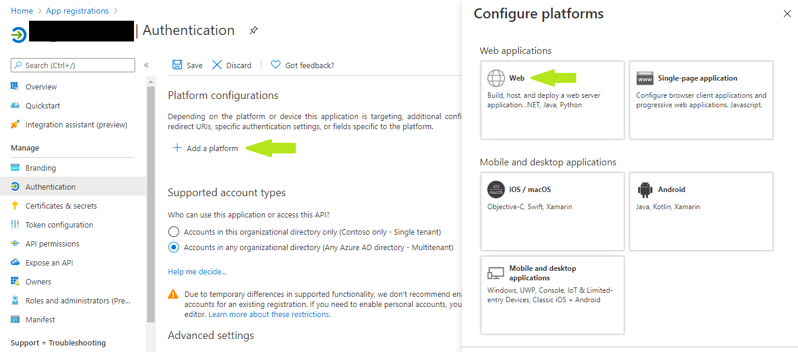
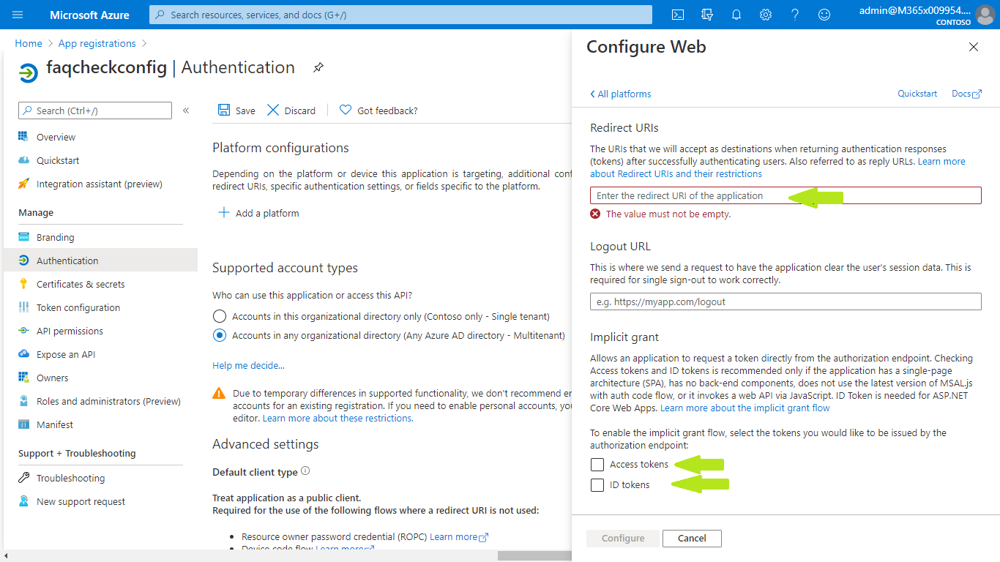
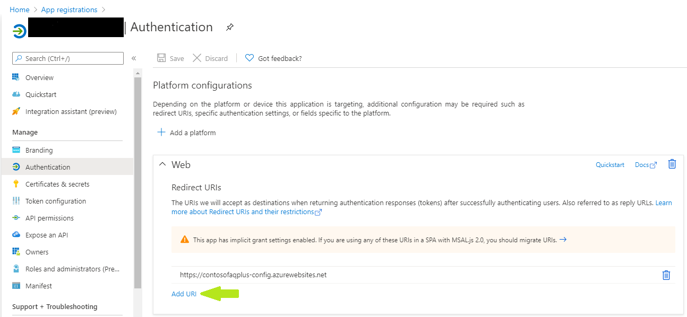
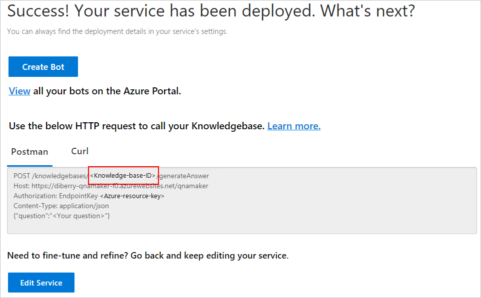
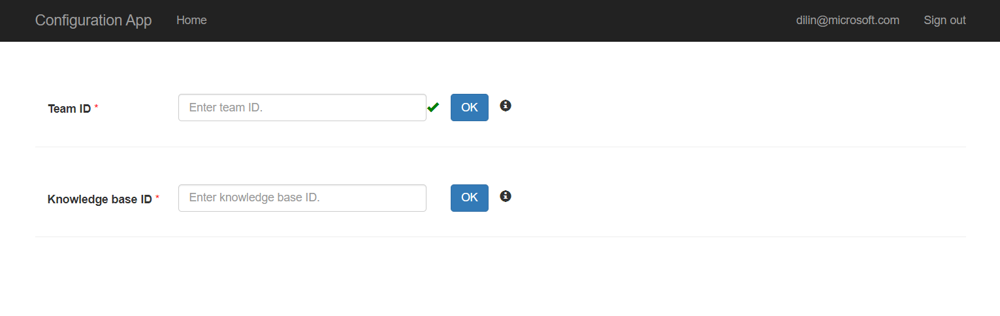
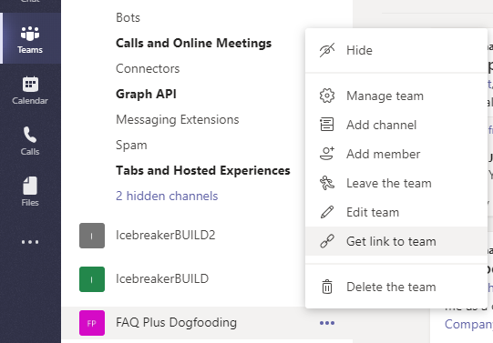
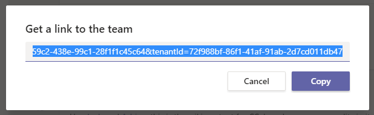
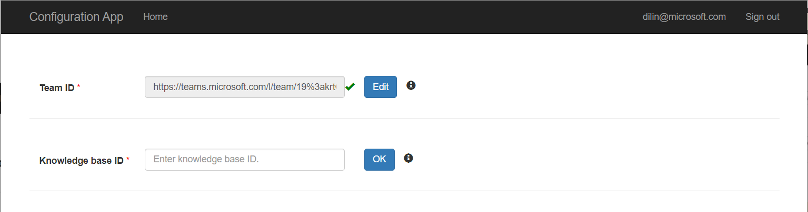

## Prerequisites

To begin, you will need: 

* An Azure subscription where you can create the following kind of resources:
	* App service
	* App service plan
	* Bot channels registration
	* Azure storage account
	* Azure search
	* Azure function
	* QnA Maker cognitive service
	* Application Insights  
* A team in Microsoft Teams with your group of experts. (You can add and remove team members later!)
* A reasonable set of Question and Answer pairs to set up the knowledge base for the bot.

## Step 1: Register Azure AD applications

Register one Azure AD applications in your tenant's directory for the configuration app.

1. Log in to the Azure Portal for your subscription, and go to the ["App registrations" blade](https://portal.azure.com/#blade/Microsoft_AAD_IAM/ActiveDirectoryMenuBlade/RegisteredApps).

2. Click on "New registration", and create an Azure AD application.
	1. **Name**: The name of your configuration app. We advise appending “Configuration” to the name of this app; for example, “FAQ Plus Configuration”.
	2. **Supported account types**: Select "Account in this organizational directory only"
	3. Leave the "Redirect URL" field blank for now.

3. Click on the "Register" button.

4. When the app is registered, you'll be taken to the app's "Overview" page. Copy the **Application (client) ID** and **Directory (tenant) ID**; we will need it later. Verify that the "Supported account types" is set to **My organization only**.

We recommend that you copy these values into a text file, using an application like Notepad. We will need these values later.

## Step 2: Deploy to your Azure subscription

1. Click on the "Deploy to Azure" button below.

2. When prompted, log in to your Azure subscription.

3. Azure will create a "Custom deployment" based on the ARM template and ask you to fill in the template parameters.

4. Select a subscription and resource group. We recommend creating a new resource group.
* The resource group location MUST be in a data center that supports:
	* Application Insights
	* Azure Search
	* QnA Maker

 Click [here](https://azure.microsoft.com/en-us/global-infrastructure/services/?products=logic-apps,cognitive-services,search,monitor) to check up-to-date list.
	
5. Enter a "Base Resource Name", which the template uses to generate names for the other resources.
* The app service names `[Base Resource Name]-config`, and `[Base Resource Name]-qnamaker` must be available. For example, if you select `contosofaqplus` as the base name, the names `contosofaqplus-config`, and `contosofaqplus-qnamaker` must be available (not taken); otherwise, the deployment will fail with a conflict error.
* Remember the base resource name that you selected. We will need it later.

6. Fill in the various IDs in the template:

	1. **Config App Client Id**: The application (client) ID of the configuration app registered in step 1.

	4. **Tenant Id**: The tenant ID registered in Step 1. If your Microsoft Teams tenant is the same as the Azure subscription tenant, then we would recommend keeping the default values.

Make sure that the values are copied as-is, with no extra spaces. The template checks that GUIDs are exactly 36 characters.

7. Fill in the "Config Admin UPN List", which is a semicolon-delimited list of users who will be allowed to access the configuration app.
* For example, to allow Megan Bowen (meganb@contoso.com) and Adele Vance (adelev@contoso.com) to access the configuration app, set this parameter to `meganb@contoso.com;adelv@contoso.com`.
* You can change this list later by going to the configuration app service's "Configuration" blade.

8. If you wish to change the app name, description, and icon from the defaults, modify the corresponding template parameters.

9. Click on "Review + create" to review the information you inputted. Then click "Create" to start the deployment.

10. Wait for the deployment to finish. You can check the progress of the deployment from the "Notifications" pane of the Azure Portal. It can take more than 10 minutes for the deployment to finish.

11. Once the deployment has finished, you would be directed to a page that has the following fields:
* configurationAppUrl - This is the URL for the configuration web application.

## Step 3: Set up authentication for the configuration app

1. Note the location of the configuration app that you deployed is "https://[BaseResourceName]-config.azurewebsites.net". For example, if you chose "contosofaqplus" as the base name, the configuration app will be at "https://contosofaqplus-config.azurewebsites.net".

2. Go back to the [App Registrations page](https://portal.azure.com/#blade/Microsoft_AAD_IAM/ActiveDirectoryMenuBlade/RegisteredAppsPreview).

3. Click on the configuration app in the application list. Under "Manage", click on "Authentication" to bring up authentication settings.

4. Click on Add a platform, select Web.

5. Add new entry to "Redirect URIs":
	If your configuration app URL is https://contosofaqplus-config.azurewebsites.net, then add the following entry as the Redirect URIs:
	- https://contosofaqplus-config.azurewebsites.net

	Note: Please refer to Step 3.1 for more details about the URL. 

6. Under "Implicit grant", check "ID tokens" and "Access tokens". The reason to check "ID tokens" is because you are using only the accounts on your current Azure tenant and using that to authenticate yourself in the configuration app. Click configure.

7. Add new entries to "Redirect URIs":
	If your configuration app's URL is https://contosofaqplus-config.azurewebsites.net, then add the following entry as the Redirect URIs:
	- https://contosofaqplus-config.azurewebsites.net/signin
	- https://contosofaqplus-config.azurewebsites.net/configuration

8. Click "Save" to commit your changes.

## Step 4: Create the QnA Maker knowledge base

Create a knowledge base on the [QnA Maker portal](https://www.qnamaker.ai/Create), following the instructions in the QnA Maker documentation [QnA Maker documentation](https://docs.microsoft.com/en-us/azure/cognitive-services/qnamaker/tutorials/create-publish-query-in-portal#create-a-knowledge-base).

Skip the step 1 "Create a QnA service in Microsoft Azure", because the ARM template that you deployed in Step 2 "Deploy to your Azure subscription" already created the QnA service. Proceed directly to the next step, "Connect your QnA service to your KB".

Use the following values when connecting to the QnA service:

* **Microsoft Azure Directory ID**: The tenant associated with the Azure subscription selected in Step 2.1.
* **Azure subscription name**: The Azure subscription to which the ARM template was deployed.
* **Azure QnA service**: The QnA service was created during the deployment. This is the same as the "Base resource name"; for example, if you chose "contosofaqplus" as the base name, the QnA Maker service will be named `contosofaqplus`.

After [publishing the knowledge base](https://docs.microsoft.com/en-us/azure/cognitive-services/qnamaker/tutorials/create-publish-query-in-portal#publish-to-get-knowledge-base-endpoints), note the knowledge base ID (see screenshot).

Remember the knowledge base ID: we will need it in the next step.

## Step 5: Finish configuring the FAQ Plus app

1. Open the configuration app by typing your confirguration app url "https://[BaseResourceName]-config.azurewebsites.net" in browser. For example, if you chose "contosofaqplus" as the base name, the configuration app url will be "https://contosofaqplus-config.azurewebsites.net".

2. You will be prompted to log in with your credentials. Make sure that you log in with an account that is in the list of users allowed to access the configuration app.

3. Get the link to the team with your experts from the Teams client. To do so, open Microsoft Teams, and navigate to the team. Click on the "..." next to the team name, then select "Get link to team".

Click on "Copy" to copy the link to the clipboard.

4. Paste the copied link into the "Team Id" field, then press "OK".

5. Enter the QnA Maker knowledge base ID into the "Knowledge base ID" field, then press "OK".

### Notes

Remember to click on "OK" after changing a setting. To edit the setting later, click on "Edit" to make the text box editable.

## Step 6: Prepare required parameters for Teams Bot app

1. Go to Azure portal, open the resource group you created during deployment in step 2.4 on this page.

2. Click and open the Azure Storage instance in the resource group, then click **Access keys** in left panel.

3. Click **Show keys** button, then copy the connection string of either key1 or key2. Record the value to your notebook and name it `StorageConnectionString`.

4. Go to the resource group again and click to open the Cognitive Service instance. The service name is the same as the "Base resource name" you specified during provision.

5. Click **Keys and Endpoint** in left panel, then click **Show Keys** button.

6. Copy the value of either KEY 1 or KEY 2. Record it to your notebook and name it `QnAMakerSubscriptionKey`

7. Copy the value of endpoint URL. Record it to your notebook and name it `QnAMakerApiEndpointUrl`.

8. The last parameter you will use is `QnAMakerHostUrl`. It should be "https://[BaseResourceName]-qnamaker.azurewebsites.net". 
Remember to replace the BaseResourceName, for example, if you chose "contosofaqplus" as the base name, your url will be "https://contosofaqplus-qnamaker.azurewebsites.net".
 
Now you will have following parameters ready on your notebook. You can go back to [readme](../README.md) and follow the instructions to config and run your app.
| Name | Example |
| ---- | ---- |
| StorageConnectionString | DefaultEndpointsProtocol=https;AccountName=[AccountName];AccountKey=[Key] |
| QnAMakerApiEndpointUrl | https://[Location].api.cognitive.microsoft.com |
| QnAMakerHostUrl | https://[BaseResourceName]-qnamaker.azurewebsites.net |
| QnAMakerSubscriptionKey | 32 alphanumeric characters string |
