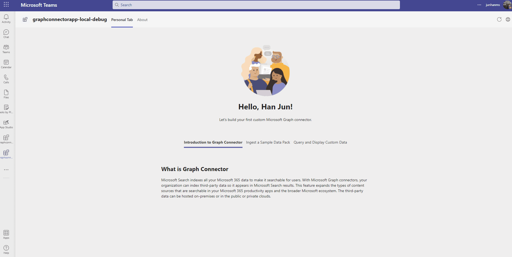
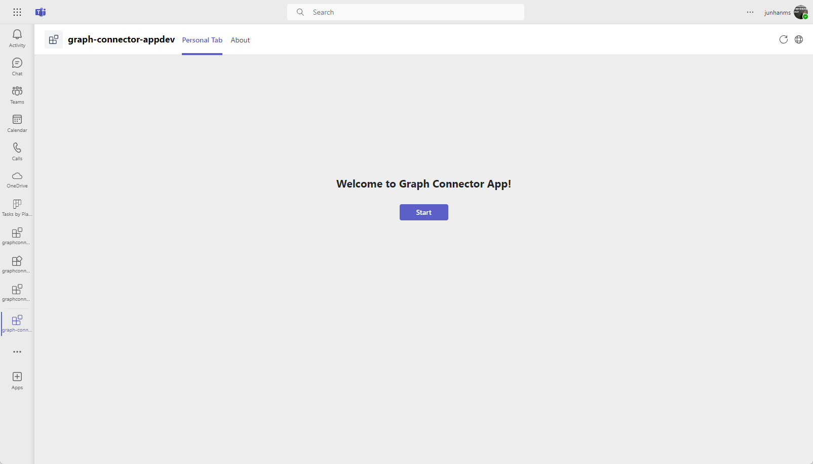
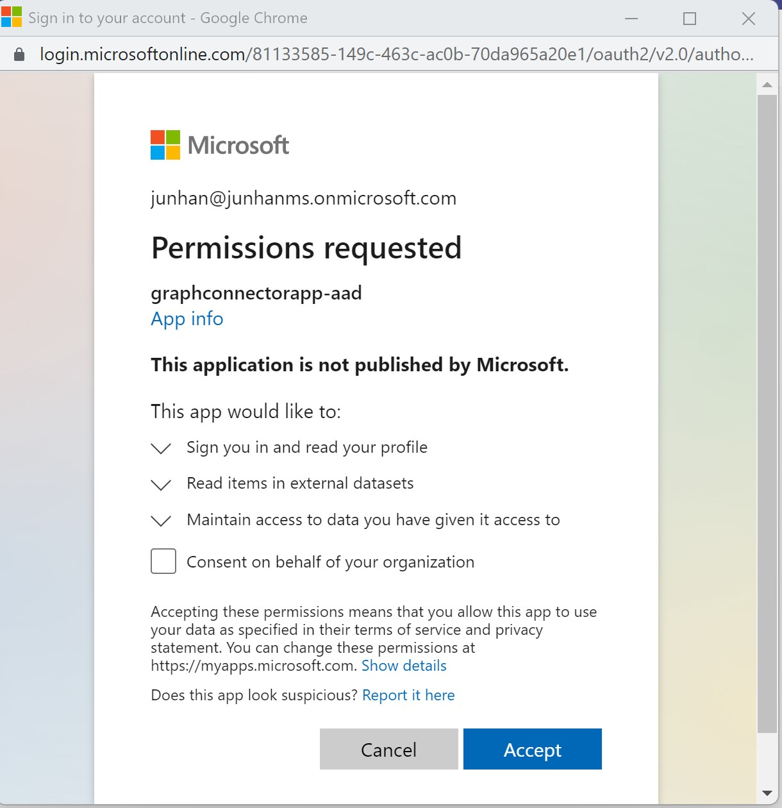
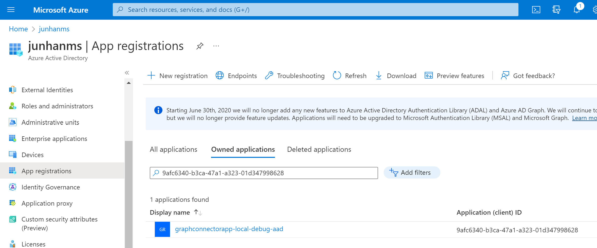
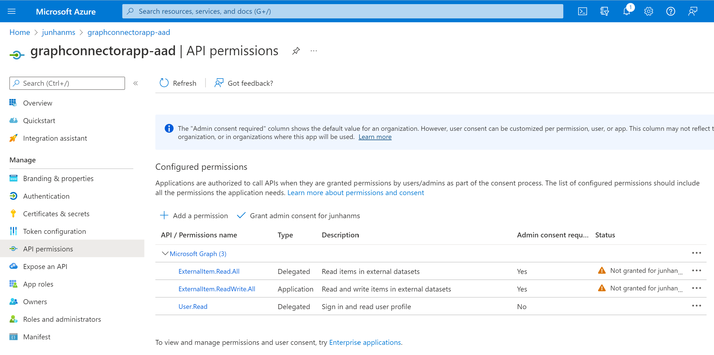
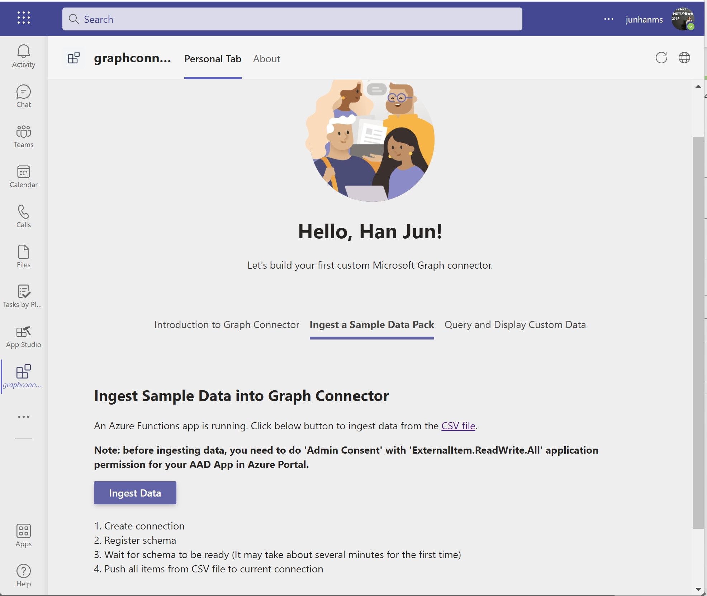
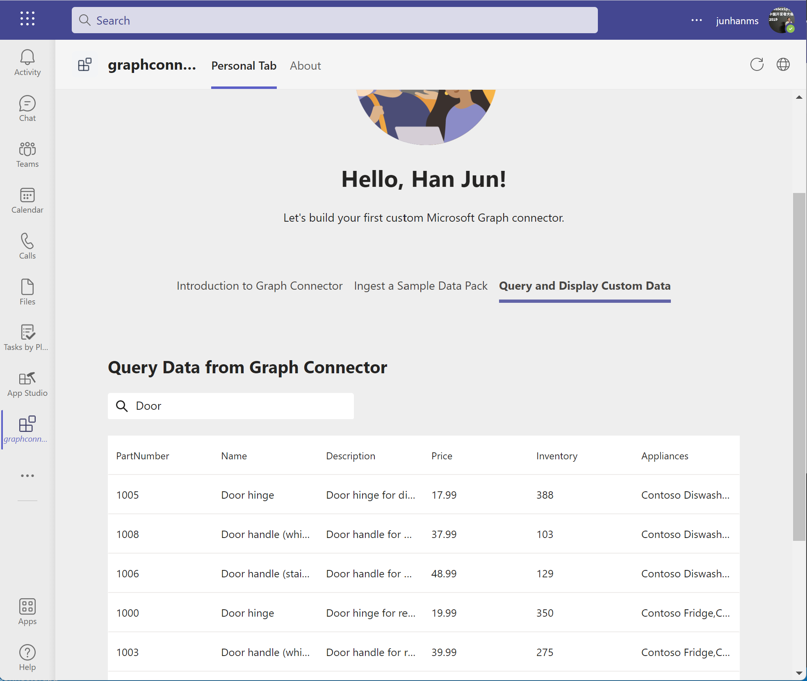

# Getting Started with Graph Connector App

This sample app showcases how to build custom Graph Connector with Azure Functions and query data using Microsoft Graph Client and TeamsFx SDK.

> Note: This sample will only provision [single tenant](https://learn.microsoft.com/azure/active-directory/develop/single-and-multi-tenant-apps#who-can-sign-in-to-your-app) Azure Active Directory app. For multi-tenant support, please refer to this [wiki](https://aka.ms/teamsfx-multi-tenant).

## This sample illustrates
- How to use TeamsFx to build frontend hosting on Azure for your tab app.
- How to use TeamsFx to build backend hosting on Azure for your tab app.
- How to use Microsoft Graph API to build a custom Graph Connector.

## Prerequisite to use this sample
- [Node.js](https://nodejs.org/), supported versions: 16, 18
- An [Azure subscription](https://azure.microsoft.com/en-us/free/)
- A Microsoft 365 account. If you do not have Microsoft 365 account, apply one from [Microsoft 365 developer program](https://developer.microsoft.com/en-us/microsoft-365/dev-program)
- [Teams Toolkit Visual Studio Code Extension](https://aka.ms/teams-toolkit) version 5.0.0 and higher or [TeamsFx CLI](https://aka.ms/teamsfx-cli)

## Minimal path to awesome

### Run the app locally
1. Clone the repo to your local workspace or directly download the source code.
1. Open the project in Visual Studio Code.
1. Open Debug View (`Ctrl+Shift+D`) and select "Debug (Edge)" or "Debug (Chrome)" in dropdown list.
1. Press "F5" to open a browser window and then select your package to view contact exporter sample app.

### Deploy the app to Azure
> If you don't have an Azure subscription, create [a free account](https://azure.microsoft.com/en-us/free/) before you begin
1. Open the command palette and select `Teams: Provision`. You will be asked to select Azure resource group to provision the sample.
1. Once provision is completed, open the command palette and select `Teams: Deploy`.

### Preview the app in Teams
1. Once deployment is completed, you can preview the APP running in Azure. In Visual Studio Code, open `Run and Debug` and select `Launch Remote (Edge)` or `Launch Remote (Chrome)` in the dropdown list and Press `F5` or green arrow button to open a browser.

#### Usage of this sample
1. The APP will look like this when it runs for the first time.

    

1. For the first time to run the app, you need to consent the APP to use Microsoft Graph API. Click on "Accept" button to accept the Authorization.

    

1. Before ingesting data, you need to do 'Admin Consent' with 'ExternalConnection.ReadWrite.OwnedBy' and 'ExternalItem.ReadWrite.All' application permissions for your AAD App in Azure Portal.

    1. Find the client id from the value of `AAD_APP_CLIENT_ID` in `env\.env.xxx` file (e.g. `.env.local` for local environment, `.env.dev` for dev environment).

    1. Sign in to Azure Portal with Microsoft 365 account.

    1. In 'App registrations' blade of Azure Active Directory in Azure Portal, search the client id to find the AAD Application.

        

    1. In 'API Permissions' blade, click 'Grant admin consent'.

        

1. You could try to ingest data into custom Graph Connector.

    > **Note**: It may take about several minutes for the first time.

    > In addition, you could go to [Microsoft 365 admin center](https://admin.microsoft.com/Adminportal/Home#/MicrosoftSearch/connectors) to see the status of custom Graph Connector.

    > If you meet with error of `400` status code, you could try to delete the connection in [Microsoft 365 admin center](https://admin.microsoft.com/Adminportal/Home#/MicrosoftSearch/connectors) and ingest data again.

    

1. You could try to query data from custom Graph Connector.

    

## Version History
|Date| Author| Comments|
|---|---|---|
| Apr 13, 2022 | junhan | update to support Teams Toolkit v4.0.0 |
| Mar 21, 2023 | junhan | update to support Teams Toolkit v5.0.0 |

## Feedback
We really appreciate your feedback! If you encounter any issue or error, please report issues to us following the [Supporting Guide](https://github.com/OfficeDev/TeamsFx-Samples/blob/dev/SUPPORT.md). Meanwhile you can make [recording](https://aka.ms/teamsfx-record) of your journey with our product, they really make the product better. Thank you!
