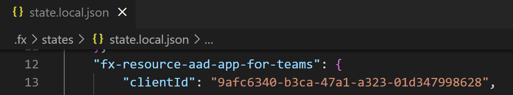
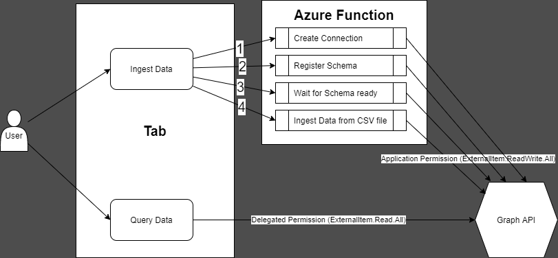

# Getting Started with Graph Connector Sample

> Note: We really appreciate your feedback! If you encounter any issue or error, please report issues to us following the [Supporting Guide](./../SUPPORT.md). Meanwhile you can make [recording](https://aka.ms/teamsfx-record) of your journey with our product, they really make the product better. Thank you!
>  
> This warning will be removed when the samples are ready for production.

This sample app showcases how to build custom Graph Connector with Azure Functions and query data using Microsoft Graph Client and TeamsFx SDK.

## Prerequisite
- [NodeJS](https://nodejs.org/en/), fully tested on NodeJS 14, 16
- An [Azure subscription](https://azure.microsoft.com/en-us/free/)
- An M365 account. If you do not have M365 account, apply one from [M365 developer program](https://developer.microsoft.com/en-us/microsoft-365/dev-program)

## What you will learn in this sample:
- How to use TeamsFx to build frontend hosting on Azure for your tab app.
- How to use TeamsFx to build backend hosting on Azure for your tab app.
- How to use Microsoft Graph API to build a custom Graph Connector.

## Try the Sample with Visual Studio Code Extension:

### Local Debug the Sample
1. Clone the repo to your local workspace or directly download the source code.
1. Download [Visual Studio Code](https://code.visualstudio.com) and install [Teams Toolkit Visual Studio Code Extension](https://aka.ms/teams-toolkit).
1. Open the project in Visual Studio Code.
1. Open Debug View (`Ctrl+Shift+D`) and select "Debug (Edge)" or "Debug (Chrome)" in dropdown list.
1. Press "F5" to open a browser window and then select your package to view contact exporter sample app. 

### (Optional) Provision and Deploy the Sample to Azure
> If you don't have an Azure subscription, create [a free account](https://azure.microsoft.com/en-us/free/) before you begin
1. Open the command palette and select `Teams: Provision in the cloud`. You will be asked to select Azure resource group to provision the sample.
1. Once provision is completed, open the command palette and select `Teams: Deploy to the cloud`.
1. Once deployment is completed, you can preview the APP running in Azure. In Visual Studio Code, open `Run and Debug` and select `Launch Remote (Edge)` or `Launch Remote (Chrome)` in the dropdown list and Press `F5` or green arrow button to open a browser.

## Use the APP in Teams
1. The APP will look like this when it runs for the first time.

    

1. For the first time to run the app, you need to consent the APP to use Microsoft Graph API. Click on "Accept" button to accept the Authorization.

    

1. Before ingesting data, you need to do 'Admin Consent' with 'ExternalItem.ReadWrite.All' application permission for your AAD App in Azure Portal.

    1. Find the client id in `.fx\states\state.xxx.json` file (e.g. `state.local.json` for local environment, `state.dev.json` for dev environment).

        

    1. Sign in to Azure Portal with M365 account.
    
    1. In 'App registrations' blade of Azure Active Directory in Azure Portal, search the client id to find the AAD Application.

        

    1. In 'API Permissions' blade, click 'Grant admin consent'.

        

1. You could try to ingest data into custom Graph Connector. 

    > **Note**: It may take about several minutes for the first time.

    > In addition, you could go to [Microsoft 365 admin center](https://admin.microsoft.com/Adminportal/Home#/MicrosoftSearch/connectors) to see the status of custom Graph Connector.

    > If you meet with error of `400` status code, you could try to delete the connection in [Microsoft 365 admin center](https://admin.microsoft.com/Adminportal/Home#/MicrosoftSearch/connectors) and ingest data again.

    

1. You could try to query data from custom Graph Connector.

    

## Architecture

- The frontend is a React tab app hosted on [Azure Storage](https://docs.microsoft.com/en-us/azure/storage/).
- The backend server is hosted on [Azure Function](https://docs.microsoft.com/en-us/azure/azure-functions/).

### Code structure

- You can check app configuration and environment information in: [.fx](.fx)
- You will find frontend code in: [tabs/src/components](tabs/src/components)
- You will find backend code in: [api](api)

## Code of Conduct
This project has adopted the [Microsoft Open Source Code of Conduct](https://opensource.microsoft.com/codeofconduct/).

For more information see the [Code of Conduct FAQ](https://opensource.microsoft.com/codeofconduct/faq/) or
contact [opencode@microsoft.com](mailto:opencode@microsoft.com) with any additional questions or comments.