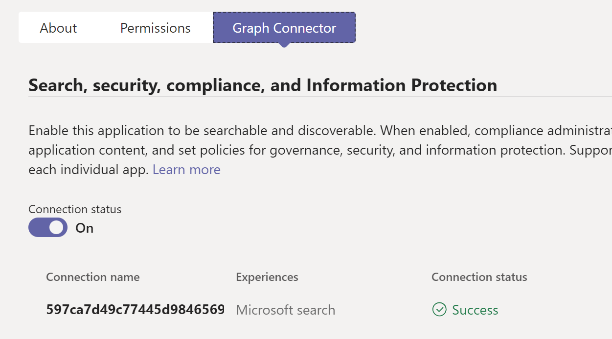

# Getting Started with Graph Connector Bot

This sample app showcases how to build a Teams command bot that queries custom data ingested into Microsoft Graph using Graph connector.

## This sample illustrates
- How to handle webhook notification when Graph connector is turned on or off in Teams Admin Center.
- How to use Microsoft Graph API to integrate with Microsoft Graph connector.
- How to use TeamsFx SDK to build bot to query data from Microsoft Graph connector.

## Prerequisite to use this sample
- [Node.js](https://nodejs.org/), supported versions: 16, 18
- An [Azure subscription](https://azure.microsoft.com/en-us/free/)
- An Microsoft 365 account with admin permission. If you do not have M365 account, apply one from [M365 developer program](https://developer.microsoft.com/en-us/microsoft-365/dev-program)
- [Teams Toolkit Visual Studio Code Extension](https://aka.ms/teams-toolkit) version 5.0.0 and higher or [TeamsFx CLI](https://aka.ms/teams-toolkit-cli)

## Minimal path to awesome

### Run the app locally
1. Clone the repo to your local workspace or directly download the source code.
1. Open the project in Visual Studio Code.
1. Open Debug View (`Ctrl+Shift+D`) and select "Debug in Teams (Edge)" or "Debug in Teams (Chrome)" in dropdown list.
1. Press "F5" to open a browser window and then select your package to view sample app.
1. Find the Teams package in `build\appPackage\appPackage.local.zip`.
1. Navigate to [Teams Admin Center](https://admin.teams.microsoft.com/policies/manage-apps), and upload the Teams package.
    > **Note**: If you are testing in a new debug session again, you need to delete the existing Teams app in Teams Admin Center and upload a new one, since the tunnel endpoint will change when you start a new debug session.

### Deploy the app to Azure
> If you don't have an Azure subscription, create [a free account](https://azure.microsoft.com/en-us/free/) before you begin
1. Open the command palette and select `Teams: Provision`. You will be asked to select Azure resource group to provision the sample.
1. Once provision is completed, open the command palette and select `Teams: Deploy`.

### Preview the app in Teams
1. Once deployment is completed, you can preview the APP running in Azure. In Visual Studio Code, open `Run and Debug` and select `Launch Remote (Edge)` or `Launch Remote (Chrome)` in the dropdown list and Press `F5` or green arrow button to open a browser.
1. Use Teams Toolkit to [publish your Teams app to your organization](https://docs.microsoft.com/en-us/microsoftteams/platform/toolkit/publish#publish-to-your-organization).

#### Usage of this sample
1. Navigate to 'Graph Connector' section of the Teams app in [Teams Admin Center](https://admin.teams.microsoft.com/policies/manage-apps), and click 'Grant permissions'.

    

1. Wait for connection status to be ready.

    > **Note**: It may take about several minutes.

    

1. In Teams, type `query <query string>` in bot conversation to query data from Graph connector.

    

1. In 'Graph Connector' section of Teams Admin Center, you could toggle the 'Connection status' to turn off Graph connector, then the connection will be deleted.

## Version History
|Date| Author| Comments|
|---|---|---|
| Sep 8, 2022 | junhan | update to support Teams Toolkit v4.0.0 |
| Mar 21, 2023 | junhan | update to support Teams Toolkit v5.0.0 |

## Feedback
We really appreciate your feedback! If you encounter any issue or error, please report issues to us following the [Supporting Guide](https://github.com/OfficeDev/TeamsFx-Samples/blob/dev/SUPPORT.md). Meanwhile you can make [recording](https://aka.ms/teamsfx-record) of your journey with our product, they really make the product better. Thank you!
