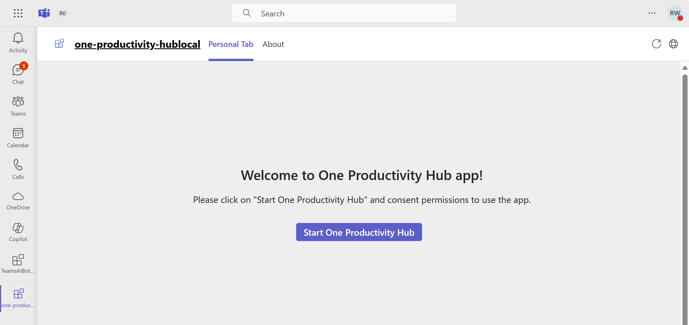
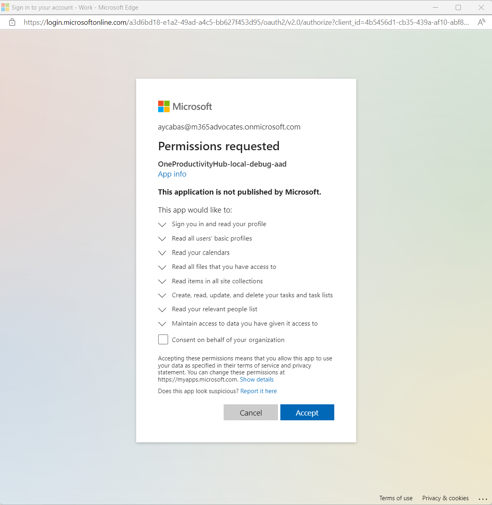
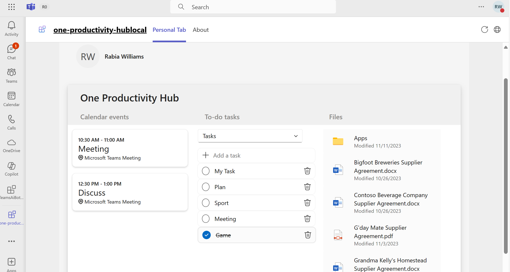

# Getting Started with One Productivity Hub Sample

> Note: We really appreciate your feedback! If you encounter any issue or error, please report issues to us following the [Supporting Guide](https://github.com/OfficeDev/TeamsFx-Samples/blob/dev/SUPPORT.md). Meanwhile you can make [recording](https://aka.ms/teamsfx-record) of your journey with our product, they really make the product better. Thank you!
>  
> This warning will be removed when the samples are ready for production.

One Productivity Hub sample shows you how to build a tab for viewing your calendar events, to-do tasks and files by using [Microsoft Graph Toolkit](https://docs.microsoft.com/en-us/graph/toolkit/overview) components and [TeamsFx Provider](https://www.npmjs.com/package/@microsoft/mgt-teamsfx-provider).


## Prerequisite

- [NodeJS](https://nodejs.org/en/), fully tested on NodeJS 14, 16
- A Microsoft 365 account. If you do not have Microsoft 365 account, apply one from [Microsoft 365 developer program](https://developer.microsoft.com/en-us/microsoft-365/dev-program)
- Latest [Teams Toolkit Visual Studio Code Extension](https://aka.ms/teams-toolkit)

## What you will learn in this sample

- How to use TeamsFx to build frontend hosting on Azure for your tab app.
- How to integration TeamsFx with Microsoft Graph Toolkit library.

## Try the Sample with Visual Studio Code Extension

### Local Debug the Sample

1. Clone the repo to your local workspace or directly download the source code.
1. Download [Visual Studio Code](https://code.visualstudio.com) and install [Teams Toolkit Visual Studio Code Extension](https://aka.ms/teams-toolkit).
1. Open the project in Visual Studio Code.
1. Open Debug View (`Ctrl+Shift+D`) and select "Debug (Edge)" or "Debug (Chrome)" in dropdown list.
1. Press "F5" to open a browser window and then select your package to view one productivity hub app.

### Provision and Deploy the Sample to Azure

> If you don't have an Azure subscription, create [a free account](https://azure.microsoft.com/en-us/free/) before you begin

1. Open the command palette and select `Teams: Provision in the cloud`. You will be asked to select Azure resource group to provision the sample.
1. Once provision is completed, open the command palette and select `Teams: Deploy to the cloud`.
1. Once deployment is completed, you can preview the APP running in Azure. In Visual Studio Code, open `Run and Debug` and select `Launch Remote (Edge)` or `Launch Remote (Chrome)` in the dropdown list and Press `F5` or green arrow button to open a browser.

## Try the Sample with TeamsFx CLI

> If you don't have an Azure subscription, create [a free account](https://azure.microsoft.com/en-us/free/) before you begin

1. Install [Node.js](https://nodejs.org/en/download/) (use the latest v14 LTS release)
1. To install the TeamsFx CLI, use the npm package manager:

    ```
    npm install -g @microsoft/teamsfx-cli
    ```

1. To clone this sample project, run the following command:

    ```
    teamsfx new template graph-toolkit-one-productivity-hub
    ```

1. In the sample project folder, run provision command.

    ```
    teamsfx provision
    ```

1. Deploy the sample project.

    ```
    teamsfx deploy
    ```

1. Once your deployment is completed, You can open the project in Visual Studio Code, open `Run and Debug` and select `Launch Remote (Edge)` or `Launch Remote (Chrome)` in the dropdown list and Press `F5` or green arrow button to open a browser.

## Use the app in Teams

1. The app will look like this when it runs for the first time. Select **Start One Productivity Hub** to enable the app for your account.

    

1. For the first time to run the app, you need to consent the required permissions for Microsoft Graph. Select **Accept** to consent permissions.

    

1. Scroll down to review your calendar events, to-do tasks and file folders in One Productivity Hub tab.

    

## Code structure

- You can check app configuration and environment information in: [.fx](.fx)
- You will find frontend code in: [tabs/src/components](tabs/src/components)
- You will find authentication code in: [public](tabs/public/)

## Code of Conduct

This project has adopted the [Microsoft Open Source Code of Conduct](https://opensource.microsoft.com/codeofconduct/).

For more information see the [Code of Conduct FAQ](https://opensource.microsoft.com/codeofconduct/faq/) or
contact [opencode@microsoft.com](mailto:opencode@microsoft.com) with any additional questions or comments.
