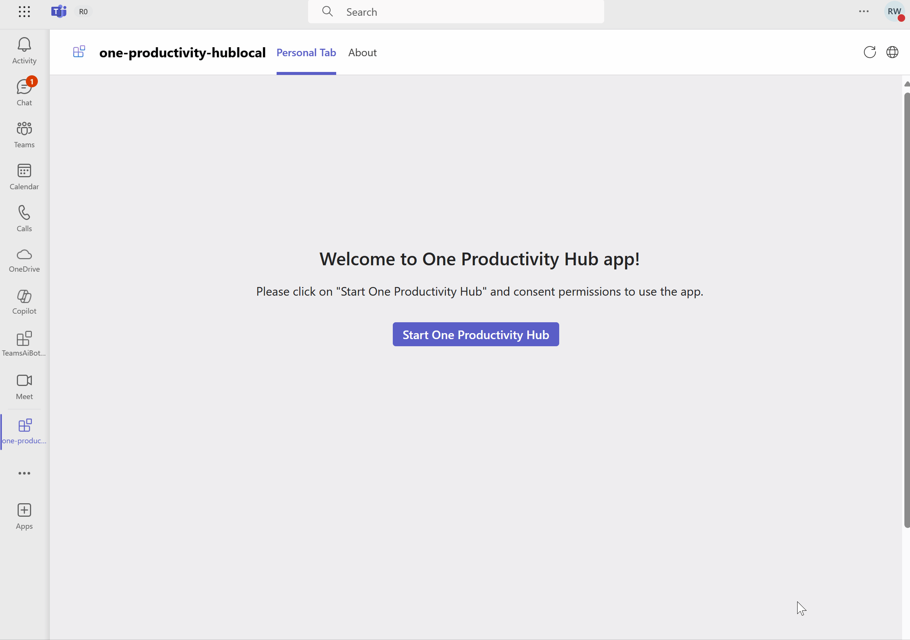

# Getting Started with One Productivity Hub

One Productivity Hub sample shows you how to build a tab for viewing your calendar events, to-do tasks and files by using [Microsoft Graph Toolkit](https://docs.microsoft.com/en-us/graph/toolkit/overview) components and [TeamsFx Provider](https://www.npmjs.com/package/@microsoft/mgt-teamsfx-provider).

> Note: This sample will only provision [single tenant](https://learn.microsoft.com/azure/active-directory/develop/single-and-multi-tenant-apps#who-can-sign-in-to-your-app) Azure Active Directory app. For multi-tenant support, please refer to this [wiki](https://aka.ms/teamsfx-multi-tenant).

## This sample illustrates

- How to use TeamsFx to build frontend hosting on Azure for your tab app.
- How to integration TeamsFx with Microsoft Graph Toolkit library.

## Prerequisite to use this sample

- [Node.js](https://nodejs.org/) version 16, 18
- A Microsoft 365 tenant in which you have permission to upload Teams apps. You can get a free Microsoft 365 developer tenant by joining the [Microsoft 365 developer program](https://developer.microsoft.com/en-us/microsoft-365/dev-program).
- [Teams Toolkit Visual Studio Code Extension](https://aka.ms/teams-toolkit) version 5.0.0 and higher or [TeamsFx CLI](https://aka.ms/teams-toolkit-cli)

## Minimal path to awesome

### Run the app locally

- From VSCode

  1. Clone the repo to your local workspace or directly download the source code.
  1. Open the project in Visual Studio Code.
  1. Open Debug View (`Ctrl+Shift+D`) and select "Debug in Teams (Edge)" or "Debug in Teams (Chrome)" in dropdown list.
  1. Press "F5" to open a browser window and then select your package to view contact exporter sample app.

- From TeamsFx CLI
  1. Run command: `teamsapp provision --env local` .
  1. Run command: `teamsapp deploy --env local` .
  1. Run command: `teamsapp preview --env local` .

### Deploy the app to Azure

> If you don't have an Azure subscription, create [a free account](https://azure.microsoft.com/en-us/free/) before you begin

- From VSCode

  1. Sign in to Azure by clicking `Sign in to Azure` under the `ACCOUNTS` section from sidebar.
  1. Click `Provision` from `LIFECYCLE` section or open the command palette and select: `Teams: Provision`.
  1. Click `Deploy` or open the command palette and select: `Teams: Deploy`.

- From TeamsFx CLI
  1. Run command: `teamsapp auth login azure`.
  1. Run command: `teamsapp provision --env dev`.
  1. Run command: `teamsapp deploy --env dev`.

### Preview the app in Teams

- From VSCode:
  1. Once deployment is completed, you can preview the APP running in Azure. In Visual Studio Code, open `Run and Debug` and select `Launch Remote (Edge)` or `Launch Remote (Chrome)` in the dropdown list and Press `F5` or green arrow button to open a browser.
- From TeamsFx CLI:
  1. Run command: `teamsapp preview --env dev`.

## Advanced usage of this sample

1. The app will look like this when it runs for the first time. Select **Start One Productivity Hub** to enable the app for your account.

   

1. For the first time to run the app, you need to consent the required permissions for Microsoft Graph. Select **Accept** to consent permissions.

   

1. Scroll down to review your calendar events, to-do tasks and file folders in One Productivity Hub tab.

   

## Known issues

- This template has adopted [Authorization Code Flow](https://docs.microsoft.com/en-us/azure/active-directory/develop/v2-oauth2-auth-code-flow) to implement SSO. There's a known limitation with mobile platforms such as iOS and a few Android versions where users have to sign in again as the state was not stored due to [third party cookie being blocked by the browser](https://webkit.org/blog/10218/full-third-party-cookie-blocking-and-more).

- Due to system webview limitations, users in the tenant with conditional access policies applied cannot consent permissions when conduct an OAuth flow within the Teams mobile clients, it would show error: "xxx requires you to secure this device...".

To achieve full SSO experience, we will recommend you to implement OBO flow to pass your token to a server. See more [here](https://learn.microsoft.com/en-us/microsoftteams/platform/tabs/how-to/authentication/tab-sso-code#pass-the-access-token-to-server-side-code).

## Version History

| Date         | Author  | Comments                               |
| ------------ | ------- | -------------------------------------- |
| Jul 17, 2022 | aycabas | update to support Teams Toolkit v4.0.0 |
| Mar 17, 2023 | rentu   | update to support Teams Toolkit v5.0.0 |

## Feedback

We really appreciate your feedback! If you encounter any issue or error, please report issues to us following the [Supporting Guide](https://github.com/OfficeDev/TeamsFx-Samples/blob/dev/SUPPORT.md). Meanwhile you can make [recording](https://aka.ms/teamsfx-record) of your journey with our product, they really make the product better. Thank you!
