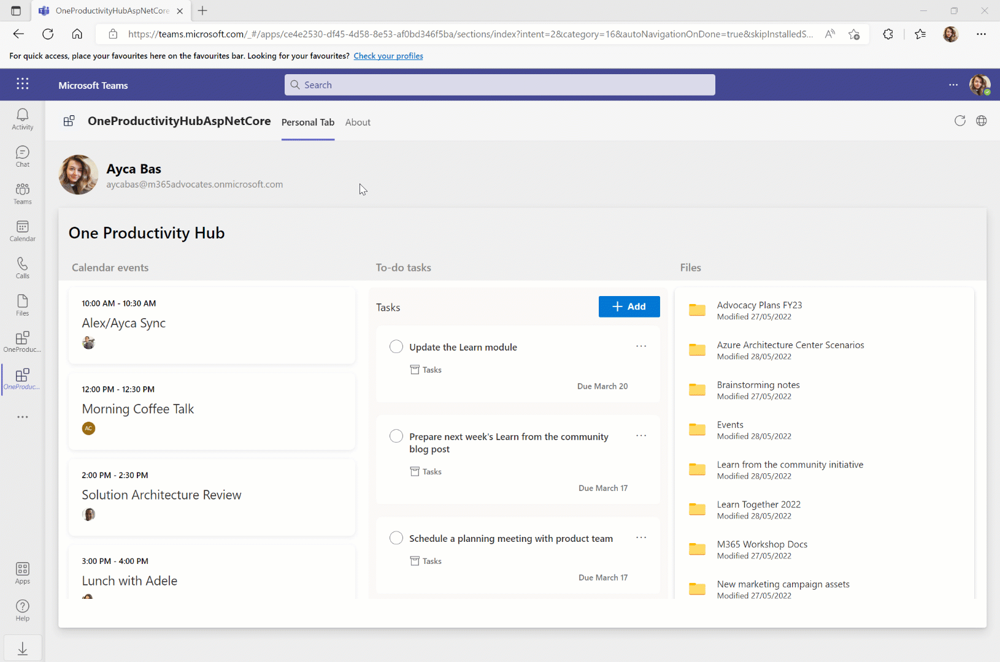
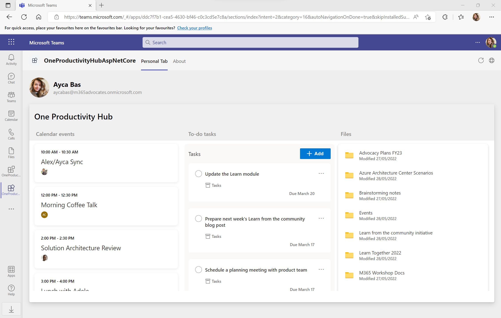

# Getting Started with Graph Productivity Hub for ASP.NET Core

One Productivity Hub sample shows you how to build a tab for viewing your calendar events, to-do tasks and files by using [Microsoft Graph Toolkit](https://docs.microsoft.com/en-us/graph/toolkit/overview) components and [MSAL2 Provider](https://docs.microsoft.com/en-us/graph/toolkit/providers/msal2).

## What you will learn in this sample

- How to use TeamsFx to build frontend hosting on Azure for your tab app.
- How to integration TeamsFx with Microsoft Graph Toolkit library.

## Prerequisite to use this sample
- [Visual Studio 2022](https://visualstudio.microsoft.com/), version 17.3 or higher.
- A Microsoft 365 tenant in which you have permission to upload Teams apps. You can get a free Microsoft 365 developer tenant by joining the [Microsoft 365 developer program](https://developer.microsoft.com/en-us/microsoft-365/dev-program).
- Latest [Teams Toolkit for Visual Studio](https://docs.microsoft.com/en-us/microsoftteams/platform/toolkit/teams-toolkit-overview-visual-studio).

## Minimal path to awesome
1. Clone the repo to your local workspace or directly download the source code.
1. Download [Visual Studio](https://visualstudio.microsoft.com/) and install [Teams Toolkit for Visual Studio Extension](https://docs.microsoft.com/en-us/microsoftteams/platform/toolkit/visual-studio-overview).
1. Open the project in Visual Studio.
1. Right click to the project, select **Teams Toolkit > Prepare Teams App Dependencies**.
1. Press "F5" to open a browser window and then select your package to view one productivity hub app.

### Deploy the app to Azure

> If you don't have an Azure subscription, create [a free account](https://azure.microsoft.com/en-us/free/) before you begin

You can create and automatically configure cloud resources for hosting your app in Azure using Teams Toolkit.

1. Select the **OneProductivityHubNetCore > Teams Toolkit > Provision in the Cloud** menu.
1. In the Select your subscription window, choose the Azure subscription you want to use to create resources with.

Teams Toolkit will create Azure resources in this subscription but no code is deployed during this step. To deploy your project to these new resources:

1. Select the **OneProductivityHubNetCore > Teams Toolkit > Deploy in the Cloud** menu.

### Preview the app in Teams
1. Once deployment is completed, you can preview the APP running in Azure. In Visual Studio, right click the project, select `Teams Toolkit ->  Preview in Teams` in the context menu to preview the app in the browser.

## Advanced usage of this sample

1. If you are running the for the first time, you need to consent the required permissions for Microsoft Graph. Select **Accept** to consent permissions.

    

1. Scroll down to review your calendar events, to-do tasks and file folders in One Productivity Hub tab.

    

## Version History
|Date| Author| Comments|
|---|---|---|
|Mar 17, 2023| rentu | update to support Teams Toolkit v5.0.0|

## Feedback
We really appreciate your feedback! If you encounter any issue or error, please report issues to us following the [Supporting Guide](https://github.com/OfficeDev/TeamsFx-Samples/blob/dev/SUPPORT.md). Meanwhile you can make [recording](https://aka.ms/teamsfx-record) of your journey with our product, they really make the product better. Thank you!
