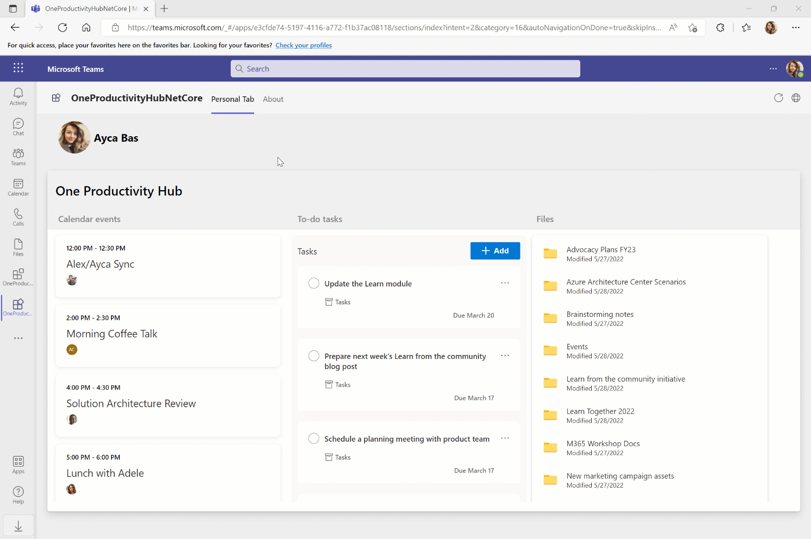
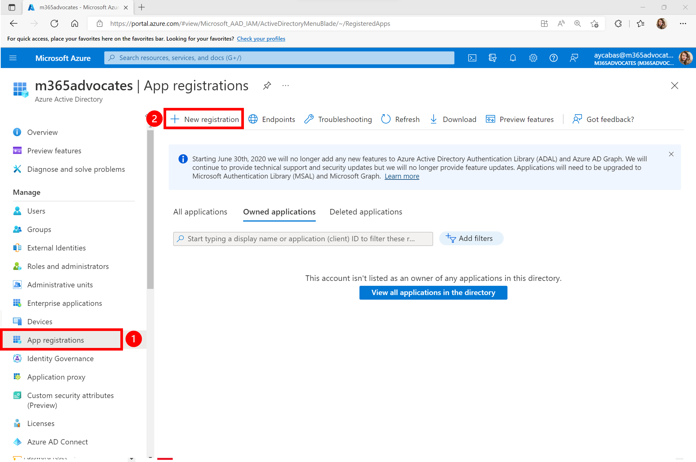
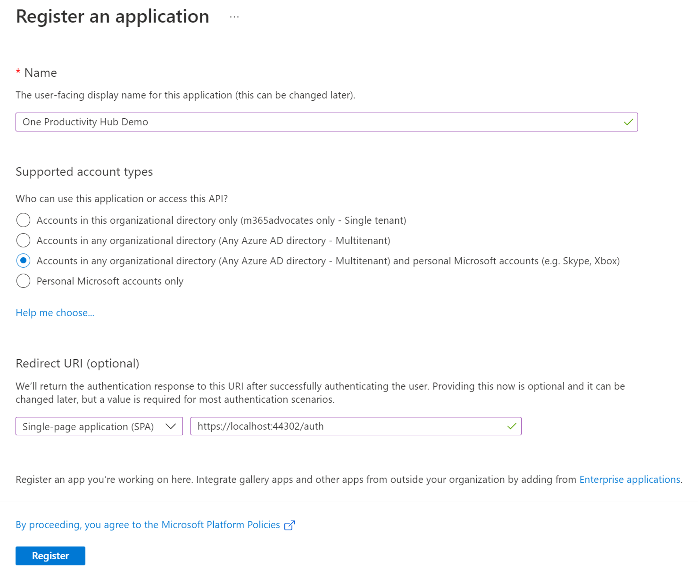
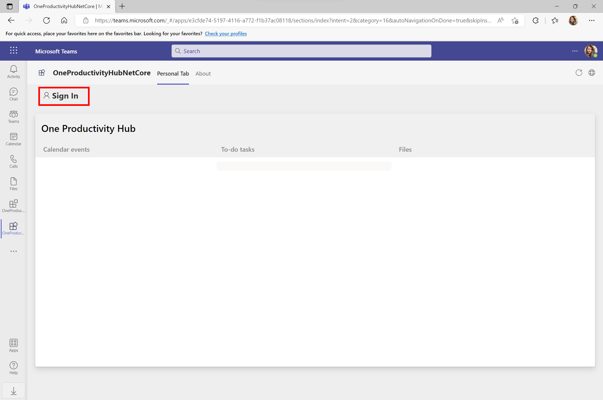

# Getting Started with One Productivity Hub ASP.NET Core Sample

> Note: We really appreciate your feedback! If you encounter any issue or error, please report issues to us following the [Supporting Guide](./../SUPPORT.md). Meanwhile you can make [recording](https://aka.ms/teamsfx-record) of your journey with our product, they really make the product better. Thank you!
>  
> This warning will be removed when the samples are ready for production.

One Productivity Hub sample shows you how to build a tab for viewing your calendar events, to-do tasks and files by using [Microsoft Graph Toolkit](https://docs.microsoft.com/en-us/graph/toolkit/overview) components and [Teams MSAL2 Provider](https://docs.microsoft.com/en-us/graph/toolkit/providers/teams-msal2?tabs=ts).

## Prerequisite

- [Visual Studio 2022](https://visualstudio.microsoft.com/), version 17.3 or higher
- Latest [Teams Toolkit Visual Studio Extension](https://docs.microsoft.com/en-us/microsoftteams/platform/toolkit/visual-studio-overview)
- An M365 account. If you do not have M365 account, apply one from [M365 developer program](https://developer.microsoft.com/en-us/microsoft-365/dev-program)

## What you will learn in this sample

- How to use TeamsFx to build frontend hosting on Azure for your tab app.
- How to integration TeamsFx with Microsoft Graph Toolkit library.

## Try the Sample with Visual Studio Extension

### Local Debug the Sample

1. Clone the repo to your local workspace or directly download the source code.
1. Download [Visual Studio](https://visualstudio.microsoft.com/) and install [Teams Toolkit Visual Studio Extension](https://docs.microsoft.com/en-us/microsoftteams/platform/toolkit/visual-studio-overview).
1. Open the project in Visual Studio.
1. Right click to the project, select **Teams Toolkit > Prepare Teams App Dependencies**.
1. Register an application in the Azure Active Directory to enable user authentication for your application:
    - Go to [Azure Portal](https://portal.azure.com) and sign in with your Microsoft 365 Developer Program tenant.
    - Select **Azure Active Directory** from the left pane, select **App Registration** and click on **New Registration**.

        

    - Complete the **Register an application** form with the following values, and then select **Register**.
        - **Name**: One Productivity Hub Demo
        - **Supported account types**: Accounts in any organizational directory (Any Azure AD directory - Multitenant) and personal Microsoft accounts (e.g. Skype, Xbox)
        - **Redirect URI**: Select **Single-page application (SPA)** as a type of redirect URI and place `https://localhost:44302/auth` as a redirect URI to test locally.

        

    - Once app registration is completed, go to **Overview** tab in your application page and copy **Application (client) ID** and **Directory (tenant) ID**, you will need it in the following section.

1. In your project, select **Pages > Tab.razor** file, inside `mgt-teams-msal2-provider`: 
    - in **client-id**, replace `<YOUR_CLIENT_ID>` with the client ID copied from the Azure AD application.
    - in **authority**, replace `<YOUR_TENANT_ID>` with your tenant ID.
1. Press "F5" to open a browser window and then select your package to view one productivity hub app.

### Provision and Deploy the Sample to Azure

> If you don't have an Azure subscription, create [a free account](https://azure.microsoft.com/en-us/free/) before you begin

You can create and automatically configure cloud resources for hosting your app in Azure using Teams Toolkit.

1. Select the **OneProductivityHubNetCore > Teams Toolkit > Provision in the Cloud** menu.
1. In the Select your subscription window, choose the Azure subscription you want to use to create resources with.

Teams Toolkit will create Azure resources in this subscription but no code is deployed during this step. To deploy your project to these new resources:

1. Select the **OneProductivityHubNetCore > Teams Toolkit > Deploy in the Cloud** menu.

## Use the app in Teams

1. The app will look like this when it runs for the first time. Select **Sign in** to enable the app for your account.

    

1. For the first time to run the app, you need to consent the required permissions for Microsoft Graph. Select **Accept** to consent permissions.

    

1. Scroll down to review your calendar events, to-do tasks and file folders in One Productivity Hub tab.

    
## Code structure

- You can check app configuration and environment information in: [OneProductivityHubNetCore/.fx](OneProductivityHubNetCore/.fx)
- You will find Microsoft Graph Toolkit SDK code in: [OneProductivityHubNetCore/_Host.cshtml](OneProductivityHubNetCore/_Host.cshtml)
- You will find frontend code in: [OneProductivityHubNetCore/Pages/tab.razor](OneProductivityHubNetCore/Pages/tab.razor)
- You will find authentication code in: [OneProductivityHubNetCore/Auth.cshtml](OneProductivityHubNetCore/Auth.cshtml)

## Code of Conduct

This project has adopted the [Microsoft Open Source Code of Conduct](https://opensource.microsoft.com/codeofconduct/).

For more information see the [Code of Conduct FAQ](https://opensource.microsoft.com/codeofconduct/faq/) or
contact [opencode@microsoft.com](mailto:opencode@microsoft.com) with any additional questions or comments.