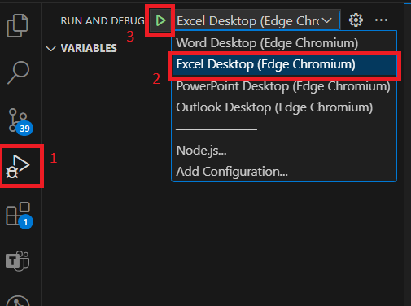
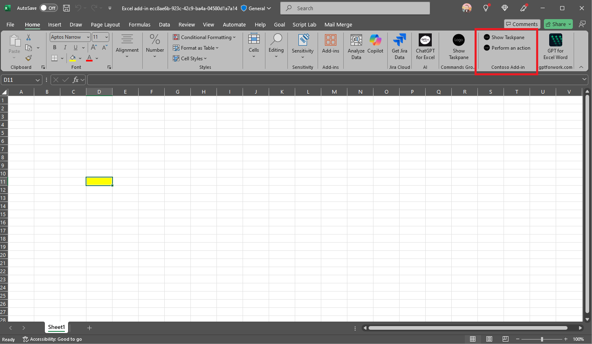
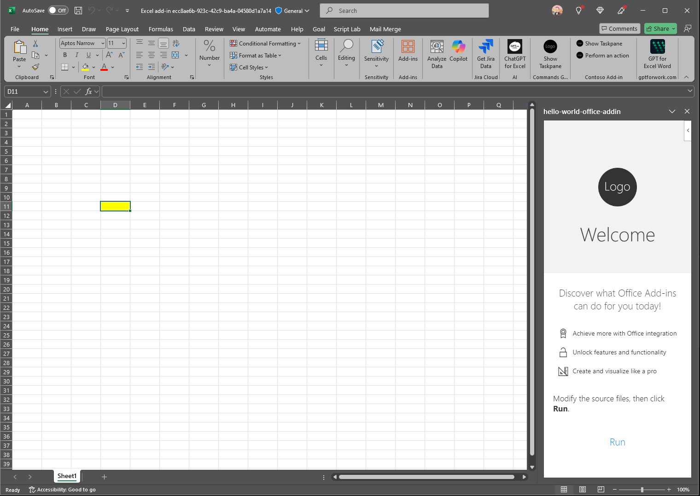

# Getting Started with Hello World Office Add-in Sample

Office add-ins are integrations built by third parties into Office by using our web-based platform.

Now you have the ability to create a single unit of distribution for all your Office applications by using the same manifest format and schema, based on the current JSON-formatted MetaOS manifest.

## This sample illustrates

- How to create an Office add-in with a unified manifest that works on Word, Excel, Powerpoint, and Outlook. 

> [!NOTE]
> The unified app manifest for Word, Excel, and PowerPoint is in preview. Visit [this link](https://aka.ms/officeversions) to check the required Office Versions. Also, publishing a unified add-in for Word, Excel, PowerPoint is not supported currently. 

## Prerequisites to use this sample

* Download and install [Visual Studio Code](https://visualstudio.microsoft.com/downloads/).
* [Microsoft 365 Agents Toolkit Visual Studio Code Extension version](https://aka.ms/teams-toolkit) 5.0.0 and higher or [Microsoft 365 Agents Toolkit CLI](https://aka.ms/teams-toolkit-cli)
* Node.js (the latest LTS version). Visit the [Node.js site](https://nodejs.org/) to download and install the right version for your operating system. To verify if you've already installed these tools, run the commands node -v and npm -v in your terminal.
* Microsoft Office connected to a Microsoft 365 subscription. You might qualify for a Microsoft 365 E5 developer subscription through the [Microsoft 365 Developer Program](https://developer.microsoft.com/microsoft-365/dev-program), see [FAQ](https://learn.microsoft.com/office/developer-program/microsoft-365-developer-program-faq#who-qualifies-for-a-microsoft-365-e5-developer-subscription-) for details. Alternatively, you can [sign up for a 1-month free trial](https://www.microsoft.com/microsoft-365/try?rtc=1) or [purchase a Microsoft 365 plan](https://www.microsoft.com/microsoft-365/buy/compare-all-microsoft-365-products).

## Minimal path to awesome

### Debug Office add-in

Please note that the same M365 account should be used both in Microsoft 365 Agents Toolkit and Office Applications (Word, Excel, Powerpoint, Outlook).

The following steps show Excel as an example, and the other Office applications share the same behavior. 
- From Visual Studio Code only: use the `Run and Debug Activity Panel` in Visual Studio Code, select `Debug in Excel Desktop (Edge Chromium)`, and click the `Run and Debug` green arrow button. Please run VSCode as administrator if localhost loopback for Microsoft Edge Webview hasn't been enabled. Once enbaled, administrator priviledge is no longer required.

   

- Once the Office app is open, you can select the ribbon command to show the add-in task pane.
   
- The taskpane opens and you can check the sideloaded add-in.
   

### Edit the manifest

You can find the app manifest in `./appPackage` folder. The folder contains the manifest file: `manifest.json`: Manifest file for Office add-in running locally.

You may add any extra properties or permissions you require to this file. See the [schema reference](https://docs.microsoft.com/en-us/microsoftteams/platform/resources/schema/manifest-schema) for more information.

### Validate manifest file

To check that your manifest file is valid:

- From Visual Studio Code: open the command palette and select: `Microsoft 365 Agents: Validate Application` and select `Validate using manifest schema`.
- From Microsoft 365 Agents Toolkit CLI: run command `atk validate` in your project directory.

## Version History

|Date| Author| Comments|
|---|---|---|
|Dec 06, 2024 | hermanwen | Init sample |

## Feedback

We really appreciate your feedback! If you encounter any issue or error, please report issues to us following the [Supporting Guide](https://github.com/OfficeDev/TeamsFx-Samples/blob/dev/SUPPORT.md). Meanwhile you can make [recording](https://aka.ms/teamsfx-record) of your journey with our product, they really make the product better. Thank you!