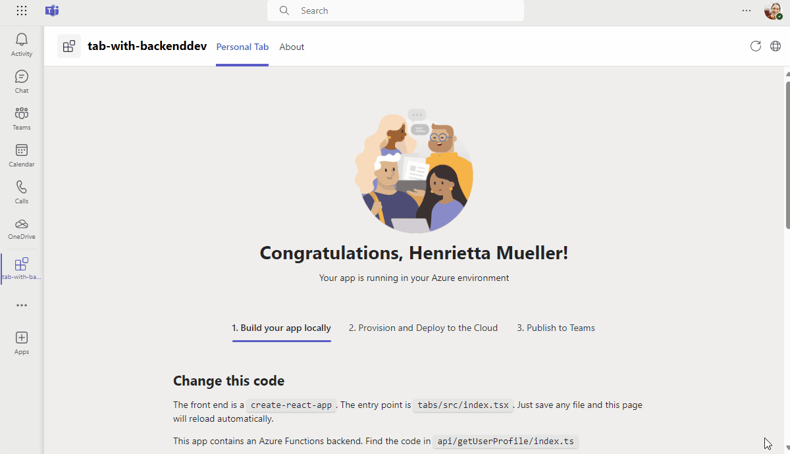

# Getting Started with Hello World Tab with Backend Sample in Docker

Microsoft Teams supports the ability to run web-based UI inside "custom tabs" that users can install either for just themselves (personal tabs) or within a team or group chat context.

Hello World Tab with Backend shows you how to build a tab app with an Azure Function as backend, how to get user login information with SSO and how to call Azure Function from frontend tab.

> Note: This sample will only provision [single tenant](https://learn.microsoft.com/azure/active-directory/develop/single-and-multi-tenant-apps#who-can-sign-in-to-your-app) Azure Active Directory app. For multi-tenant support, please refer to this [wiki](https://aka.ms/teamsfx-multi-tenant).

## This sample illustrates

- How to use Teams Toolkit to create a Teams tab app.
- How to use TeamsFx SDK to call Azure Functions.
- How to use TeamsFx SDK in Azure Function to call Graph to get user info.
- How to develop Teams tab app in Docker.

## Prerequisites

- [Docker Engine](https://docs.docker.com/engine/install/)
- A Microsoft 365 account. If you do not have Microsoft 365 account, apply one from [Microsoft 365 developer program](https://developer.microsoft.com/en-us/microsoft-365/dev-program)
- [Teams Toolkit Visual Studio Code Extension](https://aka.ms/teams-toolkit) version 5.0.0 and higher or [TeamsFx CLI](https://aka.ms/teams-toolkit-cli)
- [Azure Cli](https://learn.microsoft.com/cli/azure/install-azure-cli) for Azure Container Apps deployment

# Note
- This sample has adopted [On-Behalf-Of Flow](https://learn.microsoft.com/en-us/azure/active-directory/develop/v2-oauth2-on-behalf-of-flow) to implement SSO.

- This sample uses Azure Function as middle-tier service, and make authenticated requests to call Graph from Azure Function.

- Due to system webview limitations, users in the tenant with conditional access policies applied cannot consent permissions when conduct an OAuth flow within the Teams mobile clients, it would show error: "xxx requires you to secure this device...".

## Containerization of Teams App

Teams applications can be developed and run locally using containerization, which provides a consistent and isolated environment for testing and deployment. Containerizing your Teams app makes it easier to manage dependencies, scale efficiently, and maintain your app in production. Below are steps and references to help you containerize your Teams app.

### How to containerize

This sample demonstrate how to containerize a Teams App and integrate the Docker container into Teams Toolkit development lifecycle, which can serve as reference for your containerization process.

- **Write a Dockerfile**: Create a Dockerfile that specifies the build instructions for your container image. Refer to this [Dockerfile example](./Dockerfile)

- **Write a Compose File**: Create a Docker Compose file that defines the services, networks and volumes, expecially when there are multiple containers. Refer to this [Docker Compose file example](./docker-compose.yml)

- **Configure Debugging**: Configure `launch.json` and `tasks.json` to run Docker locally for debugging. Refer to this [VS Code launch.json example](./.vscode/launch.json) and [VS Code tasks.json example](./.vscode/tasks.json)

- **Provision Infrastructure**: Automate the provisioning of Azure Container Apps and Azure Container Registry using Bicep templates. Refer to this [Azure Bicep example](./infra/azure.bicep).

- **Build and Deploy to ACA**: Build the Docker image and push it to Azure Container Registry using Docker CLI. Deploy the image to Azure Container Apps using Azure CLI. Refer to the deployment scripts in this [teamsapp.yml example](./teamsapp.yml).

## Minimal path to awesome

### Run the app locally

- From VS Code:
    1. hit `F5` to start debugging. Alternatively open the `Run and Debug Activity` Panel and select `Debug in Teams (Edge)` or `Debug in Teams (Chrome)`.

- From TeamsFx CLI:
    1. Run command: `teamsapp provision --env local` .
    1. Run command: `docker compose -f ./docker-compose.yml up -d` .
    1. Run command: `teamsapp preview --open-only` .

### Deploy the app to Azure

- From VS Code:
    1. Sign into Azure by clicking the `Sign in to Azure` under the `ACCOUNTS` section from sidebar.
    1. Click `Provision` from `LIFECYCLE` section or open the command palette and select: `Teams: Provision` .
    1. Login Azure CLI with commands: `az login` and `az account set -s <subscription-id>` .
    1. Click `Deploy` or open the command palette and select: `Teams: Deploy` .

- From TeamsFx CLI:
    1. Run command: `teamsapp auth login azure` .
    1. Run command: `teamsapp provision --env dev` .
    1. Run command: `az login` .
    1. Run command: `teamsapp deploy --env dev` .

### Preview the app in Teams

- From VS Code:
    1. Open the `Run and Debug Activity` Panel. Select `Launch Remote (Edge)` or `Launch Remote (Chrome)` from the launch configuration drop-down.

- From TeamsFx CLI:
    1. Run command: `teamsapp preview --env dev`.

## Further reading

- [Azure Container Apps overview](https://learn.microsoft.com/azure/container-apps/overview)
- [Tutorial: Communication between microservices in Azure Container Apps](https://learn.microsoft.com/azure/container-apps/communicate-between-microservices)

## Version History

|Date| Author| Comments|
|---|---|---|
|Feb 27, 2024| hund030 | onboard sample in Teams Toolkit V5.0.0|

## Feedback
We really appreciate your feedback! If you encounter any issue or error, please report issues to us following the [Supporting Guide](https://github.com/OfficeDev/TeamsFx-Samples/blob/dev/SUPPORT.md). Meanwhile you can make [recording](https://aka.ms/teamsfx-record) of your journey with our product, they really make the product better. Thank you!