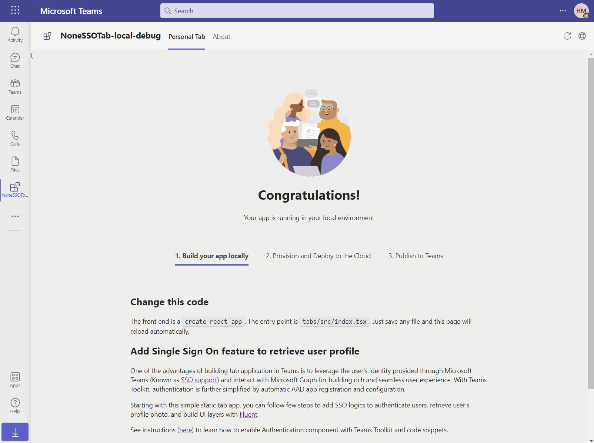
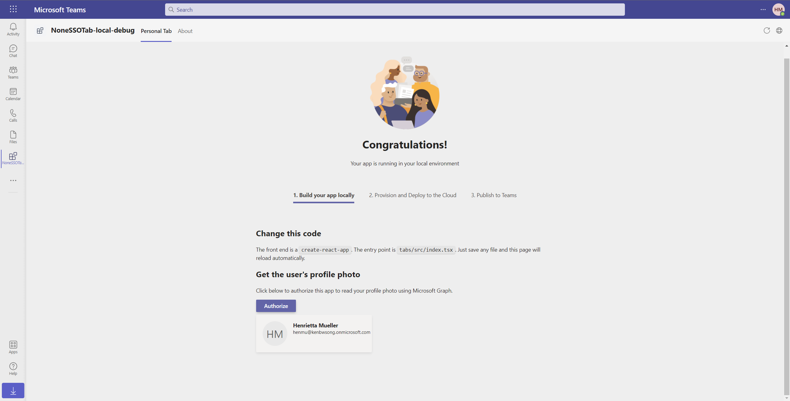

# Getting Started with Hello World Tab Without SSO Sample

> Note: Please be advised that this sample repository is currently in **Public Preview**, with a lot of active development work taking place. Please expect breaking changes as we continue to iterate.
>
> We really appreciate your feedback! If you encounter any issue or error, please report issues to us following the [Supporting Guide](./../SUPPORT.md). Meanwhile you can make [recording](https://aka.ms/teamsfx-record) of your journey with our product, they really make the product better. Thank you!
>
> This warning will be removed when the samples are ready for production.

Microsoft Teams supports the ability to run web-based UI inside "custom tabs" that users can install either for just themselves (personal tabs) or within a team or group chat context.

Hello World Tab shows you how to build a tab app without single sign on.



## Prerequisites

- [NodeJS](https://nodejs.org/en/), fully tested on NodeJS 12, 14
- An M365 account. If you do not have M365 account, apply one from [M365 developer program](https://developer.microsoft.com/en-us/microsoft-365/dev-program)
- [Teams Toolkit Visual Studio Code Extension](https://aka.ms/teams-toolkit) version after 3.3.0 or [TeamsFx CLI](https://aka.ms/teamsfx-cli) version after 0.10.2

## What you will learn in this sample:

- How to use TeamsFx to build frontend hosting on Azure for your tab app.

## Try the Sample with Visual Studio Code Extension:
>Here are the instructions to run the sample in **Visual Studio Code**. You can also try to run the app using TeamsFx CLI tool, refer to [Try the Sample with TeamsFx CLI](cli.md)

1. Clone the repo to your local workspace or directly download the source code.
1. Download [Visual Studio Code](https://code.visualstudio.com) and install [Teams Toolkit Visual Studio Code Extension](https://aka.ms/teams-toolkit).
1. Open the project in Visual Studio Code.
1. Start debugging the project by hitting the `F5` key in Visual Studio Code.

## Edit the manifest

You can find the Teams manifest in `templates/appPackage` folder. The templates contains:
* `manifest.local.template.json`: Manifest file for Teams app running locally.
* `manifest.remote.template.json`: Manifest file for Teams app running remotely (After deployed to Azure).

Both file contains template arguments with `{...}` statements which will be replaced at build time. You may add any extra properties or permissions you require to this file. See the [schema reference](https://docs.microsoft.com/en-us/microsoftteams/platform/resources/schema/manifest-schema) for more.

## Deploy to Azure

Deploy your project to Azure by following these steps:

| From Visual Studio Code                                                                                                                                                                                                                                                                                                                                                  | From TeamsFx CLI                                                                                                                                                                                                                    |
| :----------------------------------------------------------------------------------------------------------------------------------------------------------------------------------------------------------------------------------------------------------------------------------------------------------------------------------------------------------------------- | :---------------------------------------------------------------------------------------------------------------------------------------------------------------------------------------------------------------------------------- |
| <ul><li>Open Teams Toolkit, and sign into Azure by clicking the `Sign in to Azure` under the `ACCOUNTS` section from sidebar.</li> <li>After you signed in, select a subscription under your account.</li><li>Open the Teams Toolkit and click `Provision in the cloud` from DEPLOYMENT section or open the command palette and select: `Teams: Provision in the cloud`.</li><li>Open the Teams Toolkit and click `Deploy to the cloud` or open the command palette and select: `Teams: Deploy to the cloud`.</li></ul> | <ul> <li>Run command `teamsfx account login azure`.</li> <li>Run command `teamsfx account set --subscription <your-subscription-id>`.</li> <li> Run command `teamsfx provision`.</li> <li>Run command: `teamsfx deploy`. </li></ul> |

> Note: Provisioning and deployment may incur charges to your Azure Subscription.

## Package

- From Visual Studio Code: open the command palette and select `Teams: Zip Teams metadata package`.
- Alternatively, from the command line run `teamsfx package` in the project directory.

## Publish to Teams

Once deployed, you may want to distribute your application to your organization's internal app store in Teams. Your app will be submitted for admin approval.

- From Visual Studio Code: open the Teams Toolkit and click `Publish to Teams` or open the command palette and select: `Teams: Publish to Teams`.
- From TeamsFx CLI: run command `teamsfx publish` in your project directory.

## Architecture

- The frontend is a react tab app hosted on [Azure Storage](https://docs.microsoft.com/en-us/azure/storage/).

### Code structure

- You can check app configuration and environment information in: [.fx](.fx)
- You will find frontend code in: [tabs/src/components](tabs/src/components)

### Add Single Sign On feature to retrieve user profile

You can follow the steps below to add Single Sign-On feature to this project.

1. Add `fx-resource-aad-app-for-teams` into `activeResourcePlugins` in `.fx/configs/projectSettings.json`

    By adding this line, `Teams Toolkit` knows when to register an Azure Active Directory application required for implementing SSO feature. The AAD app will be created either during the time you press F5 or when you are ready to move your application to Azure (when you click `Provision in the Cloud`).

1. Add the following lines in `templates/appPackage/manifest.local.template.json`
    ```
    "webApplicationInfo": {
        "id": "{{localSettings.auth.clientId}}",
        "resource": "{{{localSettings.auth.applicationIdUris}}}"
    }
    ```

    This is to associate the Azure Active Directory app registration with Teams app manifest.

    *Note: You need to add comma at the end of last line*

1. Add the following lines in `templates/appPackage/manifest.remote.template.json`
    ```
    "webApplicationInfo": {
        "id": "{{state.fx-resource-aad-app-for-teams.clientId}}",
        "resource": "{{{state.fx-resource-aad-app-for-teams.applicationIdUris}}}"
    }
    ```

    This step aims to add a new section to manifest of Teams App for remote which contains the info of Azure AD app for Single Sign On when local debug or provision.

    *Note: You need to add comma at the end of last line*

1. Copy [auth-start.html](https://github.com/OfficeDev/TeamsFx/blob/main/templates/tab/ts/default/public/auth-start.html) and [auth-end.html](https://github.com/OfficeDev/TeamsFx/blob/main/templates/tab/ts/default/public/auth-end.html) to `tabs/public`

    When running the following code, Teams will pop up a consent window and redirect to `auth-start.html` for login. After login, will redirect to `auth-end.html` to retrieve user credential. You can config the path by updating the `REACT_APP_START_LOGIN_PAGE_URL` configuration.

1. Copy [lib](https://github.com/OfficeDev/TeamsFx/tree/b7804f7b703bde02cddaa6d2a8546db295d6a7fe/templates/tab/ts/default/src/components/sample/lib) folder to `tabs/src/components/sample`

    This folder contains three files: `useTeamsFx.ts`, `useGraph.ts` and `useData.ts`. These three files contains some basic functions for initializing [TeamsFx SDK](https://www.npmjs.com/package/@microsoft/teamsfx?activeTab=explore), calling Graph API, etc.


1. Create `Graph.tsx` under `tabs/src/components/sample` and copy the following code into it.

    ```
      import React from "react";
      import { Button } from "@fluentui/react-northstar";
      import { useGraph } from "./lib/useGraph";
      import { ProfileCard } from "./ProfileCard";

      export function Graph() {
        const { loading, error, data, reload } = useGraph(
          async (graph) => {
            const profile = await graph.api("/me").get();
            let photoUrl = "";
            try {
              const photo = await graph.api("/me/photo/$value").get();
              photoUrl = URL.createObjectURL(photo);
            } catch {
              // Could not fetch photo from user's profile, return empty string as placeholder.
            }
            return { profile, photoUrl };
          },
          { scope: ["User.Read"] }
        );

        return (
          <div>
            <h2>Get the user's profile photo</h2>
            <p>Click below to authorize this app to read your profile photo using Microsoft Graph.</p>
            <Button primary content="Authorize" disabled={loading} onClick={reload} />
            {loading && ProfileCard(true)}
            {!loading && error && (
              <div className="error">
                Failed to read your profile. Please try again later. <br /> Details: {error.toString()}
              </div>
            )}
            {!loading && data && ProfileCard(false, data)}
          </div>
        );
      }
    ```

   Create `ProfileCard.tsx` under `tabs/src/components/sample` and copy the following code into it.

    ```
      import React from "react";
      import { Avatar, Card, Flex, Skeleton, Text } from "@fluentui/react-northstar";

      export const ProfileCard = (loading: boolean, data?: any) => (
        <Card
          aria-roledescription="card avatar"
          elevated
          inverted
          styles={{ height: "max-content", margin: "0.5em 0" }}
        >
          <Card.Header styles={{ "margin-bottom": "0" }}>
            {loading && (
              <Skeleton animation="wave">
                <Flex gap="gap.medium">
                  <Skeleton.Avatar size="larger" />
                  <div>
                    <Skeleton.Line width="100px" />
                    <Skeleton.Line width="150px" />
                  </div>
                </Flex>
              </Skeleton>
            )}
            {!loading && data && (
              <Flex gap="gap.medium">
                <Avatar size="larger" image={data.photoUrl} name={data.profile.displayName} />{" "}
                <Flex column>
                  <Text content={data.profile.displayName} weight="bold" />
                  <Text content={data.profile.mail} size="small" />
                  <Text content={data.profile.mobilePhone} size="small" />
                </Flex>
              </Flex>
            )}
          </Card.Header>
        </Card>
      );
    ```

    The above two files contains `Get the user's profile photo` component which will call Graph to retrieve user profile.

    

1. Copy [App.tsx](https://github.com/OfficeDev/TeamsFx/blob/main/templates/tab/ts/default/src/components/App.tsx) and replace `tabs/src/components/App.tsx`

    This step will update `App.tsx` which will initialize `TeamsFx` SDK before launching the Teams App.

1. In `tabs/src/components/sample/Welcome.tsx`, find following line and replace `AddSSO` with `Graph`:
    ```
    <AddSSO />
    ```

    Remember to add command to import `Graph`:
    ```
    import { Graph } from "./Graph";
    ```

    This step will remove the `Add Single Sign On feature to retrieve user profile` component and add `Get the user's profile photo` component in the Teams App.

1.  Then you can run you can follow [local-debug](#try-the-sample-with-visual-studio-code-extension) or [remote](#deploy-to-azure) to test your app.

## Code of Conduct

This project has adopted the [Microsoft Open Source Code of Conduct](https://opensource.microsoft.com/codeofconduct/).

For more information see the [Code of Conduct FAQ](https://opensource.microsoft.com/codeofconduct/faq/) or
contact [opencode@microsoft.com](mailto:opencode@microsoft.com) with any additional questions or comments.
