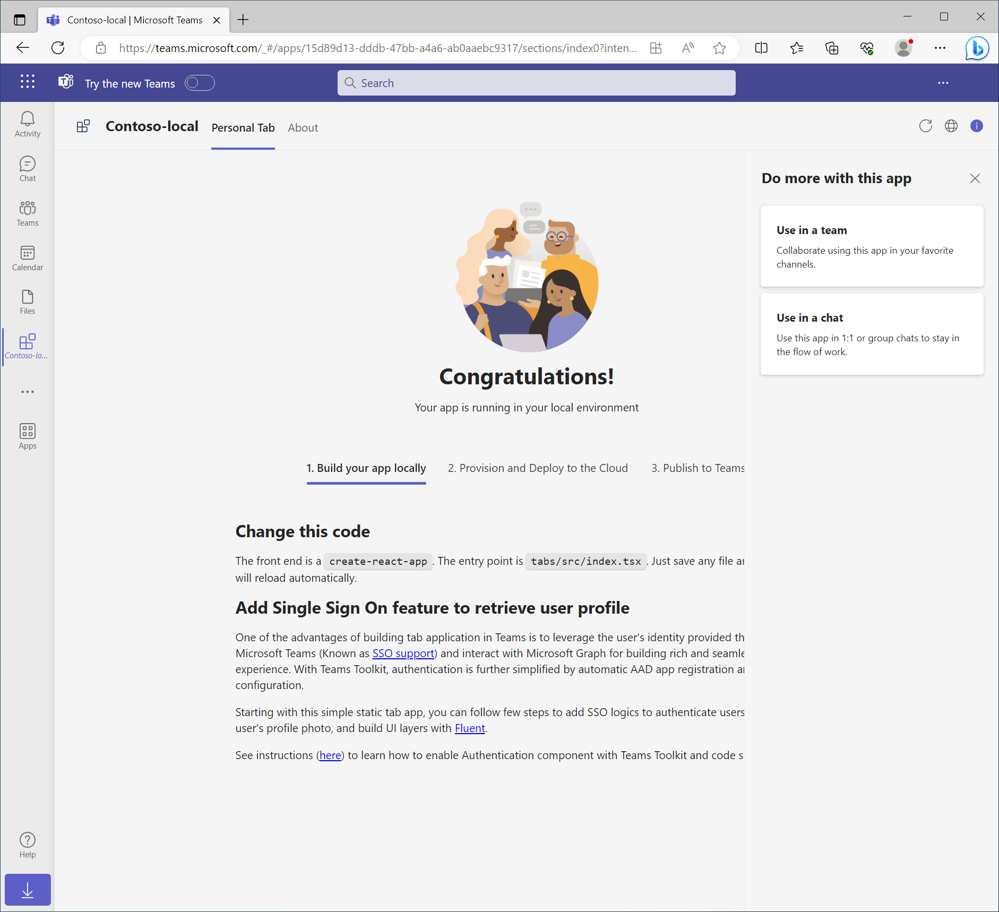
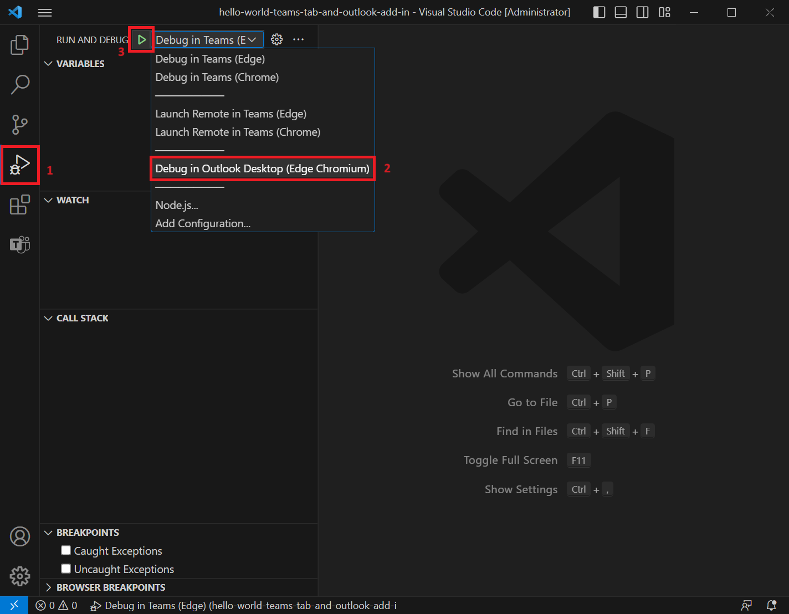
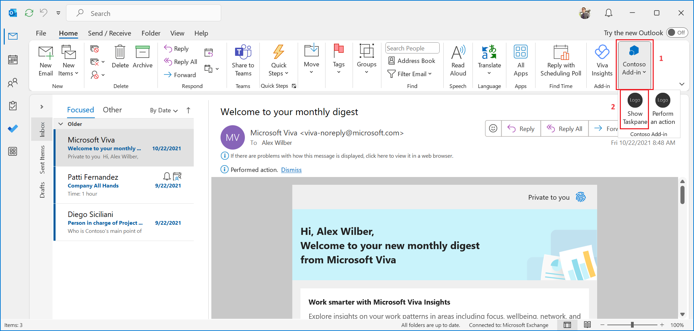

# Getting Started with Hello World Teams Tab and Outlook add-in Sample

Microsoft Teams supports the ability to run web-based UI inside "custom tabs" that users can install either for just themselves (personal tabs) or within a team or group chat context.

Outlook add-ins are integrations built by third parties into Outlook by using our web-based platform.

Now you have the ability to create a single unit of distribution for all your Microsoft 365 extensions by using the same manifest format and schema, based on the current JSON-formatted Teams manifest.

## This sample illustrates

- How a Teams Tab and an Outlook add-in share the same JSON manifest in one project.

## Prerequisites to use this sample

- [Node.js](https://nodejs.org/), supported versions: 16, 18
- Edge or Chrome installed for debugging Teams Tab. Edge installed for debugging Outlook add-in.
- Outlook for Windows: Beta Channel, Build 16320 or higher. Follow [this link](https://github.com/OfficeDev/TeamsFx/wiki/How-to-switch-Outlook-client-update-channel-and-verify-Outlook-client-build-version) for information about how to update channels and check your Outlook client build version.
- An M365 account. If you do not have M365 account, apply one from [M365 developer program](https://developer.microsoft.com/en-us/microsoft-365/dev-program)
- [Teams Toolkit Visual Studio Code Extension](https://aka.ms/teams-toolkit) version 5.0.0 and higher or [TeamsFx CLI](https://aka.ms/teams-toolkit-cli)

## Minimal path to awesome

### Debug Teams Tab

- From Visual Studio Code: Start debugging the project by hitting the `F5` key in Visual Studio Code.
- Alternatively use the `Run and Debug Activity Panel` in Visual Studio Code, select the appropriate configuration, and click the `Run and Debug` green arrow button.

- From TeamsFx CLI: Start debugging the project by executing the command `teamsapp preview --env local` in your project directory.

   After installing the app in Teams when prompted, it will launch and you'll be able to view the tab app.
   

### Debug Outlook add-in

- Please note that the same M365 account should be used both in Teams Toolkit and Outlook.
- From Visual Studio Code only: use the `Run and Debug Activity Panel` in Visual Studio Code, select `Debug in Outlook Desktop (Edge Chromium)`, and click the `Run and Debug` green arrow button. Please run VSCode as administrator if localhost loopback for Microsoft Edge Webview hasn't been enabled. Once enbaled, administrator priviledge is no longer required.

   

   Once the Outlook app is open, select a mailbox item, and you can then use the Outlook add-in. For example, you can select the option to show a task pane.
   

   The taskpane should look as shown in the following image.
   

### Edit the manifest

You can find the app manifest in `./appPackage` folder. The folder contains one manifest file:

- `manifest.json`: Manifest file for Teams app running locally or running remotely (After deployed to Azure).

This file contains template arguments with `${{...}}` statements which will be replaced at build time. You may add any extra properties or permissions you require to this file. See the [schema reference](https://docs.microsoft.com/en-us/microsoftteams/platform/resources/schema/manifest-schema) for more information.

### Deploy to Azure

Deploy your project to Azure by following these steps:

| From Visual Studio Code                                                                                                                                                                                                                                                                                                                                                  | From TeamsFx CLI                                                                                                                                                                                                                    |
| :----------------------------------------------------------------------------------------------------------------------------------------------------------------------------------------------------------------------------------------------------------------------------------------------------------------------------------------------------------------------- | :---------------------------------------------------------------------------------------------------------------------------------------------------------------------------------------------------------------------------------- |
| <ul><li>Open Teams Toolkit, and sign into Azure by clicking the `Sign in to Azure` under the `ACCOUNTS` section from sidebar.</li> <li>After you signed in, select a subscription under your account.</li><li>Open the Teams Toolkit and click `Provision` from LIFECYCLE section or open the command palette and select: `Teams: Provision`.</li><li>Open the Teams Toolkit and click `Deploy` or open the command palette and select: `Teams: Deploy`.</li></ul> | <ul> <li>Run command `teamsapp auth login azure`.</li> <li>(Optional)Set environment variable AZURE_SUBSCRIPTION_ID to your subscription id in env/.env.dev or in your current shell envrionment if you are using non-interactive mode of `teamsfx` CLI.</li> <li> Run command `teamsapp provision`.</li> <li>Run command: `teamsapp deploy`. </li></ul> |

> Note: Provisioning and deployment may incur charges to your Azure Subscription.

### Preview Teams Tab

Once the provisioning and deployment steps are finished, you can preview your Teams app:

- From Visual Studio Code

  1. Open the `Run and Debug Activity Panel`.
  1. Select `Launch Remote in Teams (Edge)` or `Launch Remote in Teams (Chrome)` from the launch configuration drop-down.
  1. Press the Play (green arrow) button to launch your app - now running remotely from Azure.

- From TeamsFx CLI: execute `teamsapp preview --env dev` in your project directory to launch your application.

### Preview Outlook add-in

Once the provisioning and deployment steps are finished, you can preview your Outlook add-in from Visual Studio Code:

1. Copy the production URL from the `TAB_ENDPOINT` in env/.env.dev file.
2. Edit webpack.config.js file and change urlProd to the value you just copied. Please note to add a '/' at the end of the URL.
3. Run `npm run build:add-in`.
4. Copy `add-in\dist\manifest.dev.json` to `appPackage` folder using `npx ncp .\add-in\dist\manifest.dev.json .\appPackage\manifest.addinPreview.json`
5. Run `npx office-addin-dev-settings sideload .\appPackage\manifest.addinPreview.json`

### Validate manifest file

To check that your manifest file is valid:

- From Visual Studio Code: open the command palette and select: `Teams: Validate Application` and select `Validate using manifest schema`.
- From TeamsFx CLI: run command `teamsapp validate` in your project directory.

### Package

- From Visual Studio Code: open the Teams Toolkit and click `Zip Teams app package` or open the command palette and select `Teams: Zip Teams app package`.
- Alternatively, from the command line run `teamsapp package` in the project directory.

## Version History

|Date| Author| Comments|
|---|---|---|
|March 13, 2023| yefuwang | onboard |
|April 11, 2023 | yufuwang | comment out manifest validation |
|May 24, 2023 | yefuwang | update outdated content |
|September 10, 2023 | joshuapa | added images |

## Feedback

We really appreciate your feedback! If you encounter any issue or error, please report issues to us following the [Supporting Guide](https://github.com/OfficeDev/TeamsFx-Samples/blob/dev/SUPPORT.md). Meanwhile you can make [recording](https://aka.ms/teamsfx-record) of your journey with our product, they really make the product better. Thank you!