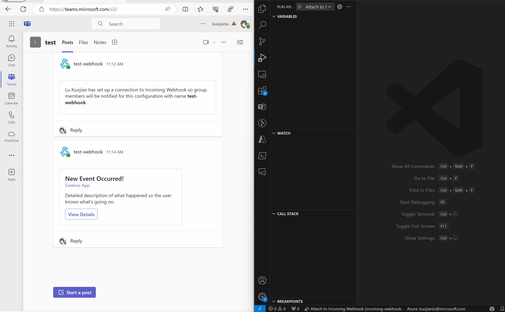

# Getting Started with Incoming Webhook Notification
An Incoming Webhook Sample provides an easy way to send adaptive cards in Microsoft Teams channels. The webhooks are used as tools to track and notify.


## This sample illustrates
- How to create an Incoming Webhook in Teams.
- How to send Adaptive Cards in Teams.

## Prerequisite to use this sample
- [Node.js](https://nodejs.org/), supported versions: 16, 18
- A [Teams Channel](https://docs.microsoft.com/en-us/microsoftteams/teams-channels-overview)

## Minimal path to awesome
### Run the app locally
1. [Add an incoming webhook in Teams](https://docs.microsoft.com/en-us/microsoftteams/platform/webhooks-and-connectors/how-to/add-incoming-webhook#create-an-incoming-webhook-1). 
1. Clone the repo to your local workspace or directly download the source code.
1. Replace the placeholder `<webhook-url>` with the webhook URL in `./src/index.ts`
    ```ts
    const webhookUrl: string = "<webhook-url>";
    ```
1. Open Debug View (`Ctrl+Shift+D`) and select "Attach to Incoming Webhook" in dropdown list or execute the command `npm install`, `npm run build` and `npm run start`. 
1. In the Teams channel, you can find the Adaptive Cards sent from the Incoming Webhook Sample. 


## Version History
| Date         | Author       | Comments                               |
| ------------ | ------------ | -------------------------------------- |
| May 23, 2022 | XiaofuHuang  | update to support Teams Toolkit V4.0.0 |
| Dec 6, 2022  | XiaofuHuang  | update to support Teams Toolkit v5.0.0 |

## Feedback
We really appreciate your feedback! If you encounter any issue or error, please report issues to us following the [Supporting Guide](https://github.com/OfficeDev/TeamsFx-Samples/blob/dev/SUPPORT.md). Meanwhile you can make [recording](https://aka.ms/teamsfx-record) of your journey with our product, they really make the product better. Thank you!