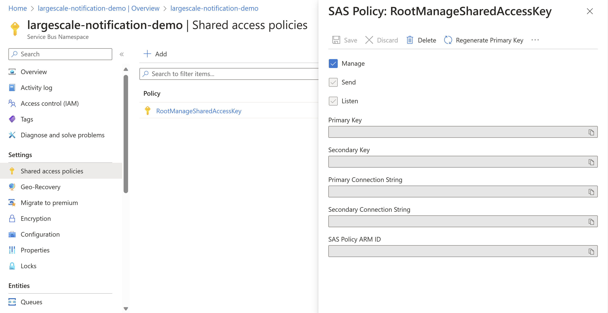
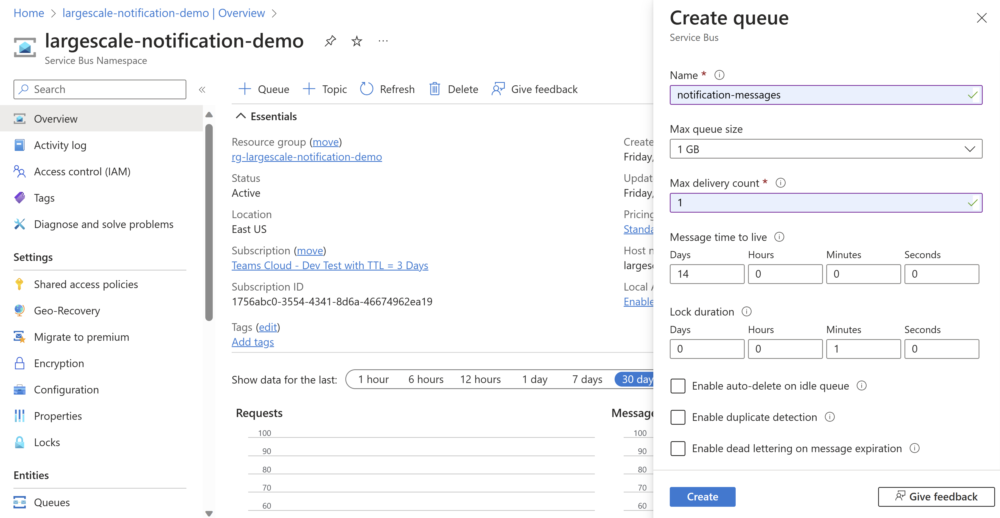
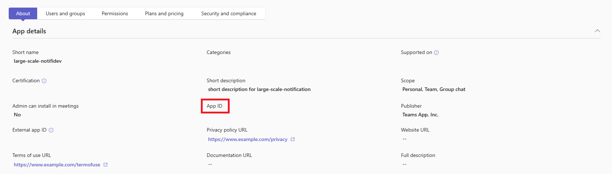

# Overview of the Large Scale Notification Bot

This sample demonstrates the architecture of a Teams notfication bot app created by Teams Toolkit to send individual chat messages to a large number of users in a tenant. This app relies on Azure services such as [Durable Function](https://learn.microsoft.com/en-us/azure/azure-functions/durable/durable-functions-overview?tabs=csharp-inproc) and [Service Bus Queue](https://learn.microsoft.com/en-us/azure/service-bus-messaging/service-bus-queues-topics-subscriptions#queues) to handle high volume and speed of notification messaging.

# How to run this project

## Run the app locally

To debug the project, you will need to configure an Azure Service Bus to be used locally:

1. [Create a Service Bus namespace in the Azure portal](https://learn.microsoft.com/en-us/azure/service-bus-messaging/service-bus-quickstart-topics-subscriptions-portal#create-a-namespace-in-the-azure-portal).
2. Navigate to the homepage of your Service Bus namespace. Under the `Settings` section, select `Shared access policies`. Then, click on `RootManageSharedAccessKey` and copy the `Primary Connection String` value.
   
3. Open **local.settings.json** file and insert the connection string value you copied earlier into the `SERVICE_BUS_CONNECTION_STRING` field.
4. Return to the homepage of your Service Bus namespace and select "+ Queue". Proceed to create a queue with the "Max delivery count" configured to 1.
   
5. Open **env/.env.local** file, and set the value of `SERVICE_BUS_QUEUE_NAME` with the name of queue you just created.
6. Press "F5" to open a browser window and then select your package to view the large scale notification bot app.
7. Get the endpoint of the trigger. For debug, `<endpoint>` is `http://localhost:3978` by default.
8. Navigate to `http://localhost:3978/api/notification` to activate the sending function. Then, access the `statusQueryGetUri` in the returned JSON object to retrieve the sending status.
9. \[Optional\] Once your app is running locally, you can utilize Azure Storage Explorer to inspect the data in your local storage table. Visit https://learn.microsoft.com/en-us/azure/storage/common/storage-explorer-emulators for more information.

## Execute lifecycle commands

1. To create the Azure resources and deploy the code to Azure Function, select `Provision` and `Deploy` from the Teams Toolkit sidebar.
2. To publish your app to Teams, select `Publish` from the Teams Toolkit sidebar.

## Install Teams App for all users

1. Visit https://admin.teams.microsoft.com/. Click "Manage apps" under "Teams apps" and find the app with name "large-scale-notifi-dev".
2. Click the app and click "Publish" to approve the request.
3. Copy "App Id" in **app details page** and paste it to variable `TEAMS_APP_ID` in `script/installAppForUsers.js`.
   
4. Visit https://developer.microsoft.com/en-us/graph/graph-explorer. Click "Modify permissions" and consent "TeamsAppInstallation.ReadWriteForUser" & "TeamsAppInstallation.ReadWriteAndConsentForUser".
5. Copy the "Access token" and paste it to variable `ACCESS_TOKEN` in `script/installAppForUsers.js`.
6. Run command in project folder: `node script/installAppForUsers.js`.
   > After publishing your app, it may take several hours before you can retrieve app details using the Graph API, which is utilized in the `installAppForUsers` script. You could check if the app is ready by sending the following request in Graph Explorer, and replace `<TEAMS_APP_ID>` with the actual "App Id" from step 2. If the value of `@odata.count` in the response is equal to 1, you are good to run the script.
   >
   > ```
   > GET https://graph.microsoft.com/v1.0/appCatalogs/teamsApps?$filter=id eq '<TEAMS_APP_ID>'
   > ```
7. Check the provisioned Azure Storage Account Table `installation` for installation records.

## Mock the installation of a large amount of users

Since there are usually at most 25 users in Microsoft 365 E3/E5 subscription in a tenant, duplicate the installation data can be used to mock a large amount of users.

1. Copy the value of `STORAGE_ACCOUNT_NAME` in `env/.env.dev` and paste it to variable `storageAccount` in `script/mockInstallationData.ts`.
2. Copy the value of `SECRET_STORAGE_ACCOUNT_KEY` in `env/.env.dev.user` by clicking "Decrypt secret" and paste it to variable `storageAccountKey` in `script/mockInstallationData.ts`.
3. Run command in project root folder: `npx ts-node script/mockInstallationData.ts`.
4. Update `storageTableName` in `src/internal/initialize.ts` to `installationMockTableName`.
5. Deploy the code to Azure Function by selecting `Deploy` from the Teams Toolkit sidebar. Your app should now use the mock data.

## Trigger send notification function

1. Visit `https://{BOT_FUNCTION_ENDPOINT}/api/notification` in browser. This will trigger the function to send notifications.
2. Check the link of `statusQueryGetUri` in returned json object, it reflects the sending status of this invocation.

## Architecture

### Azure Function

This sample extends from the "Chat Notification Message" template created by Teams Toolkit. It makes Azure Function durable to send notifications in a long-running job.
Here's the functions used in this sample:

| Function                    | Type          | Description                                                                                                                                         |
| --------------------------- | ------------- | --------------------------------------------------------------------------------------------------------------------------------------------------- |
| `durableFunctionsHttpStart` | HTTP Trigger  | It starts orchestrator and returns sending status                                                                                                   |
| `messageHandler`            | HTTP Trigger  | It handles message from Bot service like new installation                                                                                           |
| `queueTriggeredSendMessage` | Queue Trigger | Service Bus Queue triggers this function to send 1:1 message to each user stored in queue item                                                      |
| `sendMessageOrchestrator`   | Orchestrator  | It fetches installation data and sends notifications to users continuously. It also updates the success/failure count in custom orchestrator status |
| `getUsersActivity`          | Activity      | It fetches installation data in Table storage with continuation token                                                                               |
| `enqueueSendMessageTask`    | Activity      | It sends tasks for each user in a batch to Service Bus Queue                                                                                        |
| `waitSendingFinishActivity` | Activity      | It will check the active message count in Service Bus Queue and wait until all items are processed                                                  |

The following image illustrates the architecture of functions interecting with Azure services.


### Performance Tuning

Here's the variables in `src/consts.ts` that users can change to tune the performance:

| Variable             | Usage                                                                                |
| -------------------- | ------------------------------------------------------------------------------------ |
| RPS                  | The sending speed of notification message                                            |
| batchSendingInterval | Time(second) to wait before sending the next batch of messages to queue              |
| maxPageSize          | Paginated result size when querying from table storage                               |
| iterateTime          | The count of task enqueueing iterations before obtaining the subsequent queue status |

By default, the RPS is set to 50, the `batchSendingInterval` is 1, the `maxPageSize` is 500, and the `iterateTime` is 3. The performance, when evaluated with a large tenant consists of 1500 users and 300K messages, averages roughly 173K/h, subject to slight fluctuations.

## Cost Estimation

### Assumptions and SKUs

The estimate below assumes:

- 300K users in the tenant
- 1 message sent to all users every day (~30/month)
- `maxPageSize` set to 500 and `iterateTime` set to 3

The SKUs used for a production environment are:

- Service Bus: Standard
- Storage Account: Standard LRS
- Azure Functions: Dynamic

> The minor expense associated with the initial installation of the app, which involves data transactions in the storage table, is not taken into account in the estimation.

### Estimate Load and Cost

**Number of messages sent**

- 300K users \* 30 messages/month = 9M messages

**Storage Account**

- Table: ~0.26GB (Record the installation data of 300K users)
  - 0.26GB \* $0.045 per GB = $0.01
- Table Data Transactions: 1 read \* 9M messages = 9M reads
  - 900 Transaction Units(10000 transactions) \* $0.00036 = $0.32

**Service Bus**

- (1 write + 1 read)/ messages \* 9M messages = 18M Operations
  - Base charge: $0.0135/hour \* 24 \* 30 = $9.72
  - Operation charge: (18M - 13M) \* $0.80 per million operations = $4.00

**Azure Functions**

> For the calculation of Gb-sec pricing, please note that the minimum memory size is 128 MB and the minimum execution time is 100 ms. You can refer to the formula provided below for further details.
>
> `(Memory Size \* Execution Time \* Execution Count)/1024000.`

- `notifyHttpTrigger`
  - 1 execution \* 30 messages/month = 30 executions
  - (128MB \* 500ms \* 30)/1024000 = 1.875 GB-sec
- `sendNotifications`
  - 1 execution \* 30 messages/month = 30 executions
    (128MB \* 13000ms \* 30)/1024000 = 48.75 GB-sec
- `enqueueTasksForInstallations`
  - 1 execution \* (9M messages / (500 entities \* 3 iterations)) = 6000 executions
  - (256MB \* 30000ms \* 6000)/1024000 = 450000 GB-sec
- `sendNotificationQueueTrigger`
  - 1 execution \* 9M messages = 9M executions
  - (128MB \* 400ms \* 9000000)/1024000 = 450560 GB-sec
- `waitSendingFinishActivity`
  - 1 execution \* 30 messages/month = 30 executions
  - (128MB \* 5000ms \* 30)/1024000 = 18.75 GB-sec
- Total Executions: 30 + 30 + 6000 + 9M + 30 = 9.0069M executions
  - (9.0069M - 1M) \* $0.20 per million executions = $1.60
- Execution Time: 1.875 + 48.75 + 450000 + 450560 + 18.75 = 901629.375 GB-sec
  - (901629.375 GB-sec - 400000 GB-sec) \* $0.000016/GB-sec = $8.03

### Estimated Cost

> **IMPORTANT**: This is only an estimate, your actual costs may vary depending on the usage.

| Resource                | Tier         | Load                     | Monthly Price          |
| ----------------------- | ------------ | ------------------------ | ---------------------- |
| Storage account (Table) | Standard_LRS | <1GB data, 9M operations | $0.01 + $0.32 = $0.33  |
| Service Bus             | Standard     | 18M operations           | $9.72 + $4.00 = $13.72 |
| Azure Functions         | Consumption  | 9M executions            | $1.60 + $8.03 = $9.63  |
| **Total**               |              |                          | $23.68                 |

## Limitation

### Bot Framework Rate Limit

As stated in this [document](https://learn.microsoft.com/en-us/microsoftteams/platform/bots/how-to/rate-limit#per-bot-per-thread-limit), the throughput of a single bot app in theory is 180k/hour.

> - The thread limit of 3600 seconds and 1800 operations applies only if multiple bot messages are sent to a single user.
> - The global limit per app per tenant is 50 Requests Per Second (RPS). Hence, the total number of bot messages per second must not cross the thread limit.

### Azure Storage Table

This sample uses continuation token to retrieve paged results. According to the [document](https://learn.microsoft.com/en-us/rest/api/storageservices/Query-Entities?redirectedfrom=MSDN#remarks), the maxium page size is 1000.

### Azure Durable Function

Orchestrator is a pure function that has no side effect, so it will be replayed and scheduled by Durable Task framework. The context switch time cost also affects the throughput of message sending. Having a big loop in orchestrator function may slows down the execution time.

### Dynamic Concurrency

This sample uses "Consumption" plan of Azure Function. The queue triggered function will be automatically scaled out to many instances. However this is a black box and spikes may happen during the sending process if there are not enough instances.
