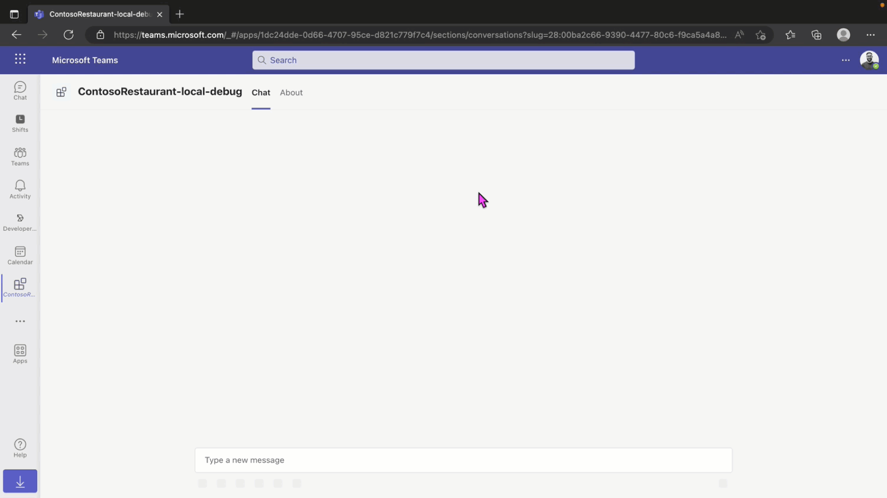

# Place Your Order Workflow Bot

> Note: We really appreciate your feedback! If you encounter any issue or error, please report issues to us following the [Supporting Guide](./../SUPPORT.md). Meanwhile you can make [recording](https://aka.ms/teamsfx-record) of your journey with our product, they really make the product better. Thank you!
>

Bots can be used to automate repetitive workflows through a conversational interface which can be used in different Microsoft Teams contexts, such as a personal bot chat, one to one or group chat, a channel conversation and within meetings.

The Place Your Order workflow bot shows you how to implement a simple workflow that uses a command to start an order process which returns an Adaptive Card containing a form in the response to the command. The bot captures the submission of the Adaptive Card confirming the submitted data in an Adaptive Card which replaces the initial form card.

## Prerequisites

- [Node.js](https://nodejs.org/en/), supported versions: 14, 16, 18
- An Microsoft 365 account. If you do not have Microsoft 365 account, apply one from [Microsoft 365 developer program](https://developer.microsoft.com/en-us/microsoft-365/dev-program)
- [Teams Toolkit Visual Studio Code Extension](https://aka.ms/teams-toolkit) or [TeamsFx CLI](https://aka.ms/teamsfx-cli)

## What you will learn in this sample:

- How to use a bot command to start a repetitive process
- How to use card actions to retrieve user input from an Adaptive Card
- How to use card actions to replace the intitial submitted Adaprive Card

## Try the Sample with Visual Studio Code Extension:

1. Clone the repo to your local workspace or directly download the source code.
1. Download [Visual Studio Code](https://code.visualstudio.com) and install [Teams Toolkit Visual Studio Code Extension](https://aka.ms/teams-toolkit).
1. Open the project in Visual Studio Code.
1. Start debugging the project by hitting the `F5` key in Visual Studio Code.

## Edit the manifest

You can find the Teams manifest in `templates/appPackage` folder. The templates contains:
* `manifest.template.json`: Manifest file for Teams app running locally and remotely.

Both file contains template arguments with `{...}` statements which will be replaced at build time. You may add any extra properties or permissions you require to this file. See the [schema reference](https://docs.microsoft.com/en-us/microsoftteams/platform/resources/schema/manifest-schema) for more.

## Deploy to Azure

Deploy your project to Azure by following these steps:

| From Visual Studio Code                                                                                                                                                                                                                                                                                                                                                  | From TeamsFx CLI                                                                                                                                                                                                                    |
| :----------------------------------------------------------------------------------------------------------------------------------------------------------------------------------------------------------------------------------------------------------------------------------------------------------------------------------------------------------------------- | :---------------------------------------------------------------------------------------------------------------------------------------------------------------------------------------------------------------------------------- |
| <ul><li>Open Teams Toolkit, and sign into Azure by clicking the `Sign in to Azure` under the `ACCOUNTS` section from sidebar.</li> <li>After you signed in, select a subscription under your account.</li><li>Open the Teams Toolkit and click `Provision in the cloud` from DEPLOYMENT section or open the command palette and select: `Teams: Provision in the cloud`.</li><li>Open the Teams Toolkit and click `Deploy to the cloud` or open the command palette and select: `Teams: Deploy to the cloud`.</li></ul> | <ul> <li>Run command `teamsfx account login azure`.</li> <li>Run command `teamsfx account set --subscription <your-subscription-id>`.</li> <li> Run command `teamsfx provision`.</li> <li>Run command: `teamsfx deploy`. </li></ul> |

> Note: Provisioning and deployment may incur charges to your Azure Subscription.

## Package

- From Visual Studio Code: open the command palette and select `Teams: Zip Teams metadata package`.
- Alternatively, from the command line run `teamsfx package` in the project directory.

## Publish to Teams

Once deployed, you may want to distribute your application to your organization's internal app store in Teams. Your app will be submitted for admin approval.

- From Visual Studio Code: open the Teams Toolkit and click `Publish to Teams` or open the command palette and select: `Teams: Publish to Teams`.
- From TeamsFx CLI: run command `teamsfx publish` in your project directory.

### Code structure

- You can check app configuration and environment information in: [.fx](.fx)
- You will find Bot code in: [bot/src/](bot/src)
- You will find Bot commands in: [bot/src/commands](bot/src/commands)
- You will find Adaptive Card actions in: [bot/src/cardActions](bot/src/cardActions)
- You will find Adaptive Cards in: [bot/src/adaptiveCards](bot/src/adaptiveCards)
- You will find Bot configuration in: [bot/src/internal/initialize.ts](bot/src/internal/initialize.ts)

## Code of Conduct

This project has adopted the [Microsoft Open Source Code of Conduct](https://opensource.microsoft.com/codeofconduct/).

For more information see the [Code of Conduct FAQ](https://opensource.microsoft.com/codeofconduct/faq/) or
contact [opencode@microsoft.com](mailto:opencode@microsoft.com) with any additional questions or comments.
