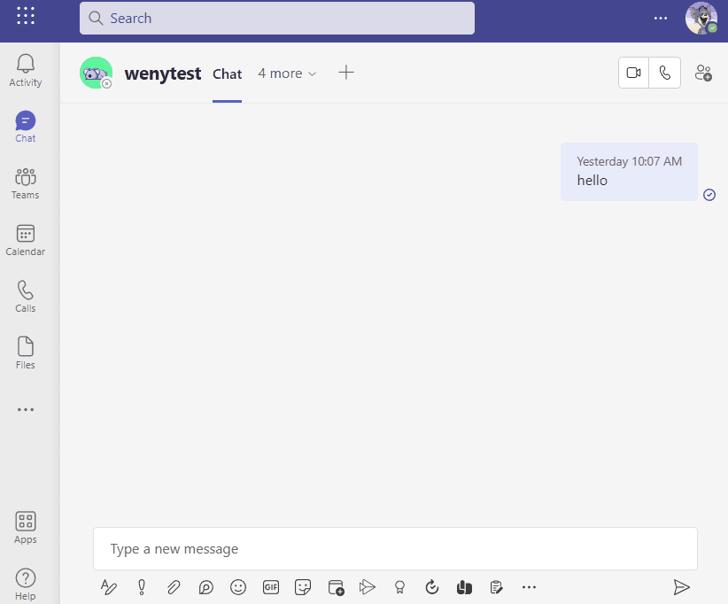
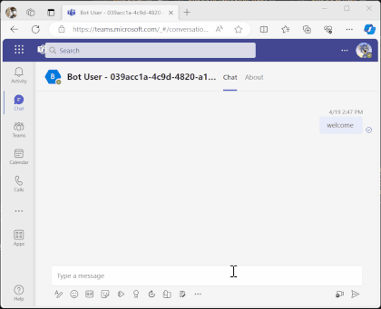
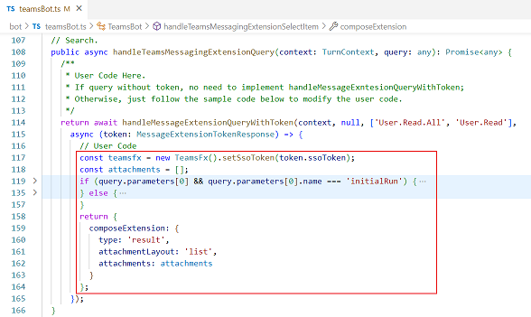
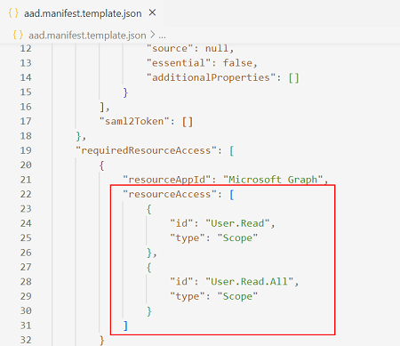
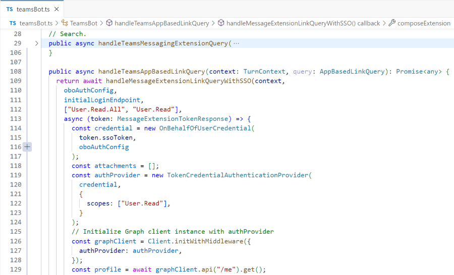
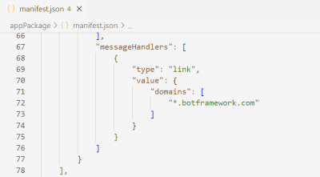
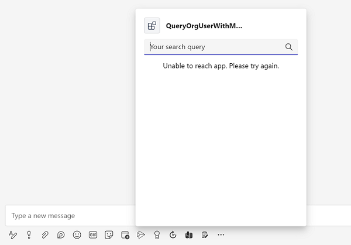

# Getting Start with Query Org User with Message Extension SSO
This is a simple search-based message extension app demonstrating how to integrate with Bot Framework SDK, TeamsFx SDK and Microsoft Graph API to implement a feature that queries organization's user with single sign on (SSO) capability.

## This sample illustrates
- How to login and consent in Message Extension
- How to use Microsoft Graph API to do query with SSO token in Message Extension

## Prerequisite to use this sample
- [Node.js](https://nodejs.org/), supported versions: 16, 18
- A Microsoft 365 account. If you do not have Microsoft 365 account, apply one from [Microsoft 365 developer program](https://developer.microsoft.com/en-us/microsoft-365/dev-program)
- [Teams Toolkit Visual Studio Code Extension](https://aka.ms/teams-toolkit) version 5.0.0 and higher or [TeamsFx CLI](https://aka.ms/teams-toolkit-cli)

## Minimal path to awesome
> Here are the instructions to run the sample in **Visual Studio Code**.
### Run the app locally
1. Clone the repo to your local workspace or directly download the source code.
3. Open the project in Visual Studio Code.
4. Open Debug View (`Ctrl+Shift+D`) and select `Debug(Edge)` or `Debug(Chrome)` in dropdown list.
5. Press `F5` finally pop up an window to login your tenant account, and install this Teams App.

### Deploy the app to Azure
Deploy your project to Azure by following these steps:
1. Open Teams Toolkit in Visual Studio Code, and sign in your Azure account by clicking the `Sign in to Azure` in the `ACCOUNTS` section from sidebar.
2. Open Teams Toolkit and click `Provision` in the `LIFECYCLE` section. Alternatively open the command palette(Ctrl+Shift+P) and type: `Teams: Provision` command.
3. Open the Teams Toolkit and click `Deploy` in the `LIFECYCLE` section. Alternatively open the command palette(Ctrl+Shift+P) and type: `Teams: Deploy` command.
> Note: Provision Azure cloud resources and deploy to Azure may cause charges to your Azure Subscription.
### Preview the app in Teams
After you have completed the provision and deploy steps in `Deploy the app to Azure` section, you can preview your app in Teams client by following steps below:

1. Open the `Run and Debug Activity` panel from sidebar, or use short key Ctrl+Shift+D.
1. Select `Launch Remote (Edge)` or `Launch Remote (Chrome)` in the launch configuration (a dropdown selection in the upper-left corner).
1. Press the `Start Debugging` button to launch your app, the Teams web client will be automatically opened in your browser, where you will see your app running remotely from Azure.

## Advanced usage of this sample
### Custom the Query Logic
- Follow the code in `teamsBot.ts`, custom your query logic in `handleMessageExtensionQueryWithToken`.

- Update the scopes in `aad.manifest.json` which used by your Graph Client.

### Custom the link unfurling SSO Logic
- Follow the code in `teamsBot.ts`, custom your query logic in `handleMessageExtensionLinkQueryWithSSO`.

- Update the `domains` in `appPackage/manifest.json` which triggers the preview card.

- If you want to see the updated results, please re-run local debug, or re-provision to update the AAD app and re-deploy the changed part.

## Known Issue
Some developers have reported an issue where they have seen `Unable to reach app. Please try again.`

This could be an intermittent issue, to mitigate, try to use a different Microsoft 365 account or run this sample later.

## Version History

|Date| Author| Comments|
|---|---|---|
|Sep 20 2022| wenytang-ms | onboard |
|Apr 3, 2023| wenytang-ms | update to support Teams Toolkit v5.0.0|

## Feedback
We really appreciate your feedback! If you encounter any issue or error, please report issues to us following the [Supporting Guide](https://github.com/OfficeDev/TeamsFx-Samples/blob/dev/SUPPORT.md). Meanwhile you can make [recording](https://aka.ms/teamsfx-record) of your journey with our product, they really make the product better. Thank you!