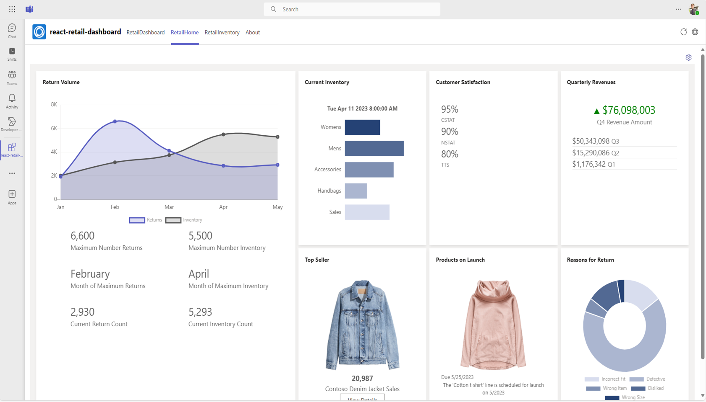

# Getting Started with Contoso Retail Dashboard Sample

This is a dashboard sample based on demo sample data that shows you how to create a Microsoft Teams personal app with SharePoint Framework, hosting the solution also in Outlook.com and in the Microsoft 365 Portal as a Microsoft 365 app.

## This sample illustrate

- How to leverage existing react component to set up a dashboard with SharePoint Framework
- How to create a Microsoft Teams personal app with SharePoint Framework, hosting the solution also in Outlook.com and in the Microsoft 365 Portal as a Microsoft 365 app

## Prerequisite to use this sample

- [Set up SharePoint Framework development environment](https://aka.ms/teamsfx-spfx-dev-environment-setup)（Recommend to use SPFx v1.18.2）
- A Microsoft 365 tenant in which you have permission to upload Teams apps. You can get a free Microsoft 365 developer tenant by joining the [Microsoft 365 developer program](https://developer.microsoft.com/en-us/microsoft-365/dev-program).
- [Microsoft 365 Agents Toolkit Visual Studio Code Extension](https://aka.ms/teams-toolkit) version 5.0.0 and higher or [Microsoft 365 Agents Toolkit CLI](https://aka.ms/teams-toolkit-cli)

## Minimal path to awesome

### Deploy the app

>Here are the instructions to run the sample in **Visual Studio Code**. You can also try to run the app using Microsoft 365 Agents Toolkit CLI tool, refer to [Try sample with Microsoft 365 Agents Toolkit CLI](cli.md)

1. Clone the repo to your local workspace or directly download the source code.
1. Open the project in Visual Studio Code, click `Provision` in LIFECYCLE panel of Microsoft 365 Agents Toolkit extension or open the command palette and select `Microsoft 365 Agents: Provision`. This step will create an app in Teams App Studio.
1. Go back to Microsoft 365 Agents Toolkit extension, click `Deploy` in LIFECYCLE panel or open the command palette and select `Microsoft 365 Agents: Deploy`.
    > This step will build a SharePoint package (*.sppkg) under `sharepoint/solution` folder. The Microsoft 365 Agents Toolkit will automatically upload and deploy it to your tenant App Catalog site. Only tenant App Catalog site admin has permission to do it. If you are not the admin, you can create your test tenant following [Setup your Microsoft 365 tenant](https://docs.microsoft.com/en-us/sharepoint/dev/spfx/set-up-your-developer-tenant).

### Launch the app in Teams

1. Once deployment is completed, you can preview the app. In Visual Studio Code, select target environment and click `Preview App` in ENVIRONMENT panel to open a browser.

### Run the app locally

1. In Debug mode, select one of the debug configurations (`SharePoint workbench`, `Teams workbench`, `Outlook workbench` and `The Microsoft 365 app workbench` are supported) and press start button. The browser will be opened and you need to sign in with your Microsoft 365 account.
2. Click `Add` if you selected `Teams workbench` in previous step.
3. You should see the app running in your selected hub:

Contoso Retail Dashboard in Teams

Contoso Retail Dashboard in Outlook

Contoso Retail Dashboard in Office

## Advanced usage of this sample

You could set up your own back-end REST API project as Azure Function to use real data instead of faked one. We'll also add back-end support to update this sample later.

## Version History

|Date| Author| Comments|
|---|---|---|
|Sep 15, 2023| huihuiwu | Onboard to Teams Toolkit|
|Dec 5, 2023| yuqzho | Upgrade to SPFx 1.18.2|

## Feedback

We really appreciate your feedback! If you encounter any issue or error, please report issues to us following the [Supporting Guide](https://github.com/OfficeDev/TeamsFx-Samples/blob/dev/SUPPORT.md). Meanwhile you can make [recording](https://aka.ms/teamsfx-record) of your journey with our product, they really make the product better. Thank you!