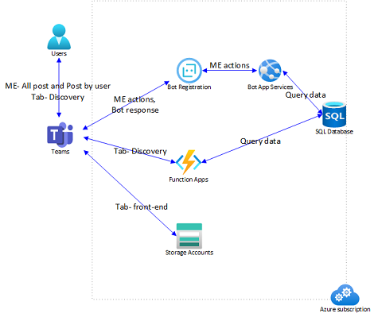

# Getting Started With Share Now Sample

> ## WARNING: This repository is under active development and the samples are not guaranteed to work!
> This warning will be removed when the samples are ready for consumption

Share Now promotes the exchange of information between colleagues by enabling users to share content within the Teams environment. Users engage the app to share items of interest and discover new shared content.


## Prerequisite
- [NodeJS](https://nodejs.org/en/)
- An M365 account. If you do not have M365 account, apply one from [M365 developer program](https://developer.microsoft.com/en-us/microsoft-365/dev-program)
- [Teams Toolkit Visual Studio Code Extension](https://aka.ms/teams-toolkit)
- An [Azure subscription](https://azure.microsoft.com/en-us/free/)

## What you will learn in this sample
- How to build frontend hosting on Azure for your tab app.
- How to build backend hosting on Azure for your tab app.
- How to build message extension bot on Azure for your app.
- How to connect to Azure SQL DB and how to do CRUD operations in DB.

## Try the Sample
>Here is the steps to try the sample **in Visual Studio Code**. If you want to try it in command line, please refer to [Command Line](cli.md)
1. Clone the repo to your local workspace or directly download the source code.
1. Download [Visual Studio Code](https://code.visualstudio.com) and install 'Teams Toolkit' extension.
1. Open the project in Visual Studio Code.
1. Open the command palette and select: `Teams: Provision in the Cloud`. You will be asked to input admin name and password of SQL. The toolkit will help you to provision Azure SQL.
1. Once provision is completed, open the command palette and select: `Teams: Deploy to the Cloud`.
1. Open [.fx/env.default.json](.fx/env.default.json) file, you could get the database name in `databaseName` setting. In Azure portal, find the database and use [query editor](https://docs.microsoft.com/en-us/azure/azure-sql/database/connect-query-portal) with below query to create tables:
    ```sql
    CREATE TABLE [TeamPostEntity](
	    [PostID] [int] PRIMARY KEY IDENTITY,
	    [ContentUrl] [nvarchar](400) NOT NULL,
	    [CreatedByName] [nvarchar](50) NOT NULL,
	    [CreatedDate] [datetime] NOT NULL,
	    [Description] [nvarchar](500) NOT NULL,
	    [IsRemoved] [bit] NOT NULL,
	    [Tags] [nvarchar](100) NULL,
	    [Title] [nvarchar](100) NOT NULL,
	    [TotalVotes] [int] NOT NULL,
	    [Type] [int] NOT NULL,
	    [UpdatedDate] [datetime] NOT NULL,
	    [UserID] [uniqueidentifier] NOT NULL,
    )
    GO
    CREATE TABLE [UserVoteEntity](
	    [VoteID] [int] PRIMARY KEY IDENTITY,
	    [PostID] [int] NOT NULL,
	    [UserID] [uniqueidentifier] NOT NULL,
    )
    GO
    ```
1. Once deployment is completed, you can preview the app running in Azure. In Visual Studio Code, open `Run and Debug` and select `Launch Remote (Edge)` or `Launch Remote (Chrome)` in the dropdown list and Press `F5` or green arrow button to open a browser.

## (Optional) Debug
To debug the project, you will need to configure an Azure SQL Database to be used locally:
1. [Create an Azure SQL Database](https://docs.microsoft.com/en-us/azure/azure-sql/database/single-database-create-quickstart?tabs=azure-portal)
1. [Add IP address of your computer into allowlist of firewall of Azure SQL Database](https://docs.microsoft.com/en-us/azure/azure-sql/database/firewall-configure#from-the-database-overview-page)
1. Use [query editor](https://docs.microsoft.com/en-us/azure/azure-sql/database/connect-query-portal) with below query to create tables:
    ```sql
    CREATE TABLE [TeamPostEntity](
	    [PostID] [int] PRIMARY KEY IDENTITY,
	    [ContentUrl] [nvarchar](400) NOT NULL,
	    [CreatedByName] [nvarchar](50) NOT NULL,
	    [CreatedDate] [datetime] NOT NULL,
	    [Description] [nvarchar](500) NOT NULL,
	    [IsRemoved] [bit] NOT NULL,
	    [Tags] [nvarchar](100) NULL,
	    [Title] [nvarchar](100) NOT NULL,
	    [TotalVotes] [int] NOT NULL,
	    [Type] [int] NOT NULL,
	    [UpdatedDate] [datetime] NOT NULL,
	    [UserID] [uniqueidentifier] NOT NULL,
    )
    GO
    CREATE TABLE [UserVoteEntity](
	    [VoteID] [int] PRIMARY KEY IDENTITY,
	    [PostID] [int] NOT NULL,
	    [UserID] [uniqueidentifier] NOT NULL,
    )
    GO
    ```
1. Open [.fx/local.env](.fx/local.env) file, and set the values of below config with the Azure SQL Database you just created:
    ```
    BACKEND_SQL_ENDPOINT=
    BACKEND_SQL_DATABASE_NAME=
    BACKEND_SQL_USER_NAME=
    BACKEND_SQL_PASSWORD=

    BOT_SQL_ENDPOINT=
    BOT_SQL_DATABASE_NAME=
    BOT_SQL_USER_NAME=
    BOT_SQL_PASSWORD=
    ```
1. Open Debug View (`Ctrl+Shift+D`) and select "Debug (Edge)" or "Debug (Chrome)" in dropdown list.
1. Press "F5" to open a browser window and then select your package to view share now sample app. 

## Use the App in Teams

1. The app will look like this when it runs for the first time:


1. You can add new content by clicking "Suggest content" button.
1. You can update content created by you by clicking "..." and then choose "update" button.
1. You can delete content created by you by clicking "..." and then choose "delete" button.
1. You can add/delete your vote for the content by click the icon  in the content.
1. You can search all/posted-by-me contents in compose box or command box by filtering based on title or tags of content and share with your colleagues.

## Architecture



This sample app consists of a personal tab and a messaging extension used to manage, search and share posts.
- The frontend is a react tab app hosted on [Azure Storage](https://docs.microsoft.com/en-us/azure/storage/).
- The Backend server is hosted on [Azure Function](https://docs.microsoft.com/en-us/azure/azure-functions/) for managing posts in the tab app.
- The messaging extension is hosted on [Azure Web App](https://docs.microsoft.com/en-us/azure/app-service/overview) for searching and sharing posts.
- The [Azure SQL DB](https://docs.microsoft.com/en-us/azure/azure-sql/) used to persist data.

### Code structure

- You can check app configuration and environment information in: [.fx](.fx)
- You will find frontend code in: [tabs/src/components](tabs/src/components)
- You will find backend code in: [api/posts](api/posts), [api/vote](api/vote)
- You will find bot code in: [bot](bot)
- You will find DB Connection code in: [api/utils/common.ts](api/utils/common.ts)

## Code of Conduct
This project has adopted the [Microsoft Open Source Code of Conduct](https://opensource.microsoft.com/codeofconduct/).

For more information see the [Code of Conduct FAQ](https://opensource.microsoft.com/codeofconduct/faq/) or
contact [opencode@microsoft.com](mailto:opencode@microsoft.com) with any additional questions or comments.
