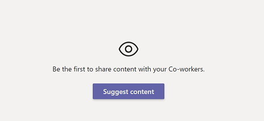

# Getting Started With Share Now Sample

Share Now promotes the exchange of information between colleagues by enabling users to share content within the Teams environment. Users engage the app to share items of interest and discover new shared content.


> Note: This sample will only provision [single tenant](https://learn.microsoft.com/azure/active-directory/develop/single-and-multi-tenant-apps#who-can-sign-in-to-your-app) Azure Active Directory app. For multi-tenant support, please refer to this [wiki](https://aka.ms/teamsfx-multi-tenant).

## This sample illustrates
- How to build frontend hosting on Azure for your tab app.
- How to build backend hosting on Azure for your tab app.
- How to build message extension bot on Azure for your app.
- How to connect to Azure SQL DB and how to do CRUD operations in DB.

## Prerequisite
- [Node.js](https://nodejs.org/), supported versions: 16, 18
- A Microsoft 365 account. If you do not have Microsoft 365 account, apply one from [Microsoft 365 developer program](https://developer.microsoft.com/en-us/microsoft-365/dev-program)
- [Teams Toolkit Visual Studio Code Extension](https://aka.ms/teams-toolkit) version 5.0.0 and higher or [TeamsFx CLI](https://aka.ms/teamsfx-cli)
- An [Azure subscription](https://azure.microsoft.com/en-us/free/)

## Minimal path to awesome
### Deploy the app to Azure
>Here are the instructions to run the sample in **Visual Studio Code**. You can also try to run the app using TeamsFx CLI tool, refer to [Try the Sample with TeamsFx CLI](cli.md)
1. Clone the repo to your local workspace or directly download the source code.
1. Open the project in Visual Studio Code.
1. Open **env/.env.dev.user** file, set value for `SQL_USER_NAME` and `SQL_PASSWORD`.
1. Open the command palette and select: `Teams: Provision`. The toolkit will help you to provision Azure SQL.
1. Once provision is completed, open the command palette and select: `Teams: Deploy`.
1. Open **env/.env.dev** file, you could get the database name in `PROVISIONOUTPUT__AZURESQLOUTPUT__DATABASENAME` output. [Set IP address of your computer into server-level IP firewall rule from the database overview page](https://docs.microsoft.com/en-us/azure/azure-sql/database/firewall-configure#from-the-database-overview-page).
1. In Azure portal, find the database by `databaseName` and use [query editor](https://docs.microsoft.com/en-us/azure/azure-sql/database/connect-query-portal) with below query to create a table:
    ```sql
    CREATE TABLE [TeamPostEntity](
	    [PostID] [int] PRIMARY KEY IDENTITY,
	    [ContentUrl] [nvarchar](400) NOT NULL,
	    [CreatedByName] [nvarchar](50) NOT NULL,
	    [CreatedDate] [datetime] NOT NULL,
	    [Description] [nvarchar](500) NOT NULL,
	    [IsRemoved] [bit] NOT NULL,
	    [Tags] [nvarchar](100) NULL,
	    [Title] [nvarchar](100) NOT NULL,
	    [TotalVotes] [int] NOT NULL,
	    [Type] [int] NOT NULL,
	    [UpdatedDate] [datetime] NOT NULL,
	    [UserID] [uniqueidentifier] NOT NULL,
    )
    GO
    CREATE TABLE [UserVoteEntity](
	    [VoteID] [int] PRIMARY KEY IDENTITY,
	    [PostID] [int] NOT NULL,
	    [UserID] [uniqueidentifier] NOT NULL,
    )
    GO
    ```
### Preview the app in Teams
1. Once deployment is completed, you can preview the app running in Azure. In Visual Studio Code, open `Run and Debug` and select `Launch Remote (Edge)` or `Launch Remote (Chrome)` in the dropdown list and Press `F5` or green arrow button to open a browser.
1. The app will look like this when it runs for the first time:

	

1. You can add new content by clicking "Suggest content" button.
1. You can update content created by you by clicking "..." and then choose "update" button.
1. You can delete content created by you by clicking "..." and then choose "delete" button.
1. You can add/delete your vote for the content by click the icon  in the content.
1. You can search all/posted-by-me contents in compose box or command box by filtering based on title or tags of content and share with your colleagues.

### (Optional) Run the app locally
To debug the project, you will need to configure an Azure SQL Database to be used locally:
1. [Create an Azure SQL Database](https://docs.microsoft.com/en-us/azure/azure-sql/database/single-database-create-quickstart?tabs=azure-portal)
1. [Add IP address of your computer into allowlist of firewall of Azure SQL Server](https://docs.microsoft.com/en-us/azure/azure-sql/database/firewall-configure#from-the-database-overview-page)
1. Use [query editor](https://docs.microsoft.com/en-us/azure/azure-sql/database/connect-query-portal) with below query to create tables:
    ```sql
    CREATE TABLE [TeamPostEntity](
	    [PostID] [int] PRIMARY KEY IDENTITY,
	    [ContentUrl] [nvarchar](400) NOT NULL,
	    [CreatedByName] [nvarchar](50) NOT NULL,
	    [CreatedDate] [datetime] NOT NULL,
	    [Description] [nvarchar](500) NOT NULL,
	    [IsRemoved] [bit] NOT NULL,
	    [Tags] [nvarchar](100) NULL,
	    [Title] [nvarchar](100) NOT NULL,
	    [TotalVotes] [int] NOT NULL,
	    [Type] [int] NOT NULL,
	    [UpdatedDate] [datetime] NOT NULL,
	    [UserID] [uniqueidentifier] NOT NULL,
    )
    GO
    CREATE TABLE [UserVoteEntity](
	    [VoteID] [int] PRIMARY KEY IDENTITY,
	    [PostID] [int] NOT NULL,
	    [UserID] [uniqueidentifier] NOT NULL,
    )
    GO
    ```
1. Open **env/.env.local** file, and set the values of below config with the Azure SQL Database you just created:
    ```
    SQL_ENDPOINT=
    SQL_DATABASE_NAME=
    ```
1. Open **env/.env.local.user** file, and set the values of below config with the Azure SQL Database you just created:
    ```
    SQL_USER_NAME=
    SQL_PASSWORD=
    ```
1. Open Debug View (`Ctrl+Shift+D`) and select "Debug (Edge)" or "Debug (Chrome)" in dropdown list.
1. Press "F5" to open a browser window and then select your package to view share now sample app.


## Version History

|Date| Author| Comments|
|---|---|---|
|May 13 2021| xzf0587 | onboard |
|May 18, 2022| xzf0587 | update to support Teams Toolkit v4.0.0|
|Apr 3, 2023| xzf0587 | update to support Teams Toolkit v5.0.0|

## Feedback
We really appreciate your feedback! If you encounter any issue or error, please report issues to us following the [Supporting Guide](https://github.com/OfficeDev/TeamsFx-Samples/blob/dev/SUPPORT.md). Meanwhile you can make [recording](https://aka.ms/teamsfx-record) of your journey with our product, they really make the product better. Thank you!
