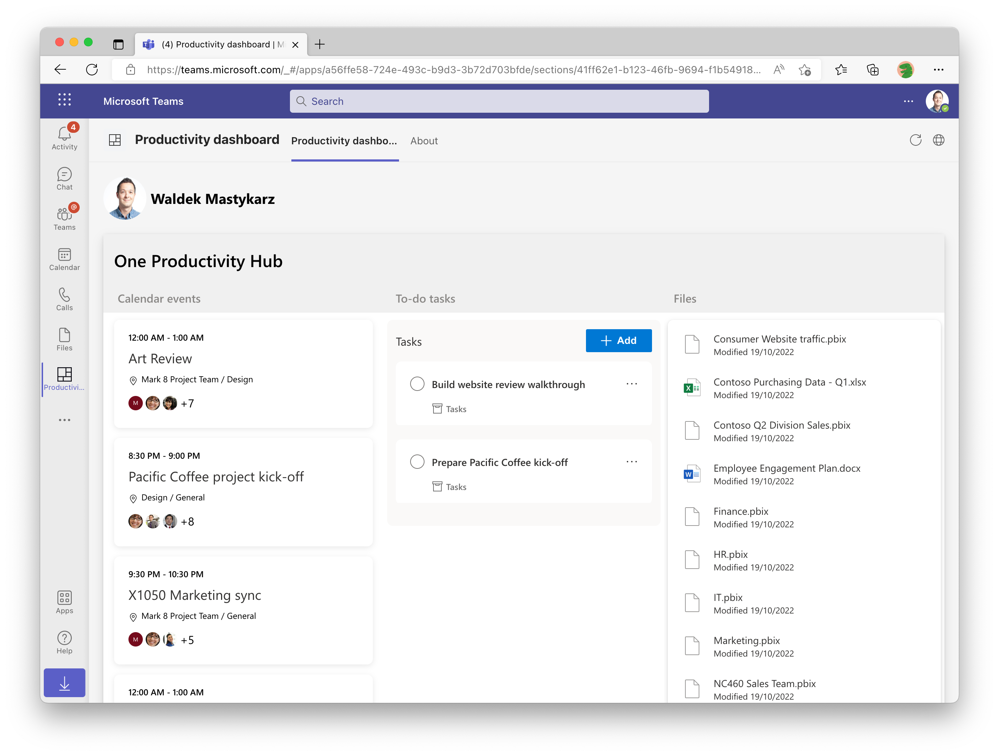

# Getting Started with One Productivity Hub using Graph Toolkit with SPFx Sample

`One Productivity Hub using Graph Toolkit with SPFx` is a demo application that helps you keep track of your activities planned for the day. The application is built using the SharePoint Framework and runs in Microsoft Teams, Outlook, Microsoft 365 app, and SharePoint. It uses Microsoft Graph Toolkit to connect to Microsoft Graph and display data from Microsoft 365.

## This sample illustrates

- How to build a SharePoint web part with the Microsoft Graph Toolkit.
- How to build and deploy web parts with additional permission requests.

## Prerequisite to use this sample

- [Set up SharePoint Framework development environment](https://aka.ms/teamsfx-spfx-dev-environment-setup)（Recommend to use SPFx v1.21.1）
- A Microsoft 365 tenant in which you have permission to upload Teams apps. You can get a free Microsoft 365 developer tenant by joining the [Microsoft 365 developer program](https://developer.microsoft.com/en-us/microsoft-365/dev-program).
- [Microsoft 365 Agents Toolkit Visual Studio Code Extension](https://aka.ms/teams-toolkit) version 5.0.0 and higher or [Microsoft 365 Agents Toolkit CLI](https://aka.ms/teams-toolkit-cli)
- [Deploy the Microsoft Graph Toolkit SharePoint Framework package to your tenant](https://learn.microsoft.com/en-us/sharepoint/dev/spfx/web-parts/get-started/build-web-part-microsoft-graph-toolkit?WT.mc_id=m365-80548-wmastyka#deploy-the-microsoft-graph-toolkit-sharepoint-framework-package)

## Minimal path to awesome

### Deploy the app

>Here are the instructions to run the sample in **Visual Studio Code**. You can also try to run the app using Microsoft 365 Agents Toolkit CLI tool, refer to [Try sample with Microsoft 365 Agents Toolkit CLI](cli.md)

1. Clone the repo to your local workspace or directly download the source code.
1. Open the project in Visual Studio Code, click `Provision` in LIFECYCLE panel of Microsoft 365 Agents Toolkit extension or open the command palette and select `Microsoft 365 Agents: Provision`. This step will create an app in Teams App Studio.
1. Go back to Microsoft 365 Agents Toolkit extension, click `Deploy` in LIFECYCLE panel or open the command palette and select `Microsoft 365 Agents: Deploy`.
    > This step will build a SharePoint package (*.sppkg) under `sharepoint/solution` folder. The Microsoft 365 Agents Toolkit will automatically upload and deploy it to your tenant App Catalog site. Only tenant App Catalog site admin has permission to do it. If you are not the admin, you can create your test tenant following [Setup your Microsoft 365 tenant](https://docs.microsoft.com/en-us/sharepoint/dev/spfx/set-up-your-developer-tenant).
1. Go to your SharePoint Admin center. In the left-hand navigation, select `Advanced` and then `API Access`. You should see pending requests for each of the permissions requested in src\config\package-solution.json file. Select and approve each permission.

### Launch the app in Teams

1. Once deployment is completed, you can preview the app. In Visual Studio Code, select target environment and click `Preview App` in ENVIRONMENT panel to open a browser.

## Further Reading

- [Build a SharePoint web part with the Microsoft Graph Toolkit](https://learn.microsoft.com/sharepoint/dev/spfx/web-parts/get-started/build-web-part-microsoft-graph-toolkit?WT.mc_id=m365-80548-wmastyka)
- [Retrieving data from Microsoft 365 using Microsoft Graph and Microsoft Graph Toolkit](https://learn.microsoft.com/graph/toolkit/overview?WT.mc_id=m365-80548-wmastyka)

## Version History

|Date| Author| Comments|
|---|---|---|
|Aug 09, 2023| huihuiwu | Onboard to Teams Toolkit |
|Dec 5, 2023| yuqzho | Upgrade to SPFx 1.18.2 |
|May 14, 2025| huihuiwu | Upgrade to SPFx 1.21.1|

## Feedback

We really appreciate your feedback! If you encounter any issue or error, please report issues to us following the [Supporting Guide](https://github.com/OfficeDev/TeamsFx-Samples/blob/dev/SUPPORT.md). Meanwhile you can make [recording](https://aka.ms/teamsfx-record) of your journey with our product, they really make the product better. Thank you!
