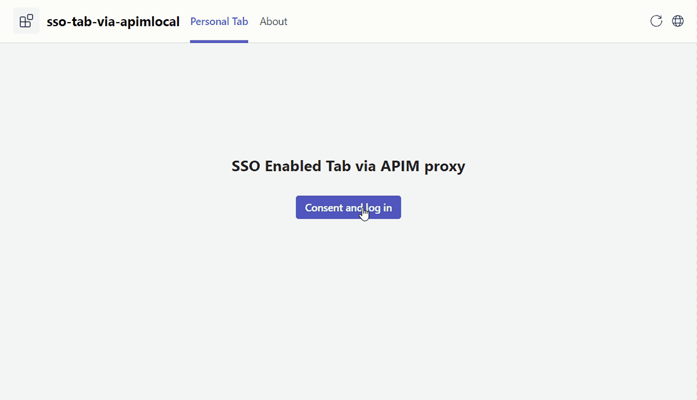

# Getting Started with SSO Enabled Tab via APIM Proxy Sample (Azure)

Microsoft Teams supports the ability to run web-based UI inside "custom tabs" that users can install either for just themselves (personal tabs) or within a team or group chat context.

SSO Enabled Tab via APIM Proxy shows you how to build a tab app with Graph Toolkit as frontend and Azure API Management as proxy to get user login information with SSO.

With this sample, you can achieve the SSO feature in your tab app using OBO (on-behalf-of) flow without building a dedicated backend service.

## This sample illustrates

- How to use Teams Toolkit to create a Teams tab app.
- How to use integrate APIM in TeamsFx projects.
- How to implement SSO in Teams Tab app.
- How to use APIM as proxy of Graph Toolkit, use SSO token to call Graph and get user login info.

## Note
- This sample has adopted [On-Behalf-Of Flow](https://learn.microsoft.com/en-us/azure/active-directory/develop/v2-oauth2-on-behalf-of-flow) to implement SSO.

- This sample uses Azure API Management as proxy, and make authenticated requests to call Graph.

- Due to system webview limitations, users in the tenant with conditional access policies applied cannot consent permissions when conduct an OAuth flow within the Teams mobile clients, it would show error: "xxx requires you to secure this device...".

## Prerequisites

- [Node.js](https://nodejs.org/), supported versions: 16, 18
- An M365 account. If you do not have M365 account, apply one from [M365 developer program](https://developer.microsoft.com/microsoft-365/dev-program)
- [Set up your dev environment for extending Teams apps across Microsoft 365](https://aka.ms/teamsfx-m365-apps-prerequisites)
> Please note that after you enrolled your developer tenant in Office 365 Target Release, it may take couple days for the enrollment to take effect.
- [Teams Toolkit Visual Studio Code Extension](https://aka.ms/teams-toolkit) version 5.0.0 and higher or [TeamsFx CLI](https://aka.ms/teams-toolkit-cli)

## Getting Started

You can follow the steps [here](https://aka.ms/teamsfx-sso-tab-via-apim) for how to run this app.

## References

* [Extend a Teams personal tabs across Microsoft 365](https://docs.microsoft.com/microsoftteams/platform/m365-apps/extend-m365-teams-personal-tab?tabs=manifest-teams-toolkit)
* [Teams Toolkit Documentations](https://docs.microsoft.com/microsoftteams/platform/toolkit/teams-toolkit-fundamentals)
* [Teams Toolkit CLI](https://docs.microsoft.com/microsoftteams/platform/toolkit/teamsfx-cli)
* [TeamsFx SDK](https://docs.microsoft.com/microsoftteams/platform/toolkit/teamsfx-sdk)
* [Teams Toolkit Samples](https://github.com/OfficeDev/TeamsFx-Samples)
