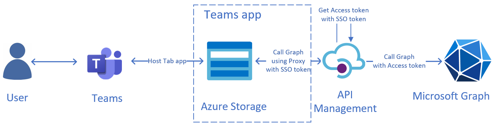
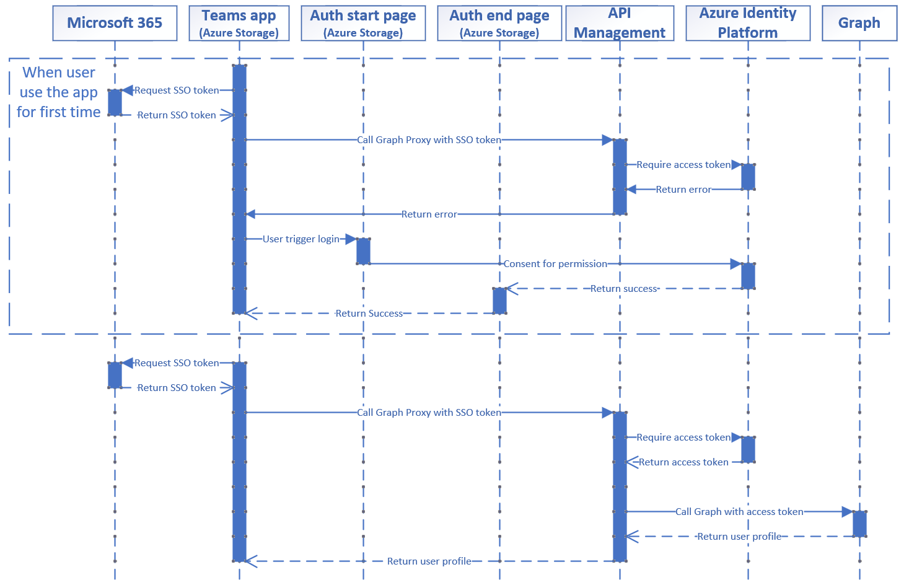

# Overview

Microsoft Teams supports the ability to run web-based UI inside "custom tabs" that users can install either for just themselves (personal tabs) or within a team or group chat context.

SSO Enabled Tab via APIM Proxy shows you how to build a single-page Tab app with Graph Toolkit in frontend, Azure API Management (APIM) as Proxy for calling Graph APIs. APIM has adopted [On-Behalf-Of flow](https://learn.microsoft.com/en-us/azure/active-directory/develop/v2-oauth2-on-behalf-of-flow) for SSO.

## This sample illustrates

- How to use Teams Toolkit to create a Teams tab app.
- How to use integrate APIM in TeamsFx projects.
- How to implement SSO in Teams Tab app.
- How to use APIM as proxy of Graph Toolkit, use SSO token to call Graph and get user login info.

## Note
- This sample has adopted [On-Behalf-Of Flow](https://learn.microsoft.com/en-us/azure/active-directory/develop/v2-oauth2-on-behalf-of-flow) to implement SSO.

- This sample uses Azure API Management as proxy, and make authenticated requests to call Graph.

- Due to system webview limitations, users in the tenant with conditional access policies applied cannot consent permissions when conduct an OAuth flow within the Teams mobile clients, it would show error: "xxx requires you to secure this device...".

## Benefits

1. 

# Architecture

Here is an overall architectural diagram for the `SSO Enabled Tab via APIM Proxy` sample:




# Authentication



# Minimal path to awesome

## Run this app locally

Follow below instructions to create an Azure API Management for local debugging.

1. Click F5 to preview this Teams App. After preview success, close debug session of VSCode. It will create and config necessary AAD app and teams app for you.

1. Open `.env.local`, note the value of following keys: `AAD_APP_CLIENT_ID`, `AAD_APP_TENANT_ID`.

1. Open `.env.local.user`, decrypt and note the value of `SECRET_AAD_APP_CLIENT_SECRET`.

1. Create Azure API Manangement

    - Go to [Azure Portal](https://ms.portal.azure.com/#home)
    - Create an `API Management`.
      > You can skip ths step if you already have an existing API Management.
    - After resource is successfully deployed, note the value of `Gateway URL` of your API Management.
    
1. Config Azure API Management
    - Select `Named Values` in the left panel, and add following key-value pairs:
      * clientId: value of `AAD_APP_CLIENT_ID`
      * clientSecret: value of `SECRET_AAD_APP_CLIENT_SECRET`
      * tenantId: value of `AAD_APP_TENANT_ID`
      * scope: "User.Read"
    - Click on `APIs` in the left panel, click on `Add API` and select `HTTP`
    - Fill in the blanks to create your API. For `API URL Suffix`, you can fill in `v1.0`.
    - Select `All operations`, select `Add Policy` as shown below. Add the following CORS policy:
     
      ```
      <policies>
        <inbound>
            <cors>
                <allowed-origins>
                    <origin>*</origin>
                </allowed-origins>
                <allowed-methods>
                    <method>*</method>
                </allowed-methods>
                <allowed-headers>
                    <header>*</header>
                </allowed-headers>
                <expose-headers>
                    <header>*</header>
                </expose-headers>
            </cors>
            <base />
        </inbound>
        <backend>
            <base />
        </backend>
        <outbound>
            <base />
        </outbound>
        <on-error>
            <base />
        </on-error>
      </policies>
      ``` 
    - Select `Add Operation`, and fill in the following values:
      * Display Name: me-user-GetUser 
      * URL: GET "/me"
    - Select `Add Operation`, and fill in the following values:
      * Display Name: me-user-GetUserPhoto
      * URL: GET "/me/photo"
    - Select `Add Operation`, and fill in the following values:
      * Display Name: batch-user-GetUser
      * URL: POST "/$batch"
    - For every operation above, click on `Add Policy` as shown below and add following policy:
      
      ```
      <policies>
          <inbound>
              <base />
              <send-request ignore-error="true" timeout="20" response-variable-name="bearerToken" mode="new">
                  <set-url>https://login.microsoftonline.com/{{tenantId}}/oauth2/v2.0/token</set-url>
                  <set-method>POST</set-method>
                  <set-header name="Content-Type" exists-action="override">
                      <value>application/x-www-form-urlencoded</value>
                  </set-header>
                  <set-body>@{
                    var assertion = context.Request.Headers.GetValueOrDefault("Authorization","").Replace("Bearer ","");
                    return $"client_id={{clientId}}&scope={{scope}}&client_secret={{clientSecret}}&assertion={assertion}&requested_token_use=on_behalf_of&grant_type=urn:ietf:params:oauth:grant-type:jwt-bearer";
                }</set-body>
              </send-request>
              <set-header name="Authorization" exists-action="override">
                  <value>@("Bearer " + (String)((IResponse)context.Variables["bearerToken"]).Body.As<JObject>()["access_token"])</value>
              </set-header>
              <!--  Don't expose APIM subscription key to the backend. -->
              <set-header name="Ocp-Apim-Subscription-Key" exists-action="delete" />
          </inbound>
          <backend>
              <base />
          </backend>
          <outbound>
              <base />
          </outbound>
          <on-error>
              <base />
          </on-error>
      </policies>
      ```

1. Open `env.local`, set value of `Gateway URL` to `APIM_ENDPOINT`.

1. Hit `F5` to start debugging. Alternatively open the `Run and Debug Activity` Panel and select `Debug (Edge)` or `Debug (Chrome)`.

## Run this app on Azure
1. Click `Provision` from `LIFECYCLE` section or open the command palette and select: `Teams: Provision`.

1. Click `Deploy` or open the command palette and select: `Teams: Deploy`.

1. Open the `Run and Debug Activity` Panel. Select `Launch Remote (Edge)` or `Launch Remote (Chrome)` from the launch configuration drop-down.