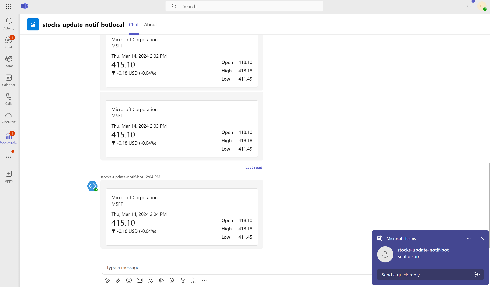

# Getting Started with Stocks Update Notification Bot

Stocks Update Notifcation Bot is a an application that can be installed in different Microsoft Teams contexts, personal, group chat, or teams channel, which sends a message on a pre-defined schedule as an Adaptive Card to locations where it is installed.

## This sample illustrates
- How to use API client in TeamsFx to get access data in public API using the API Key provider.
- How to render data in an Adaptive Card.

## Prerequisite to use this sample
- [Visual Studio 2022](https://visualstudio.microsoft.com/), version 17.3 or higher.
- Latest [Teams Toolkit for Visual Studio](https://docs.microsoft.com/en-us/microsoftteams/platform/toolkit/teams-toolkit-overview-visual-studio).
- A Microsoft 365 account. If you do not have Microsoft 365 account, apply one from [Microsoft 365 developer program](https://developer.microsoft.com/en-us/microsoft-365/dev-program).

## Minimal path to awesome
### Run the app locally
1. Clone the repo to your local workspace or directly download the source code.
1. Open the project in Visual Studio.
1. Right click to the project, select **Teams Toolkit > Prepare Teams App Dependencies**.
1. Press "F5" to launch the bot 
1. Sideloading your app to view into Microsoft Teams to view the Stocks Update Notification bot.

### Deploy the app to Azure
You can create and automatically configure cloud resources for hosting your app in Azure using Teams Toolkit.
1. If you don't have an Azure subscription, create [a free account](https://azure.microsoft.com/en-us/free/) before you begin
1. Select the **StocksUpdateNotificationBot > Teams Toolkit > Provision** menu. In the Select your subscription window, choose the Azure subscription you want to use to create resources with. Teams Toolkit will create Azure resources in this subscription but no code is deployed during this step.
1. Select the **StocksUpdateNotificationBot > Teams Toolkit > Deploy in the Cloud** menu to deploy your project to these new resources.

### Preview the app in Teams
1. When you install the app into Microsoft Teams, it will immediately begin to send messages every thirty seconds into the location where you have installed it. There is no additional configuration required.

## Version History
| Date         | Author        | Comments                               |
| ------------ | ------------- | -------------------------------------- |
| Oct 24, 2022 | garrytrinder  | update to support Teams Toolkit V4.0.0 |
| Dec 5, 2022  | XiaofuHuang   | update to support Teams Toolkit v5.0.0 |

## Feedback
We really appreciate your feedback! If you encounter any issue or error, please report issues to us following the [Supporting Guide](https://github.com/OfficeDev/TeamsFx-Samples/blob/dev/SUPPORT.md). Meanwhile you can make [recording](https://aka.ms/teamsfx-record) of your journey with our product, they really make the product better. Thank you!