# Getting Started With Todo List Sample (SPFx)

> Note: Please be advised that this sample repository is currently in **Public Preview**, with a lot of active development work taking place. Please expect breaking changes as we continue to iterate. 
> 
> We really appreciate your feedback! If you encounter any issue or error, please report issues to us following the [Supporting Guide](./../SUPPORT.md). Meanwhile you can make [recording](https://aka.ms/teamsfx-record) of your journey with our product, they really make the product better. Thank you!
>  
> This warning will be removed when the samples are ready for production.

Todo List with SPFx is a Todo List Manage tool for a group of people. This app is installed in Teams Team or Channel and hosted on SharePoint, members in the Team/Channel can collaborate on the same Todo List, manipulate the same set of Todo items. There is no requirement asking for an Azure account to deploy Azure resouces to run this sample app.

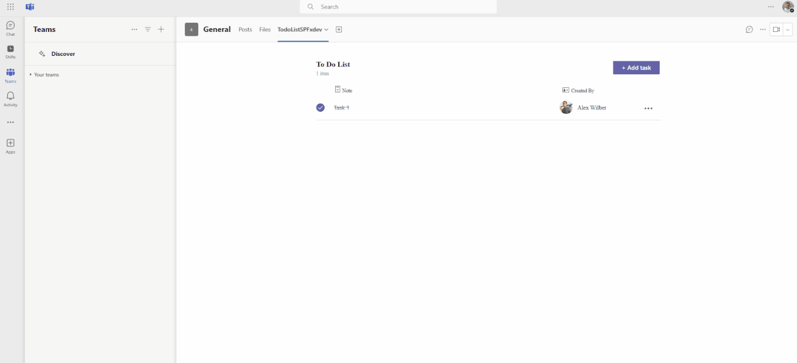

### What you will learn in this sample

- How to create SharePoint List in the SharePoint team site and how to do CRUD operations on SharePoint List in SPFx context.
- How to deploy your app to SharePoint App Catalog and sync the solution to Teams App Catalog.

## Prerequisites
* [NodeJS](https://nodejs.org/en/download/releases/) (Recommend LTS 14.x)
    >  The SharePoint Framework v1.12.1 is supported on the following Node.js versions:
    >- Node.js v10.13.0+ (Dubnium)
    >- Node.js v12.13.0+ (Erbium)
    >- Node.js v14.15.0+ (Fermium) 
* Setup SharePoint Environment by following the [instructions](https://docs.microsoft.com/en-us/sharepoint/dev/spfx/set-up-your-developer-tenant).
* Use the team site in SharePoint to create a List.
    - Navigate to the [SharePoint team site](https://support.microsoft.com/en-us/office/create-a-team-site-in-sharepoint-ef10c1e7-15f3-42a3-98aa-b5972711777d), in `Home` tab, click `New` and select `List`.
    > *Note: Each Team/Channel in Teams has a corresponding team site in SharePoint. You must nagivate to the target SharePoint team site of the Team/Channel in which you want to add the "Todo List" app. The team site URL ends with xx.sharepoint.com/sites/xx*. eg. `https://{your-tenant-name}.sharepoint.com/sites/{your-team-name}`. 
    > In case you want to create a List in subsite of the team site, you will need manual steps to change the site url in *[./SPFx/src/webparts/todoList/components/SharePointListManager.ts](./SPFx/src/webparts/todoList/components/SharePointListManager.ts).*
    - Name the List 'To Do List'
    - Click `Add Column`, select `Single line of text`, name the column 'description'
    - Click `Add Column`, select `Yes/No`, name the column 'isCompleted'
* [Teams Toolkit Visual Studio Code Extension](https://aka.ms/teams-toolkit)
* [Optional] If you want your users see only the items created by themselves, add access control to your List.
    - In List Page, click `setting` button and then choose `list setting`.
    
    - In `Advanced Settings`, Set the `Read Access` to `Read items that were created by the user`, and Set the `Create and Edit access` to `Create items and edit items that were created by the user`.
    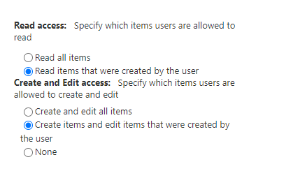
    - Click 'Ok' to save your setting.
* [Optional] If you want your guest users use the To-Do-list when using Teams Desktop app, add access permission to your app catlog.
    - In the App Catlog page, click `setting` button, and then choose `shared with`.
    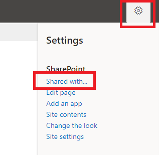
    - Invite the guest user and click `Share` button.
    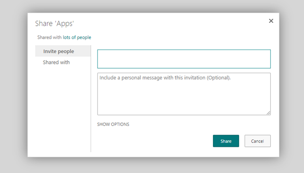

## Try the Sample
>Here are the instructions to run the sample in **Visual Studio Code**. You can also try to run the app using TeamsFx CLI tool, refer to [Try sample with TeamsFx CLI](cli.md)
1. Clone the repo to your local workspace or directly download the source code. 
1. Download [Visual Studio Code](https://code.visualstudio.com) and install [Teams Toolkit Visual Studio Code Extension](https://aka.ms/teams-toolkit).
1. Open [./SPFx/src/webparts/todoList/components/SharePointListManager.ts](./SPFx/src/webparts/todoList/components/SharePointListManager.ts), navigate to line:16, set the `listname` variable to your SharePoint List name.
1. Open the project in Visual Studio Code, click `Provision in the Cloud` in PROJECT panel of Microsoft Teams Toolkit extension or open the command palette and select `Teams: Provision in the Cloud`. This step will create an app in Teams App Studio.
1. Go back to Microsoft Teams Toolkit extension, click `Deploy to the Cloud` in PROJECT panel or open the command palette and select `Teams: Deploy to the Cloud`. 
    > This step will generate a SharePoint package (*.sppkg) under `sharepoint/solution` folder.
1. Upload or drag-and-drop the *.sppkg file under `sharepoint/solution` folder to the SharePoint App Catalog site, follow the instruction [Deploy the HelloWorld package to App Catalog](https://docs.microsoft.com/en-us/sharepoint/dev/spfx/web-parts/get-started/serve-your-web-part-in-a-sharepoint-page#deploy-the-helloworld-package-to-app-catalog)
    > Note: Tick the "Make this solution available to all sites in the organization" option to make the solution available in Teams.
1. Go back to Microsoft Teams Toolkit extension, in in PROJECT panel, click `Publish to Teams` or open the command palette and select `Teams: Publish to Teams`.
1. Check the published app in [Microsoft Teams admin center](https://admin.teams.microsoft.com/policies/manage-apps) by searching "todoList" in the search box.
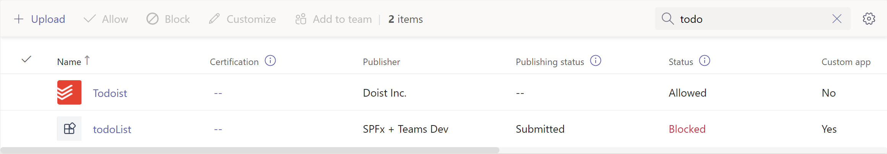
1. Click the 'TodoList' app you just published and select `Publish` in the Publishing status.

    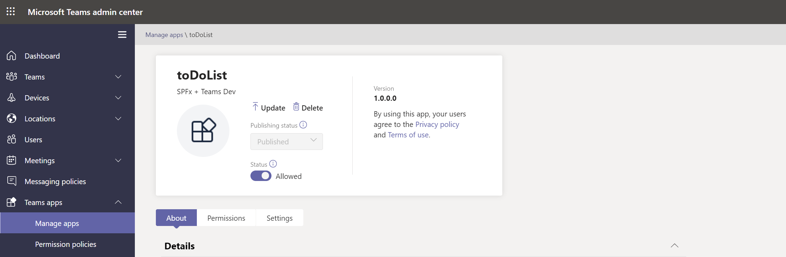

    It may take a few minutes to publish the Teams app.
1. Login to Teams using your M365 tenant admin account, same account you are using to create SharePoint environment and logging to VS Code extension. You will see your app in the `Apps - Built for your org`. 
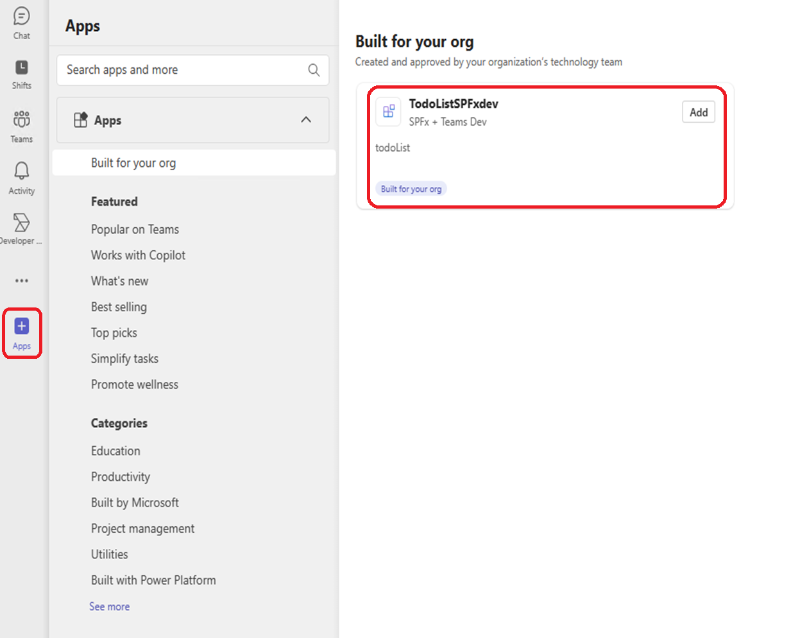
1. Add the app to your Teams.
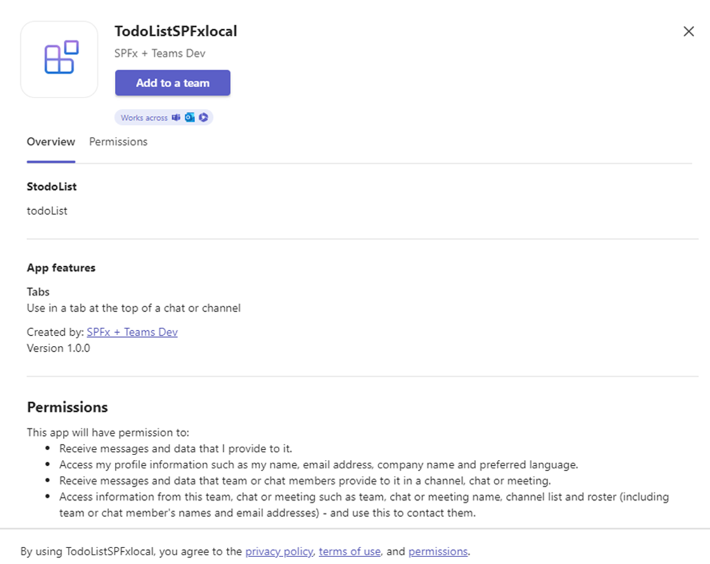
1. You should see the app running in your Teams.
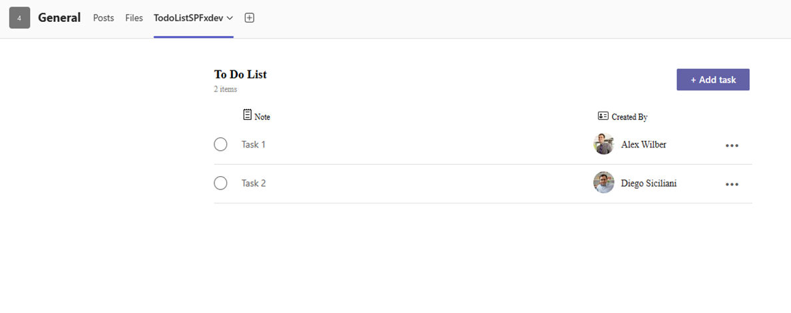

## (Optional) Debug
Debug the app with SharePoint WorkBench in VSCode.
1. Navigate to [launch.json](.vscode/launch.json), replace `enter-your-SharePoint-site` with your SharePoint site, eg. `https://{your-tenant-name}.sharepoint.com/sites/{your-team-name}/_layouts/workbench.aspx`.
1. In Debug mode, select "Hosted workbench" and press start button. The Hosted Workbench will be opened and you may need to sign in with your M365 account.
1. Click the plus button in the middle, and select `TodoList`, the webpart will show up in the workbench.
- 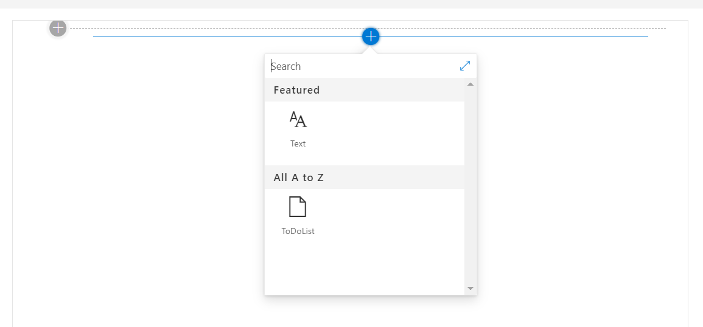

## Use the App in Teams
1. Since SharePoint can get the context so app user doesn't need to do consent/login operation.
2. You could add new todo item by clicking "Add Task" button.
3. You could complete todo item by choosing the checkbox before the item.
4. You could update todo item by typing text in todo item list.
5. You could delete todo item by clicking "..." and then choose "Delete" button.

## Architecture

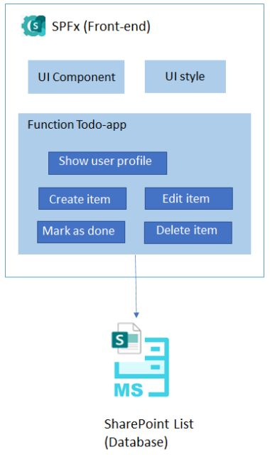
- The frontend is a React Tab hosted on [SharePoint](https://docs.microsoft.com/en-us/sharepoint/dev/spfx/build-for-teams-overview).
- Backend server(including the database) is provided by [SharePoint List](https://support.microsoft.com/en-us/office/introduction-to-lists-0a1c3ace-def0-44af-b225-cfa8d92c52d7) 

## Further Reading

- [Getting started with SharePoint Framework](https://docs.microsoft.com/en-us/sharepoint/dev/spfx/set-up-your-developer-tenant)
- [Building for Microsoft teams](https://docs.microsoft.com/en-us/sharepoint/dev/spfx/build-for-teams-overview)
- [Publish SharePoint Framework applications to the Marketplace](https://docs.microsoft.com/en-us/sharepoint/dev/spfx/publish-to-marketplace-overview)
- [Microsoft 365 Patterns and Practices](https://aka.ms/m365pnp) - Guidance, tooling, samples and open-source controls for your Microsoft 365 development

## Known Issue:
1. Importing [msteams-ui-components-react](https://www.npmjs.com/package/msteams-ui-components-react) package will cause issues during package build:
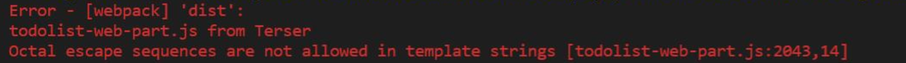
2. When using the TodoList app, switching Teams accounts <b>in the same browser</b> may cause errors(the app still uses the previous account instead of the current one). To avoid this, we suggest you to open a new browser or switch your profile in the browser settings instead of simply switching in the website.

## Code of Conduct
This project has adopted the [Microsoft Open Source Code of Conduct](https://opensource.microsoft.com/codeofconduct/).

For more information see the [Code of Conduct FAQ](https://opensource.microsoft.com/codeofconduct/faq/) or
contact [opencode@microsoft.com](mailto:opencode@microsoft.com) with any additional questions or comments.
