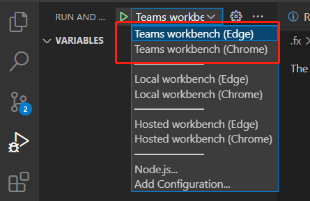
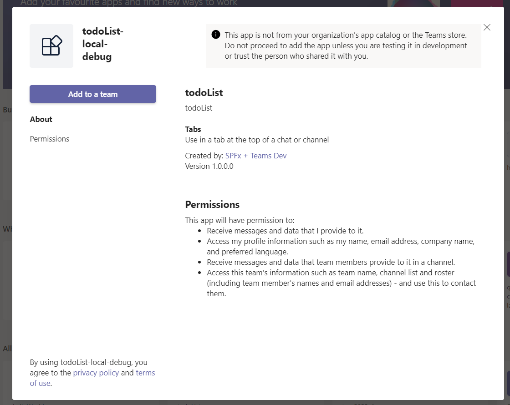
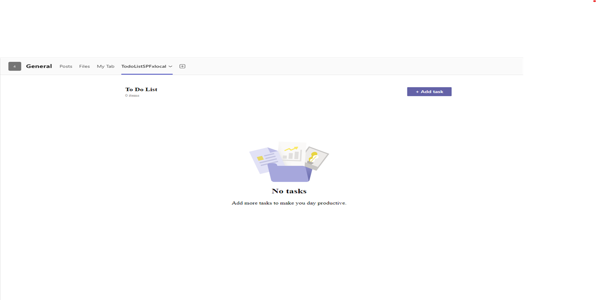

# Getting Started With Todo List Sample (SPFx)

`Todo List with SPFx` is a Todo List Manage tool for a group of people. This app is installed in Teams Team or Channel and hosted on SharePoint, members in the Team/Channel can collaborate on the same Todo List, manipulate the same set of Todo items. There is no requirement asking for an Azure account to deploy Azure resources to run this sample app.

## This sample illustrates

- How to create SharePoint List in the SharePoint team site and how to do CRUD operations on SharePoint List in SPFx context.
- How to deploy your app to SharePoint App Catalog and sync the solution to Teams App Catalog.

## Prerequisite to use this sample
* [Set up SharePoint Framework development environment](https://aka.ms/teamsfx-spfx-dev-environment-setup)（Recommend to use SPFx v1.21.1）
* An Microsoft 365 account. Get your own free Microsoft 365 tenant from [Microsoft 365 developer program](https://developer.microsoft.com/en-us/microsoft-365/dev-program)
* Use the team site in SharePoint to create a List.
    - Navigate to the [SharePoint team site](https://support.microsoft.com/en-us/office/create-a-team-site-in-sharepoint-ef10c1e7-15f3-42a3-98aa-b5972711777d), in `Home` tab, click `New` and select `List`.
    > *Note: Each Team/Channel in Teams has a corresponding team site in SharePoint. You must navigate to the target SharePoint team site of the Team/Channel in which you want to add the "Todo List" app. The team site URL ends with xx.sharepoint.com/sites/xx*. eg. `https://{your-tenant-name}.sharepoint.com/sites/{your-team-name}`.
    > In case you want to create a List in subsite of the team site, you will need manual steps to change the site url in *[./src/src/webparts/todoList/components/SharePointListManager.ts](./src/src/webparts/todoList/components/SharePointListManager.ts).*
    - Name the List 'To Do List'
    - Click `Add Column`, select `Single line of text`, name the column 'description'
    - Click `Add Column`, select `Yes/No`, name the column 'isCompleted', and set the default value to `No`.
* [Microsoft 365 Agents Toolkit Visual Studio Code Extension](https://aka.ms/teams-toolkit) version 5.0.0 and higher or [Microsoft 365 Agents Toolkit CLI](https://aka.ms/teams-toolkit-cli)
* [Optional] If you want your users see only the items created by themselves, add access control to your List.
    - In List Page, click `setting` button and then choose `list setting`.
    
    - In `Advanced Settings`, Set the `Read Access` to `Read items that were created by the user`, and Set the `Create and Edit access` to `Create items and edit items that were created by the user`.
    
    - Click 'Ok' to save your setting.
* [Optional] If you want your guest users use the To-Do-list when using Teams Desktop app, add access permission to your app catlog.
    - In the App Catlog page, click `setting` button, and then choose `shared with`.
    
    - Invite the guest user and click `Share` button.
    

## Minimal path to awesome
### Run the app locally
Debug the app with Teams workbench

1. In Debug mode, select `Teams workbench (Edge)` or `Teams workbench (Chrome)` and press start button. The browser will be opened and you need to sign in Teams with your Microsoft 365 account.

2. Click `Add to a team`.

3. You should see the app running in your Teams.

### Deploy the app
>Here are the instructions to run the sample in **Visual Studio Code**. You can also try to run the app using Microsoft 365 Agents Toolkit CLI tool, refer to [Try sample with Microsoft 365 Agents Toolkit CLI](cli.md)

1. Clone the repo to your local workspace or directly download the source code.
1. Open [./src/src/webparts/todoList/components/SharePointListManager.ts](./src/src/webparts/todoList/components/SharePointListManager.ts), navigate to line:17, set the `listname` variable to your SharePoint List name.
1. Open the project in Visual Studio Code, click `Provision` in LIFECYCLE panel of Microsoft 365 Agents Toolkit extension or open the command palette and select `Microsoft 365 Agents: Provision`. This step will create an app in Teams App Studio.
1. Go back to Microsoft 365 Agents Toolkit extension, click `Deploy` in LIFECYCLE panel or open the command palette and select `Microsoft 365 Agents: Deploy`.
    > This step will build a SharePoint package (*.sppkg) under `sharepoint/solution` folder. The Microsoft 365 Agents Toolkit will automatically upload and deploy it to your tenant App Catalog site. Only tenant App Catalog site admin has permission to do it. If you are not the admin, you can create your test tenant following [Setup your Microsoft 365 tenant](https://docs.microsoft.com/en-us/sharepoint/dev/spfx/set-up-your-developer-tenant).
1. Go back to Microsoft 365 Agents Toolkit extension, in LIFECYCLE panel, click `Publish` or open the command palette and select `Microsoft 365 Agents: Publish`.
1. Check the published app in [Microsoft Teams admin center](https://admin.teams.microsoft.com/policies/manage-apps) by searching "todoList" in the search box.

1. Click the 'TodoList' app you just published and select `Publish` in the Publishing status.

    

    It may take a few minutes to publish the Teams app.
1. Login to Teams using your Microsoft 365 tenant admin account, same account you are using to create SharePoint environment and logging to VS Code extension. You will see your app in the `Apps - Built for your org`.

1. Add the app to your Teams.

1. You should see the app running in your Teams.

### Use the app in Teams
1. Since SharePoint can get the context so app user doesn't need to do consent/login operation.
2. You could add new todo item by clicking "Add Task" button.
3. You could complete todo item by choosing the checkbox before the item.
4. You could update todo item by typing text in todo item list.
5. You could delete todo item by clicking "..." and then choose "Delete" button.

## Further Reading
- [Getting started with SharePoint Framework](https://docs.microsoft.com/en-us/sharepoint/dev/spfx/set-up-your-developer-tenant)
- [Building for Microsoft teams](https://docs.microsoft.com/en-us/sharepoint/dev/spfx/build-for-teams-overview)
- [Publish SharePoint Framework applications to the Marketplace](https://docs.microsoft.com/en-us/sharepoint/dev/spfx/publish-to-marketplace-overview)
- [Microsoft 365 Patterns and Practices](https://aka.ms/m365pnp) - Guidance, tooling, samples and open-source controls for your Microsoft 365 development

## Known Issues
1. Importing [msteams-ui-components-react](https://www.npmjs.com/package/msteams-ui-components-react) package will cause issues during package build:

2. When you want to switch accounts to test the app, and if you are using edge browser with profile mode instead of guest mode, we suggest you to switch accounts by switching  profiles in the browser. This is because if you simply log out in Teams site, SharePoint site will still use the profile account. Thus the accounts for these two sites may be not consistent and will cause error.

## Version History
|Date| Author| Comments|
|---|---|---|
|Apr 21, 2022| huihuiwu | Update to support Teams Toolkit v4.0.0|
|Mar 23, 2023| huihuiwu | Update to support Teams Toolkit v5.0.0|
|Dec 5, 2023| yuqzho | Upgrade to SPFx 1.18.2 |
|May 14, 2025| huihuiwu | Upgrade to SPFx 1.21.1|

## Feedback
We really appreciate your feedback! If you encounter any issue or error, please report issues to us following the [Supporting Guide](https://github.com/OfficeDev/TeamsFx-Samples/blob/dev/SUPPORT.md). Meanwhile you can make [recording](https://aka.ms/teamsfx-record) of your journey with our product, they really make the product better. Thank you!
