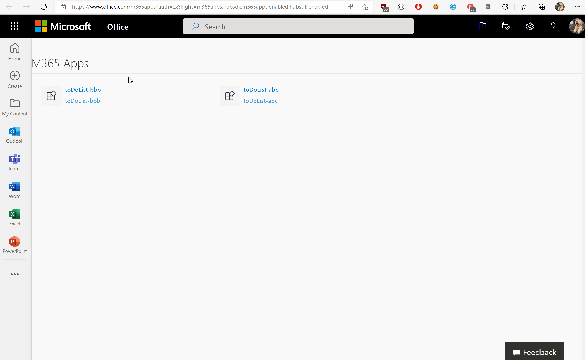
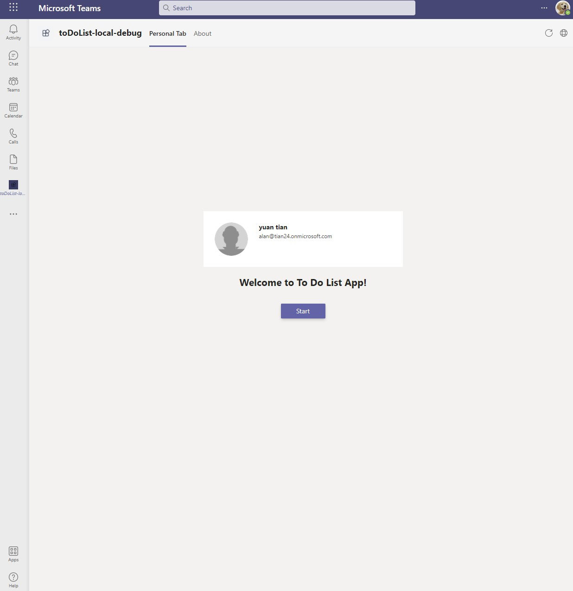
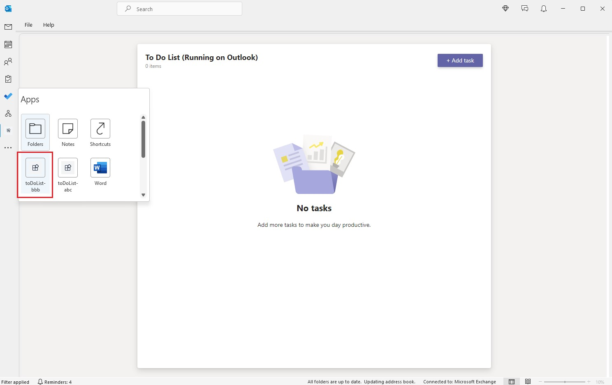
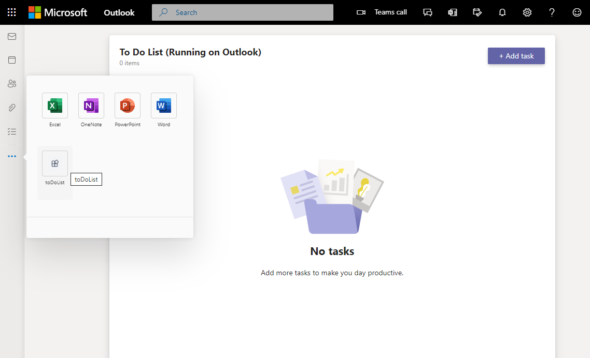

# Getting Started with Todo List Sample

> Note: Please be advised that this sample repository is currently in **Public Preview**, with a lot of active development work taking place. Please expect breaking changes as we continue to iterate. 
> 
> We really appreciate your feedback! If you encounter any issue or error, please report issues to us following the [Supporting Guide](./../SUPPORT.md). Meanwhile you can make [recording](https://aka.ms/teamsfx-record) of your journey with our product, they really make the product better. Thank you!
>  
> This warning will be removed when the samples are ready for production.

Todo List app helps to manage your personal to do items. This app can be installed and used not only in your Teams client, but also Outlook client and Office.com. The frontend is a React app and the backend is an Azure Function. You can deploy and host the app in Azure.

## Teams

## Outlook

## Office

## Prerequisite
- [NodeJS](https://nodejs.org/en/), fully tested on NodeJS 12, 14
- An [Azure subscription](https://azure.microsoft.com/en-us/free/)
- [Set up your dev environment for extending Teams apps across Microsoft 365](https://aka.ms/teamsfx-m365-apps-prerequisites)

## What you will learn in this sample:

- How to use TeamsFx to build frontend hosting on Azure for your tab app.
- How to use TeamsFx to build backend hosting on Azure for your tab app.
- How to use MS graph client in TeamsFx to get access to M365 data.
- How to use Teams Toolkit to build a personal tab app with Azure Function backend that runs across M365 including Teams, Outlook and Office

## Try the Sample with Visual Studio Code Extension:
1. Clone the repo to your local workspace or directly download the source code.
2. Download [Visual Studio Code](https://code.visualstudio.com) and install [Teams Toolkit Visual Studio Code Extension](https://aka.ms/teams-toolkit).
3. Open the project in Visual Studio Code.
4. Open the command palette and select `Teams: Provision in the cloud`. 
5. Once provision is completed, open the command palette and select `Teams: Deploy to the cloud`.
6. Once deployment is completed, open the command palette and select `Teams: Zip Teams metadata package`.
7. Log in to Teams with your test tenant account, and ensure you are on the Public Developer Preview. You can verify this in Teams client by clicking on the ellipsis (...) menu by your user profile and opening **About** to check that the *Developer preview* option is toggled on.

   
8.  Open the *Apps* pane, and click **Upload a custom app** and then **Upload for me or my teams**.

    

    Select your app package and click *Open*. Once the app is uploaded, your app will be available in Outlook and Office within several minutes.

## Use the App in Teams

1. The app will look like this when it runs for the first time.

    
2. For the first time to run the app, you need to consent the app to get your profile information like your avatar. Click on "Accept" button to accept the Authorization.

    
3. You could try to add new todo item by typing item by clicking "Add task" button.
4. You could try to complete todo item by choosing the checkbox before the item.
5. You could try to update todo item by typing text in todo item list.
6. You could try to delete todo item by clicking "..." and then choose "delete" button.

## Use the App in Outlook
To view your app running in Outlook on desktop, launch Outlook and sign in using your test tenant account. Click on the ellipses (...) menu on the Outlook app bar. Your sideloaded app title will appear among your installed apps.

Click on your app icon to launch and preview your app running in Outlook.

## Use the App in Outlook Web Client
To view your app in Outlook Web Client, visit https://outlook.office.com and sign in using your test tenant account. Click on the ellipses (...) menu on the Outlook app bar. Your sideloaded app title will appear among your installed apps.

Click on your app icon to launch and preview your app running in Outlook Web Client.

## Use the App in Office
To preview your app running in Office, log into [office.com](https://www.office.com/) with your test tenant credentials. Click on the ellipses (...) menu on the Office app bar. Your sideloaded app title will appear among your installed apps.

Click on your app icon to launch and preview your app running in Office.

## Architecture

- The frontend is a react tab app hosted on [Azure Storage](https://docs.microsoft.com/en-us/azure/storage/).
- The backend server is hosted on [Azure Function](https://docs.microsoft.com/en-us/azure/azure-functions/) for managing posts in the tab app.
- The backend data is stored in memory on [Azure Function](https://docs.microsoft.com/en-us/azure/azure-functions/). This is only for simplicity of demonstration. The data might not persist in certain circumstances.

### Code structure

- You can check app configuration and environment information in: [.fx](.fx)
- You will find frontend code in: [tabs/src/components](tabs/src/components)
- You will find backend code in: [api/todo](api/todo)
- You will find MS graph client code in: [tabs/src/components/Creator.js](tabs/src/components/Creator.js)

## Code of Conduct
This project has adopted the [Microsoft Open Source Code of Conduct](https://opensource.microsoft.com/codeofconduct/).

For more information see the [Code of Conduct FAQ](https://opensource.microsoft.com/codeofconduct/faq/) or
contact [opencode@microsoft.com](mailto:opencode@microsoft.com) with any additional questions or comments.
