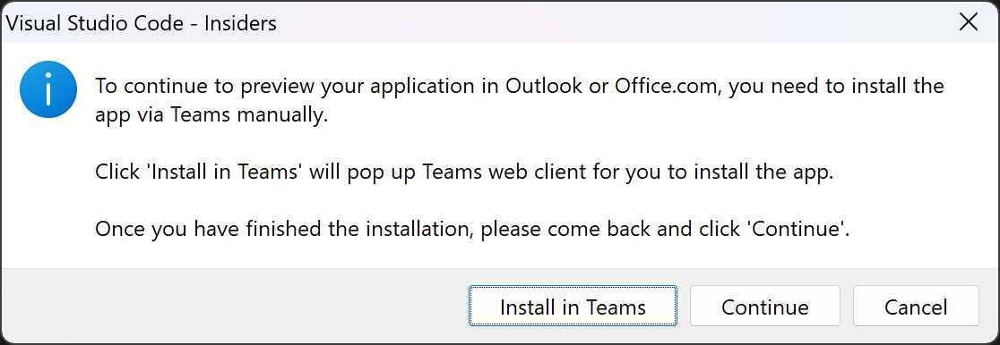
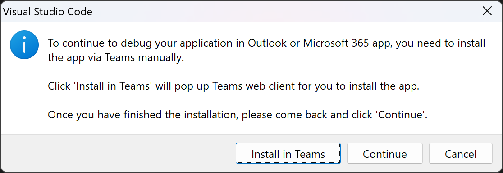
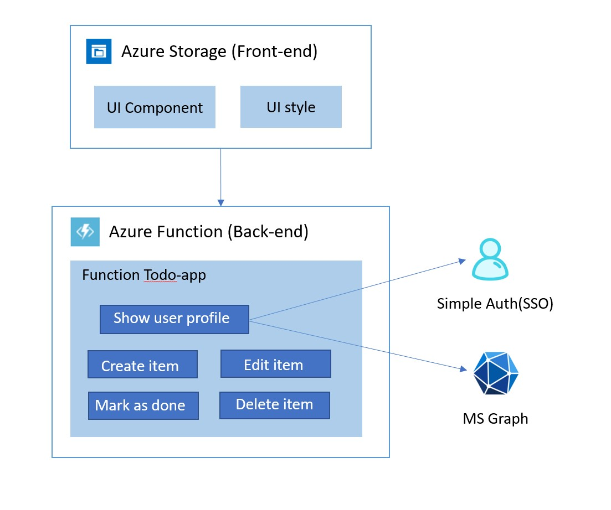

# Getting Started with Todo List Sample

> Note: We really appreciate your feedback! If you encounter any issue or error, please report issues to us following the [Supporting Guide](https://github.com/OfficeDev/TeamsFx-Samples/blob/dev/SUPPORT.md). Meanwhile you can make [recording](https://aka.ms/teamsfx-record) of your journey with our product, they really make the product better. Thank you!
>  
> This warning will be removed when the samples are ready for production.

Todo List app helps to manage your personal to do items. This app can be installed and used not only in your Teams client, but also Outlook client and Office.com. The frontend is a React app and the backend is an Azure Function. You can deploy and host the app in Azure.

## Prerequisite

- [Node.js](https://nodejs.org/en/), supported versions: 14, 16, 18 (preview)
- An [Azure subscription](https://azure.microsoft.com/en-us/free/)
- [Set up your dev environment for extending Teams apps across Microsoft 365](https://aka.ms/teamsfx-m365-apps-prerequisites)
- Latest [Teams Toolkit Visual Studio Code Extension](https://aka.ms/teams-toolkit) **version >= 3.8.0** or [TeamsFx CLI](https://aka.ms/teamsfx-cli) **version >= 0.14.0**

## What you will learn in this sample:

- How to use TeamsFx to build frontend hosting on Azure for your tab app.
- How to use TeamsFx to build backend hosting on Azure for your tab app.
- How to use MS graph client in TeamsFx to get access to Microsoft 365 data.
- How to use Teams Toolkit to build a personal tab app with Azure Function backend that runs across Microsoft 365 including Teams, Outlook and Office

## Try the Sample with Visual Studio Code Extension:

> Here are the instructions to run the sample in **Visual Studio Code**. You can also try to run the app using TeamsFx CLI tool, refer to [Try the Sample with TeamsFx CLI](cli.md)

1. Clone the repo to your local workspace or directly download the source code.
2. Download [Visual Studio Code](https://code.visualstudio.com) and install [Teams Toolkit Visual Studio Code Extension](https://aka.ms/teams-toolkit).
3. Open the project in Visual Studio Code.
4. Open the command palette and select `Teams: Provision in the cloud`. 
5. Once provision is completed, open the command palette and select `Teams: Deploy to the cloud`.
6. Once deployment is completed, you can preview the app running in Azure. In Visual Studio Code, open the `Teams Toolkit` Activity Panel. In `ENVIRONMENTS`, select the environment you want to preview and click the `Preview App` icon. For the prompted question, select the platform you want to preview in. If you select Outlook or Office, a VS Code dialog will be popped up as the image below. Please click "Install in Teams" first to install the app in Teams, then click "Continue" to continue to preview the app in Outlook or Office.
  

## (Optional) Debug

1. In Visual Studio Code, open the `Run and Debug` Activity Panel, select `Debug in Teams`, `Debug in Outlook` or `Debug in Office` and click the `Run and Debug` green arrow button. If you select `Debug in Outlook` or `Debug in Office`, during debugging, a VS Code dialog will be popped up as the image below. Please click "Install in Teams" first to install the app in Teams, then click "Continue" to continue to debug the app in Outlook or Office.
  

## Use the App

1. The app will look like this when it runs for the first time.
  
2. For the first time to run the app, you need to consent the app to get your profile information like your avatar. Click on "Accept" button to accept the Authorization.
  
3. You could try to add new todo item by typing item by clicking "Add task" button.
4. You could try to complete todo item by choosing the checkbox before the item.
5. You could try to update todo item by typing text in todo item list.
6. You could try to delete todo item by clicking "..." and then choose "delete" button.

## Architecture

- The frontend is a react tab app hosted on [Azure Storage](https://docs.microsoft.com/en-us/azure/storage/).
- The backend server is hosted on [Azure Function](https://docs.microsoft.com/en-us/azure/azure-functions/) for managing posts in the tab app.
- The backend data is stored in memory on [Azure Function](https://docs.microsoft.com/en-us/azure/azure-functions/). This is only for simplicity of demonstration. The data might not persist in certain circumstances.

### Code structure

- You can check app configuration and environment information in: [.fx](.fx)
- You will find frontend code in: [tabs/src/components](tabs/src/components)
- You will find backend code in: [api/todo](api/todo)
- You will find MS graph client code in: [tabs/src/components/Creator.js](tabs/src/components/Creator.js)

## Code of Conduct
This project has adopted the [Microsoft Open Source Code of Conduct](https://opensource.microsoft.com/codeofconduct/).

For more information see the [Code of Conduct FAQ](https://opensource.microsoft.com/codeofconduct/faq/) or
contact [opencode@microsoft.com](mailto:opencode@microsoft.com) with any additional questions or comments.
