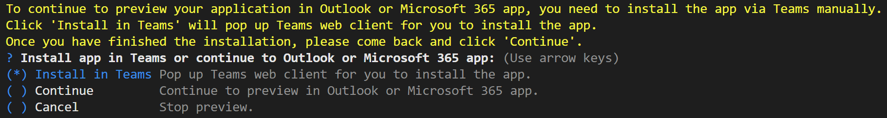

## Try the Sample with TeamsFx CLI
1. Install [Node.js](https://nodejs.org/en/download/) (use the latest v14 LTS release)
1. To install the TeamsFx CLI, use the npm package manager:
    ```
    npm install -g @microsoft/teamsfx-cli
    ```
1. Create todo-list-with-azure-backend-m365 project.
    ```
    teamsfx new template todo-list-with-azure-backend-m365
    ```
1. Provision the project to Azure.
    ```
    teamsfx provision
    ```
1. Deploy.
    ```
    teamsfx deploy
    ```
1. Execute `teamsfx preview --remote --m365-host <m365-host>` in your project directory to launch your application, where `m365-host` is `teams`, `outlook` or `office`. If you select `m365-host` as `outlook` or `office`, during preview, a dialog will be popped up as the image below. Please select "Install in Teams" first to install the app in Teams, then select "Continue" to continue to preview the app in Outlook or Office.
  

## (Optional) Debug
1. Start debugging the project by executing the command `teamsfx preview --local --m365-host <m365-host>` in your project directory, where `m365-host` is `teams`, `outlook` or `office`. If you select `m365-host` as `outlook` or `office`, during debugging, a dialog will be popped up as the image below. Please select "Install in Teams" first to install the app in Teams, then select "Continue" to continue to debug the app in Outlook or Office.
  