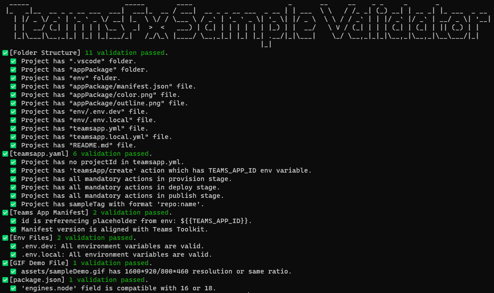

# TeamsFx Sample Validation Tool

TeamsFx sample validator is a command line tool that can help to validate whether a sample is compatible with Teams Toolkit. It checks the project content like folder structure, Teams manifest, demo gif file, etc.

If you want to contribute to the sample gallery of Teams Toolkit, this tool can help you do a quick validation in local environment. Passing all of the validation is a mandatory requirement for sample onboarding process.

## How to Use

1. Make sure NodeJS(>=14) has been installed.
2. Change directory to "validation-tool" using command like `cd validation-tool`.
3. Run `node .\validator.cjs -p <path to the project folder>` and check output.
The output looks like the following screenshot.

  * Another way to run validator is to install the npm package. You can run `npm install -g .\validation-tool` to install the package. After that, you can run `teamsfx-sample-validator` to validate the project in current folder.

## Sample Project Validation Rules
### Folder Structure
Following files are required:
  * appPackage/
    * manifest.json
    * color.png
    * outline.png
  * env/
    * .env.dev
    * .env.local
  * teamsapp.yml
  * teamsapp.local.yml
  * README.md
### Teams App YAML
The content of teamsapp.yml should follow these rules:
* There is no `projectId` defined.
* "teamsApp/create", "teamsApp/zipAppPackage", "teamsApp/update" actions are defined in `provision` lifecycle.
* `deploy` lifecycle is defined
* "teamsApp/publishAppPackage" action is defined in `publish` lifecycle.
* 'teamsApp/create' action has `TEAMS_APP_ID` env variable
* `sampleTag` is defined using format 'repo:name'. If the sample is hosted in this repo, it should be 'TeamsFx-Samples:\<sample name\>'
### Teams App Manifest
The content of appPackage/manifest.json should follow these rules:
* `id` is referencing placeholder from env, which is `${{TEAMS_APP_ID}}`
* Manifest version should be latest to align with Teams Toolkit
### Demo GIF
The default path is 'assets/sampleDemo.gif', if the sample is not using this path, validator will show a warning message.
The size of sample gif file should be 1600x920/800x460 or other size that has same ratio.
### Env Files
`env/.env.dev` and `env/.env.local` should not contain any environment variables except for `TEAMSFX_ENV` and `TEAMS_APP_NAME`.
### package.json
Node version which is defined in `engines.node` property should be compatible with 16 & 18.
