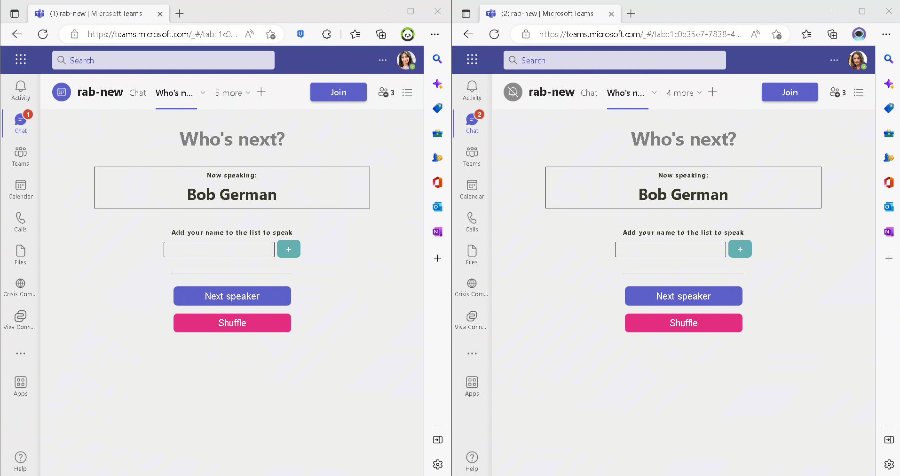

# How to use this Who's Next In-meeting app

## Summary

This application runs in the sidebar of a Teams meeting and assists in deciding who will speak next. Anyone who wishes to speak can enter their name to be added to the list of speakers. When it's time for the next speaker, the "Next Speaker" button will advance to display the new speaker at the top. There are also buttons for removing names (if someone has to leave the meeting, for example) and for shuffling the names randomly.

This application illustrates the use of Teams Live Share SDK and the Fluid Framework. The Live Share SDK provides a secure connection to a Fluid Relay service hosted in Microsoft 365. Each instance of the service is isolated to the current meeting automatically. The Fluid Relay Service, along with the Fluid Framework SDK, synchronizes the list of names across everyone who is using the app. This is not screen sharing - it's keeping a JavaScript object structure in sync among all attendees, and a small React user interface is displaying the data locally.

## The backstory
🧑‍💻👩🏽‍💻 This project was created as part of FHL, a week dedicated to Fixing, Hacking and Learning something new together.

❓ The Microsoft 365 Cloud Advocates always had a challenge in their weekly sync meetings: They could not decide on **who's next** to give an update on project progress.

🚀So [Bob German](https://github.com/BobGerman) and [Rabia Williams](https://github.com/rabwill) decided to take the necessary step, cloud 🥑 style, to create a meeting app called "Who's next" which will help choose attendees from a meeting.
👀 Here is a quick look of how the app works!

⚙️They used [Teams Toolkit](https://learn.microsoft.com/en-us/microsoftteams/platform/toolkit/teams-toolkit-fundamentals?pivots=visual-studio-code), a VS Code extension to create their base teams app from a sample meeting app available in the toolkit itself.
Then they used [Fluid Framework](https://fluidframework.com/docs/) to synchronize the view for each attendee.

⚠️ If you can upload a Teams app, you can run this. It doesn't require any Azure AD permission or other administrative consent.

## Prerequisites

- [NodeJS](https://nodejs.org/en/) version as required by Teams Toolkit (v14 or v16 at the time of this sample)
- A Microsoft 365 tenant in which you have permission to upload Teams apps. Please don't develop in production; you can get a free Microsoft 365 developer tenant by joining the [Microsoft 365 developer program](https://developer.microsoft.com/en-us/microsoft-365/dev-program)
- [Teams Toolkit Visual Studio Code Extension](https://aka.ms/teams-toolkit)

## Version history

Version|Date|Author|Comments
-------|----|----|--------
1.2|February 7, 2023|Bob German|Updates for Teams Toolkit samples repository
1.1|January 25, 2023|Bob German|Update to use [Live Share SDK](https://learn.microsoft.com/microsoftteams/platform/apps-in-teams-meetings/teams-live-share-overview)
1.0|November 21, 2022|Bob German and Rabia Williams|Initial release

## Disclaimer

**THIS CODE IS PROVIDED *AS IS* WITHOUT WARRANTY OF ANY KIND, EITHER EXPRESS OR IMPLIED, INCLUDING ANY IMPLIED WARRANTIES OF FITNESS FOR A PARTICULAR PURPOSE, MERCHANTABILITY, OR NON-INFRINGEMENT.**

---

## This demo illustrates

- Use of Teams Toolkit to create a simple meeting tab application
- Use of Live Share SDK to obtain a Fluid framework container
- Use of Fluid framework to synchronize the contents of a meeting tab among meeting attendees

## Try the sample with the Visual Studio Code extension

### Prepare a meeting

Follow the instructions to [create a meeting in Microsoft Teams](https://support.microsoft.com/office/create-a-meeting-in-teams-for-personal-and-small-business-use-eb571219-517b-49bf-afe1-4fff091efa85). Then in the Calendar you can find the meeting you just created. Double click the meeting will open the meeting details, and will enable the meeting app to be added in this meeting in later steps.

### Run the app locally

- Clone or download the repository to your local machine
- Ensure Teams Toolkit and a supported version of node are installed
- Within the "whos-next-meeting" folder, run `npm install` to install the developer and server-side dependencies
- In Visual Studio Code: Start debugging the project by hitting the `F5` key in your keyboard.
  - Alternatively open the `Run and Debug Activity` panel(Ctrl+Shift+D) in Visual Studio Code and click the `Run and Debug` green arrow button.
- The Teams web client will launch in your browser. Select `Add to a meeting`, then select the meeting you just created. (It may take a few minutes to appear on the list)
- Click `Set up a tab` in the next step, it will take you to the meeting configuration page.
- In the configuration page, click `Save`, this may take several minutes, and then you will see the meeting chat tab, however it will only display a message saying that you need to join the meeting in order to use it.
- Click `Join` to join the meeting.
- Select the tab (with a cartoon bubble logo and a default name of `Who's Next`) in the tab bar above the meeting scren. You will see a side panel tab in the meeting.

### Deploy the app to Azure

Deploy your project to Azure by following these steps:

- Open Teams Toolkit in Visual Studio Code, and sign in your Azure account by clicking the `Sign in to Azure` in the `ACCOUNTS` section from sidebar.
- After you signed in, select a subscription under your account. The Teams Toolkit will use this subscription to provision Azure resources to host you app.
- Open the Teams Toolkit and click `Provision` in the `LIFECYCLE` section.
  - Alternatively open the command palette(Ctrl+Shift+P) and type: `Teams: Provision` command.
- Open the Teams Toolkit and click `Deploy to the cloud` in the `DEVELOPMENT` section.
  - Alternatively open the command palette(Ctrl+Shift+P) and type: `Teams: Deploy to the cloud` command.

> Note: Provisioning Azure cloud resources and deploying to Azure may cause charges to your Azure Subscription.

### Preview the app in Teams client

After you have completed the provision and deploy steps in `Deploy the app to Azure` section, you can preview your app in Teams client by following steps below:

- In Visual Studio Code

  1. Open the `Run and Debug Activity` panel from sidebar, or use short key Ctrl+Shift+D.
  1. Select `Launch Remote (Edge)` or `Launch Remote (Chrome)` in the launch configuration (a dropdown selection in the upper-left corner).
  1. Press the `Start Debugging` (small green arrow) button to launch your app, the Teams web client will be automatically opened in your browser, where you will see your app running remotely from Azure.

### Use in other tenants

This is a very simple application. It doesn't authenticate users, so the manifest works in any tenant. When you have a production deployment in Azure, you can use the same app package in any Microsoft 365 tenant where you have permission to upload or install it.

### Run Fluid Relay Service in Azure

If you wish to host your own Fluid Relay Service in Azure instead of using the Live Share provided Fluid Relay Service,
you can find alternative sources [in this folder](./alt-tabs-azure/). This is allows use of the application outside of meetings. Check the README.md file for details.